# 08 — 셋업: 멀티 GPU · 사내 서버

카드 여러 장 또는 서버에서 모델을 띄우는 절차. **기동까지가 이 문서의 범위**다.

← [07 NVIDIA 워크스테이션](07-setup-nvidia-workstation.md) · 다음 → [09 모델 현황](09-model-landscape.md)

> ### 이 문서의 경계 ★
> 여기서 다루는 것은 **"여러 장에 모델을 올려 기동하는 법"이다.**
> **조직이 그것을 운영하는 법**(게이트웨이·마스킹·라우팅·용량계획·관측·거버넌스)은 다루지 않는다 — 포인터는 §8.

> **검증 상태:** 공식 문서를 대조했지만 **다중 GPU에서 실행하지 않았다.** version별 flag와 metric 이름은
> [검증 기록](VALIDATION.md)과 현재 vLLM 문서를 함께 확인한다. `[문서 확인 · 2026-08-10]`

---

## 0. 시작 전 — 내 서버 확인

07 §2의 드라이버 확인에 더해, 멀티 GPU에서는 **카드 수와 카드 간 연결 형태**를 먼저 본다.

```bash
nvidia-smi -L                 # 카드 목록 — 몇 장이, 무엇이 꽂혀 있는가
nvidia-smi topo -m            # 카드 간 연결 토폴로지 — §3의 판단 재료
```

`topo -m` 출력의 카드 간 교차 칸이 **`NV#`면 NVLink 직결**, **`PIX`·`PHB`·`SYS`면 PCIe 경유**다
(SYS 쪽으로 갈수록 경로가 멀어 느리다). 이 한 줄이 §3의 "내 서버는 어느 쪽인가"에 대한 답이다. `[자료 확인 · 2026-08-10]`

**총 VRAM(카드당 × 장수)을** [04 §2](04-hardware-tiers.md) 티어표에 대입하되, §4의 예산 계산처럼
**나눠지지 않는 고정분**이 있다는 점을 기억한다.

---

## 1. 결론 먼저

- **VRAM은 단순히 합산되지 않는다.** 나누는 방식과 카드 간 통신 대역이 실효 성능을 정한다 `[원리]`
- 같은 총 VRAM이라도 큰 카드 한 장과 작은 카드 여러 장의 성능은 같지 않다. 통신 경로와 workload를 함께 본다 `[원리]`
- 멀티 GPU는 주로 **① 한 장에 model이 안 들어가거나 ② 목표 동시 처리량을 한 장으로 못 맞출 때** 검토한다 `[해석]`

이 문서는 공개 문서와 운영 도구가 비교적 잘 갖춰진 **vLLM을 대표 경로**로 쓴다. 다른 runtime도
TP·PP·통신 topology 개념을 쓰지만 flag와 제약이 같다고 가정하면 안 된다. llama.cpp의 다중 카드 분산(`-ts`)은
[07 §4](07-setup-nvidia-workstation.md)의 팁을 참고한다. `[해석]`

---

## 2. 모델을 나누는 두 가지 방식



`[원리]`

### TP 크기 제약 ★

많은 model/runtime 조합에서 `--tensor-parallel-size` 값은 **model의 attention head 수와 나눗셈이 맞아야 한다.**
지원 제약은 model config와 실행 version의 error message로 최종 확인한다. `[문서 확인 · 2026-08-10]`
헤드 수는 HF 모델 카드의 `config.json`에서 본다([02 §2 스펙 카드 읽는 법](02-model-anatomy.md)) —
`num_attention_heads`, 그리고 아래 팁의 `num_key_value_heads`.

```text
  예: 어텐션 헤드가 64개인 모델
      유효한 TP 값 = 1, 2, 4, 8, 16, 32, 64
      TP=3, TP=6 → 기동 실패
```

GPU 수와 head 수가 맞지 않거나 카드별 VRAM이 고르지 않으면 PP 또는 TP+PP 조합을 검토한다. 예를 들어
6장은 TP 2 × `--pipeline-parallel-size 3`처럼 구성할 수 있지만, 실제 지원 여부와 memory balance는 현재
vLLM 문서와 기동 log로 확인한다. `[문서 확인 · 2026-08-10]`

> 🔧 **한 단계 더 — 실제로 먼저 걸리는 것은 KV 헤드 수다.** GQA 모델은 KV 헤드가 훨씬 적어서
> (예: 쿼리 헤드 64, KV 헤드 8 — [02 §5](02-model-anatomy.md)), **TP가 KV 헤드 수를 넘으면** 런타임이
> KV를 복제하는 등 효율이 떨어지거나 제약에 걸린다. TP 값은 어텐션 헤드뿐 아니라 **KV 헤드 수로도
> 나눠지는 값**으로 잡는 것이 안전하다. `[자료 확인 · 2026-08-10]`

---

## 3. 카드 간 통신 — NVLink와 PCIe

| 연결 | 어디에 | 성격 |
| --- | --- | --- |
| **NVLink / NVSwitch** | 현행 라인업 기준 데이터센터 SXM 카드 (H100·H200·B200) `[변동]` 조회 2026-08-10 | 고대역 카드 간 직결. TP 확장에 유리 |
| **PCIe** | 소비자·워크스테이션 카드 다중 구성 | 상대적 저대역. TP에서 병목이 될 수 있음 |

내 서버가 어느 쪽인지는 §0의 `nvidia-smi topo -m`으로 이미 확인했다.

**실무 함의:** 소비자 카드 여러 장을 묶어도 카드 수에 비례해 성능이 오르지는 않는다. model 수용이
목적인지 처리량이 목적인지 정하고, 단일 대용량 카드와 다중 카드 구성을 같은 workload로 비교한다. `[해석]`

> 🔧 **한 단계 더 — 통신 문제의 진단 도구는 NCCL이다.** 카드 간 통신은 NCCL 라이브러리가 담당한다.
> 다중 GPU에서 원인 불명의 행(hang)·기동 실패가 나면 `NCCL_DEBUG=INFO`로 로그를 열어 보는 것이 표준
> 첫 수이고, P2P 통신이 문제로 지목되면 `NCCL_P2P_DISABLE=1`로 우회 확인한다(느려지지만 동작하면
> P2P 경로를 더 조사할 근거가 된다). debug 환경변수는 성능 저하·장애를 일으킬 수 있으므로 원인 확인 뒤
> 제거하고 production 설정에 남기지 않는다. `[문서 확인 · 2026-08-10]`

---

## 4. vLLM 다중 GPU 기동

```bash
vllm serve <model> \
  --tensor-parallel-size 4 \
  --max-model-len 8192 \
  --gpu-memory-utilization 0.90 \
  --host 127.0.0.1 --port 8000
```

| 플래그 | 의미 |
| --- | --- |
| `--tensor-parallel-size 4` | TP 값 — §2의 제약(헤드 수로 나눠지는 값) |
| 나머지 | [07 §5](07-setup-nvidia-workstation.md)와 동일 — 양자화 자동 인식·튜닝 순서 포함 |

`[자료 확인 · 2026-08-10]`

> **먼저 닫고 시작한다:** 위 예시는 local host에만 bind한다. 다른 기기에 제공하려고 `0.0.0.0`으로
> 바꾸기 전 API key, TLS reverse proxy, firewall, 접근 log와 rate limit을 설계한다. vLLM의 `--api-key`는
> 최소한의 호출 인증 수단이지 조직용 보안 경계 전체가 아니다. `[원리]`

### 메모리 예산 — 나눠도 여전히 예산이다

```text
  카드당 필요량 ≈ (가중치 ÷ TP)  +  (KV 캐시 ÷ TP)  +  활성화·통신 버퍼
                                                        ↑ 나눠지지 않는 고정분
```
`[원리]`

**계산 절차 — 목표 model·context·동시 요청을 넣어 카드당 예산을 구한다.** KV의 token당 byte는
[02 §5](02-model-anatomy.md)의 model config 산식으로 계산하고 runtime overhead는 실제 load log로 보정한다.

```text
  카드당 가중치 근사 = model file 또는 weight byte ÷ TP
  총 KV 근사          = KV byte/token × 실제 context token × 동시 sequence
  카드당 필요량 근사 = 카드당 가중치 + (총 KV ÷ TP) + runtime buffer
```
`[해석]`

**단, vLLM의 실제 동작 방향은 이 계산과 반대다** — 동시 요청 수를 먼저 정하는 것이 아니라,
`--gpu-memory-utilization`으로 정한 예산에서 가중치·버퍼를 뺀 **잔여분을 전부 KV 블록으로 미리
할당**해 두고, 그 안에서 동시 요청을 받는다. 위 계산은 "이 장비로 그 동시성이 감당되는가"를
**사전 검증**하는 용도로 쓰는 것이다. `[자료 확인 · 2026-08-10]`

> **관찰:** 긴 context와 높은 동시성을 함께 요구하면 KV cache가 큰 비중을 차지할 수 있다. 그래서
> `--max-model-len`과 동시 sequence 상한을 별도로 관리한다. `[해석]`

> 🔧 **한 단계 더 — 처리량 튜닝 4종.** `--max-num-seqs`(동시 요청 상한), `--enable-prefix-caching`
> (공통 시스템 프롬프트 재사용), `--enable-chunked-prefill`(긴 prefill을 쪼개 decode 지연 완화),
> `--kv-cache-dtype fp8`(지원되는 조합에서 KV byte 절감 후보). 절감 폭이 곧 동시 요청 배수가 되는 것은
> 아니므로 변경 전후는 §6의 metric으로 비교한다. `[문서 확인 · 2026-08-10]`

---

## 5. 컨테이너 구성

```bash
docker run --gpus all \
  --ipc=host \
  -v /srv/models:/root/.cache/huggingface \
  -p 8000:8000 \
  vllm/vllm-openai:latest \
  --model <model> \
  --tensor-parallel-size 4 \
  --max-model-len 8192
```
`[자료 확인 · 2026-08-10]` — `--ipc=host`는 `--shm-size=16g`로 대체 가능, 캐시 볼륨은 모델 재다운로드 방지용(아래 표).

| 항목 | 이유 |
| --- | --- |
| `--ipc=host` / `--shm-size` | **다중 GPU는 프로세스 간 공유메모리를 쓴다.** 기본값(64MB)이면 실패한다 |
| 모델 캐시 볼륨 | 수십~수백 GB 재다운로드 방지. **디스크 용량과 네트워크가 실제 병목이 되는 지점** |
| `--gpus all` | 특정 카드만 쓰려면 `--gpus '"device=0,1"'` |

---

## 6. 기동 후 확인

```bash
nvidia-smi                                    # 카드마다 고르게 VRAM이 잡혔는가
curl http://localhost:8000/v1/models          # 모델이 노출되는가
curl http://localhost:8000/metrics            # vLLM 메트릭 (Prometheus 형식 — 모니터링 시스템이 긁어 가는 표준 텍스트 형식)
```
`[자료 확인 · 2026-08-10]`

### ★ 성공 판정

- `nvidia-smi`에서 **모든 카드의 VRAM 점유가 비슷하다** — 한 장만 높으면 TP가 적용되지 않고 단일 GPU로 동작 중이다
- `/v1/models`가 모델 목록을 반환한다
- 실제 chat completions 요청([07 §5](07-setup-nvidia-workstation.md)와 동일 형식)에 응답한다

> 🔧 **한 단계 더 — `/metrics`에서 무엇을 보나.** 처음 볼 지표 셋:
> `vllm:num_requests_waiting`(대기 큐 — 지속적으로 0보다 크면 포화), `vllm:gpu_cache_usage_perc`
> (KV 블록 사용률 — 상시 90%+면 `--max-model-len`·KV 양자화 조정), TTFT/TPOT 히스토그램(지연 체감의
> 실체 — 용어는 [10 §1](10-operations.md)). 부하를 걸어 곡선을 그리려면 vLLM 동봉 벤치마크
> (`vllm bench serve`)를 쓴다. `[자료 확인 · 2026-08-10]`

---

## 7. 증상별 대응

| 증상 | 원인 | 대응 |
| --- | --- | --- |
| 기동 시 헤드 수 관련 오류 | TP 값이 헤드 수를 못 나눔 | TP를 2의 거듭제곱으로 (§2) |
| 다중 GPU에서만 행(hang) | 공유메모리 부족 **또는 NCCL 통신 문제** | `--ipc=host`/`--shm-size=16g` → 그래도면 `NCCL_DEBUG=INFO`로 진단 (§3 팁) |
| 카드 한 장만 사용됨 | TP 미적용 | `--tensor-parallel-size` 확인, 컨테이너 GPU 노출 확인 |
| 카드를 늘렸는데 처리량이 안 늚 | PCIe 통신 병목 | `topo -m`으로 연결 확인 (§0). 정상적 한계면 큰 카드로 통합 검토 |
| OOM인데 VRAM은 남아 보임 | 활성화·통신 버퍼 미고려, 또는 vLLM이 KV 블록을 선점 할당한 것 (§4) | `--gpu-memory-utilization` 하향 |

---

## 8. 여기서 끝, 그다음은 다른 문서 ★

기동에 성공하면 **기술적으로는 "모델 서버"가 생긴 것**이고, 조직에서 쓰려면 그 앞단이 필요하다.

| 다음 관심사 | 어디로 |
| --- | --- |
| 인증·TLS·rate limit | API gateway 또는 reverse proxy에서 통제하고 직접 노출을 피한다 |
| 민감정보·prompt log | 입력 전 masking, log 보존 기간, 열람 권한을 정한다 |
| model routing·fallback | 요청 민감도·난도·장애 상태에 따른 규칙과 실패 동작을 정한다 |
| 용량·관측 | 목표 동시성에서 TTFT·TPOT·throughput·error rate를 측정한다 |
| 평가·거버넌스 | 사용 목적별 evaluation set, model·prompt version, 승인·변경 기록을 남긴다 |

> **한 줄:** 이 문서가 만드는 것은 **엔드포인트 하나**다. 조직이 쓰는 시스템은 그 엔드포인트 **앞에** 만들어진다. `[해석]`
> 그 엔드포인트를 혼자서라도 꺼지지 않게 유지하려면(재부팅 자동 기동·컨테이너 재시작 정책) [07 §6](07-setup-nvidia-workstation.md)의 운영 팁과 [10 §5](10-operations.md).

---

## 9. 체크리스트

- [ ] `nvidia-smi -L`·`topo -m`으로 카드 수와 연결 형태를 확인했다 (§0)
- [ ] TP 값이 모델의 헤드 수(가능하면 KV 헤드 수까지)로 나눠진다 (§2)
- [ ] 카드당 메모리 예산을 사전 검증했다 (§4 계산 예)
- [ ] 기동 후 모든 카드의 VRAM 점유가 고르다 (§6)
- [ ] OpenAI 호환 엔드포인트가 응답한다
- [ ] 목표 동시성으로 부하를 걸어 `/metrics`의 대기 큐·KV 사용률을 확인했다 (§6 팁)

---

**다음 →** [09 모델 현황](09-model-landscape.md)
