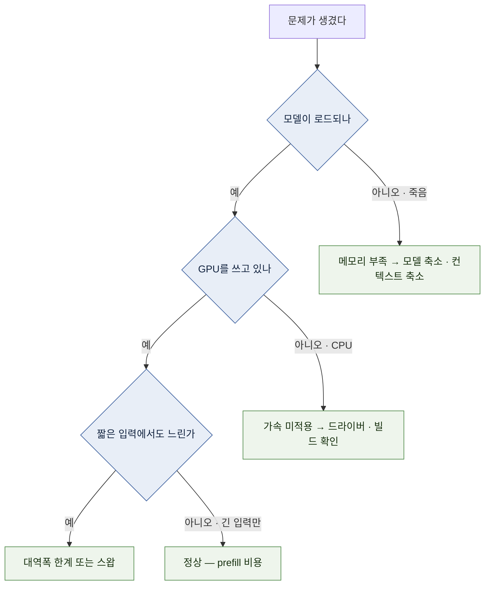

# 10 — 운영 실무

띄운 다음의 문제들: **제대로 도는지 어떻게 아는가, 느리면 왜 느린가, 앱에 어떻게 붙이는가.**

← [09 모델 고르기](09-model-landscape.md) · 다음 → [11 용어집](11-glossary.md) · [README로](README.md)

---

## 1. 성능 측정 — 무엇을 재야 하는가

**"빠르다/느리다"를 감으로 말하지 않으려면 두 숫자를 구분해야 한다.** `[원리]`


| 증상 | 어느 지표 | 원인 |
| --- | --- | --- |
| "긴 문서를 넣으면 한참 멈춰 있다" | **TTFT** | 긴 prefill, queue 대기, cold load 등을 분리 확인 |
| "글자가 뚝뚝 끊겨 나온다" | **TPS** | model·memory bandwidth·offloading·runtime 등을 확인 |

`[원리]` — 대역폭이 TPS를 정하는 이유는 [04 §1](04-hardware-tiers.md).

### 측정 방법

```bash
# Ollama — 상세 통계 출력
ollama run <model> --verbose
```

`--verbose`가 끝에 출력하는 통계와 위 두 지표의 대응: `[자료 확인 · 2026-08-10]`

| 출력 항목 | 무엇인가 |
| --- | --- |
| `eval rate` | **② TPS** — 생성(decode) 속도. "빠르다/느리다"의 그 숫자 |
| `prompt eval rate` | prefill 처리 속도. TTFT에는 model load·queue·network 등도 포함될 수 있다 |
| `prompt eval count` / `eval count` | 입력 / 생성 토큰 수 |

```bash
# llama.cpp 내장 벤치마크 — .gguf 파일 실물 경로가 필요하다.
# llama-server를 -hf로 썼다면 파일은 llama.cpp 캐시(~/Library/Caches/llama.cpp 또는
# ~/.cache/llama.cpp)에 받아져 있다. huggingface-cli로 받았다면 그 경로를 준다.
llama-bench -m <model.gguf>

# API로 총 소요시간을 직접 재기
curl -w "\n총 소요: %{time_total}s\n" http://localhost:11434/v1/chat/completions \
  -H "Content-Type: application/json" \
  -d '{"model":"<model>","messages":[{"role":"user","content":"1+1?"}]}'
```
`[자료 확인 · 2026-08-10]`

**비교할 때의 원칙:** 같은 모델·같은 양자화·같은 컨텍스트 길이·같은 프롬프트로만 비교한다.
공개 벤치마크 수치를 내 장비 수치와 직접 비교하면 대개 조건이 달라 무의미하다. `[해석]`

> 🔧 **한 단계 더 — prefill과 decode를 분리해서 재기.** `llama-bench -p 512 -n 128`처럼 프롬프트
> 길이(`-p`)와 생성 길이(`-n`)를 바꿔 가며 돌리면 두 단계의 속도가 따로 나온다 — "긴 문서 요약"과
> "짧은 질답"의 체감이 왜 다른지가 숫자로 보인다. 서빙(동시 요청) 부하 곡선은 [08 §6](08-setup-multi-gpu-server.md)의 벤치마크 도구를 쓴다. `[자료 확인 · 2026-08-10]`

### 내 기준선 만들기

TPS 숫자만으로 “쾌적함”을 정하지 않습니다. 대화형 사용은 TTFT와 token이 출력되는 cadence, batch 작업은
전체 처리량과 완료 시간을 함께 봅니다. 같은 prompt set을 세 번 이상 실행해 median을 기록하고, 내가 기다릴
수 있는 기준을 먼저 정합니다. `[해석]`

---

## 2. 컨텍스트 길이 관리

context length는 memory 문제를 줄이는 중요한 손잡이입니다([02 §5](02-model-anatomy.md)).

| 런타임 | 조정 방법 |
| --- | --- |
| Ollama | `/set parameter num_ctx 4096` 또는 Modelfile의 `PARAMETER num_ctx` — 두 방법의 정확한 사용법은 [06 §2](06-setup-apple-silicon.md) |
| llama.cpp | `-c 4096` |
| vLLM | `--max-model-len 4096` |
| LM Studio | 모델 로드 설정 화면의 컨텍스트 슬라이더 |

`[자료 확인 · 2026-08-10]`

**설정 원칙:** `[해석]`

1. **실제 필요한 길이로 낮춘다.** 도구 기본값은 대개 크게 잡혀 있다
2. 길이가 꼭 필요하면 **KV 캐시 양자화**를 켠다([03 §7](03-quantization.md))
3. 그래도 안 되면 **모델을 한 단계 줄인다** — 큰 모델을 짧은 컨텍스트로 쓰는 것보다 작은 모델을 긴 컨텍스트로 쓰는 편이 나은 작업이 많다

> 🔧 **한 단계 더 — 창을 넘겼을 때의 동작은 런타임마다 다르다.** 어떤 런타임은 앞부분을 조용히
> 잘라내고(대화가 "앞 내용을 잊는" 원인), 어떤 구성은 에러를 반환한다. 반복 호출에서 같은 시스템
> 프롬프트를 쓴다면 **prefix caching**([02 §5](02-model-anatomy.md) 팁)이 TTFT를 크게 줄여 준다. `[자료 확인 · 2026-08-10]`

---

## 3. 증상별 진단 ★



### 증상표

| 증상 | 가능한 원인 | 확인 방법 |
| --- | --- | --- |
| 로드 중 프로세스가 죽음 | 메모리 부족 | 모델 크기 + KV를 [02 §1 산식·§4 검산](02-model-anatomy.md)으로 재계산 |
| `CUDA out of memory` | VRAM 초과 | `nvidia-smi`로 점유 확인 → [07 §7](07-setup-nvidia-workstation.md) |
| 로드는 되는데 극단적으로 느림 | 오프로딩 또는 스왑 | GPU 점유율 확인. Mac은 메모리 압박 확인 |
| GPU가 안 잡힘 | 드라이버·빌드·가속 미적용 | `ollama ps` / `nvidia-smi` / 기동 로그의 레이어 수 |
| 짧은 대화는 되는데 긴 문서에서 죽음 | **KV 캐시** | 컨텍스트 축소 ([02 §5](02-model-anatomy.md)) |
| 출력이 이상하거나 반복됨 | [채팅 템플릿](11-glossary.md) 불일치 또는 과도한 양자화 | 템플릿 옵션 확인(llama.cpp `--jinja`), 한 단계 약한 양자화로 교체 |
| 첫 응답만 느림 | prefill | 정상 (§1) |
| 어제는 됐는데 오늘 안 됨 | 런타임 자동 업데이트, 모델 태그 갱신, OS·드라이버 업데이트 | 런타임 버전·변경 로그 확인 → 모델 다이제스트 확인(§5 팁) → 최근 시스템 업데이트 확인 |

`[해석]`

---

## 4. 앱에 붙이기 — OpenAI 호환 API

여러 runtime이 OpenAI API의 일부와 비슷한 endpoint를 제공합니다([05 §4](05-stack-map.md)). 단, 지원
endpoint·field·streaming·tool calling 동작은 runtime과 version마다 다릅니다.

```bash
pip install openai        # 처음 한 번 (venv 사용 권장 — 06 §5 참조)
```

```python
from openai import OpenAI

client = OpenAI(
    base_url="http://localhost:11434/v1",   # Ollama. vLLM이면 8000
    api_key="not-needed",                    # 아래 참조
)

resp = client.chat.completions.create(
    model="<model>",
    messages=[{"role": "user", "content": "요약해줘: ..."}],
)
print(resp.choices[0].message.content)
```
`[자료 확인 · 2026-08-10]`

위 Ollama local 예시의 `api_key`는 SDK 초기화를 위한 placeholder다. 인증을 설정한 runtime에서는 실제 key를
써야 하며, key를 검증하지 않는 local server를 외부 network에 그대로 노출하면 안 된다. `[문서 확인 · 2026-08-10]`

| 기본 포트 | 런타임 |
| --- | --- |
| 11434 | Ollama |
| 8080 | llama.cpp `llama-server` (기본값) · [06 §5](06-setup-apple-silicon.md)의 `mlx_lm.server` 예시(명시 지정) |
| 8000 | vLLM |
| 1234 | LM Studio Local Server |

호환되는 chat completion 범위에서는 client 구조를 재사용할 수 있습니다. 하지만 `base_url`만 바꾸면 완전히
같이 동작한다고 가정하지 말고 model name, authentication, message field, tool calling, structured output,
error와 token accounting을 integration test로 확인합니다. `[원리]`

> **보안 주의:** 로컬 엔드포인트는 대개 **인증이 없다.** `--host 0.0.0.0`으로 열면 같은 네트워크의 누구나 호출할 수 있다.
> 공유가 목적이면 앞단에 인증·통제 계층을 둔다 — [README §5](README.md)의 경계 포인터. `[해석]`

> 🔧 **한 단계 더 — 실전 코드에서 다음에 필요해지는 것들.** 스트리밍(`stream=True` — 첫 글자부터
> 흘려보내기), `max_tokens`(생성 여지 예약 — [02 §6](02-model-anatomy.md)의 예산과 직결),
> `temperature`(창의성/일관성 조절), 구조화 출력(JSON 강제 — 런타임별 지원 편차 있음). `[자료 확인 · 2026-08-10]`

---

## 5. 기본 운영 수칙 — 로컬에서도 필요한 것

| 항목 | 내용 |
| --- | --- |
| **디스크** | 모델 파일이 빠르게 쌓인다. 수십~수백 GB. **먼저 `ollama list`와 `du -sh ~/.ollama ~/.cache/huggingface`로 현황을 보고**, 안 쓰는 모델을 삭제한다(`ollama rm <model>`) |
| **캐시 위치** | 기본 캐시 경로(`~/.ollama`, `~/.cache/huggingface`)를 용량 있는 볼륨으로 옮기는 것을 검토 — Ollama는 `OLLAMA_MODELS` 환경변수([06 §2](06-setup-apple-silicon.md) 팁) |
| **버전 고정** | 자동 업데이트로 기본값이 바뀌어 동작이 달라질 수 있다. 재현이 중요하면 버전을 기록 |
| **모델 세대교체** | 새 model로 바꾸기 전 기존 evaluation set을 다시 돌리고, 변경 이유·결과를 남긴다 ([09 §7](09-model-landscape.md)) |
| **기밀 데이터** | 로컬이라도 프롬프트·출력이 로그·캐시에 남을 수 있다. 민감 데이터를 다룬다면 로그 정책을 확인 |

`[해석]`

> 🔧 **한 단계 더 — "돌아가는 상태"를 재현 가능하게.** ① 모델은 이름이 아니라 **다이제스트**로 기록한다
> (`ollama list`의 ID와 `ollama show <model>`의 세부 정보 — 같은 tag가 바뀌는 문제를 추적) ② 서버를
> 상시 운영한다면 로그인 세션이 아니라 서비스로 등록한다 — Linux는 systemd unit(설치 스크립트가 이미
> 등록했을 수 있다, [07 §3](07-setup-nvidia-workstation.md)), macOS는 launchd, 컨테이너는 `--restart`
> 정책([07 §6](07-setup-nvidia-workstation.md) 팁). `[해석]`

---

## 6. 회의에서 나올 만한 질문과 짧은 답

| 질문 | 답 |
| --- | --- |
| "노트북에서 큰 모델을 돌릴 수 있나요?" | model size·quantization·context에 따라 다릅니다. 장비 이름으로 단정하지 말고 [02](02-model-anatomy.md) 산식과 실제 file size로 계산합니다 `[원리]` |
| "양자화하면 품질이 떨어지지 않나요?" | 손실 가능성이 있습니다. bit 수만으로 체감 정도를 단정하지 말고 실제 한국어 평가 세트로 원본 또는 더 높은 정밀도와 비교합니다 ([03 §6](03-quantization.md)) `[원리]` |
| "GPU 하나 사면 되나요?" | VRAM 용량이 먼저입니다. 무엇을 돌릴지 정하고 [02](02-model-anatomy.md) 산식으로 필요량을 계산한 뒤 고릅니다 `[해석]` |
| "로컬이 hosted API보다 싼가요?" | 사용량·장비 감가·전력·운영 인력·가용성 요구에 따라 달라집니다. 같은 기간과 workload로 총비용을 비교합니다 ([01 §4](01-orientation.md)) `[원리]` |
| "오픈 모델이니 그냥 써도 되죠?" | 라이선스가 모델마다 다릅니다. 상업적 사용 조건을 모델 카드에서 확인해야 합니다 ([09 §4](09-model-landscape.md)) `[원리]` |
| "왜 처음 응답이 느리죠?" | 프롬프트를 통째로 처리하는 prefill 단계입니다. 프롬프트가 길수록 커지며 정상 동작입니다 (§1) `[원리]` |

---

**다음 →** [11 용어집](11-glossary.md) · **← [README로 돌아가기](README.md)**
