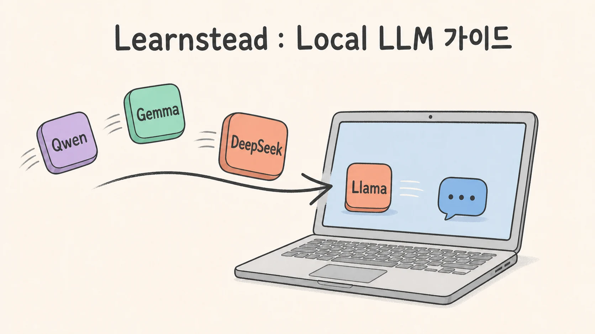

# 내 장비에서 LLM 직접 실행하기

[](#10분-안에-첫-응답-받기)

노트북, NVIDIA GPU가 있는 PC, 여러 GPU를 갖춘 서버에서 open-weight LLM을 직접 실행하기 위한
가이드입니다. 처음 접하는 독자는 가장 짧은 성공 경로부터 시작하고, 모델과 장비를 직접 고르려는 독자는 뒤의
계산·선택 문서로 이어서 읽을 수 있습니다.

> 이 가이드는 모델을 새로 학습시키는 방법이 아니라, 이미 학습된 모델을 불러와 답을 생성하는 **추론(inference)**을
> 다룹니다. 각 실행 경로의 실제 검증 범위는 [검증 기록](VALIDATION.md)에서 먼저 확인하세요.

**[개념부터 시작 → 01 오리엔테이션: 로컬 실행의 전체 지도](01-orientation.md)**

## 이 가이드에서 얻게 되는 것

- Local·Hosted·Open-weight가 어떻게 다른지 설명할 수 있습니다.
- model 크기, quantization, context가 memory 요구량에 미치는 영향을 가늠할 수 있습니다.
- 내 장비와 목적에 맞는 runtime을 골라 첫 응답을 받을 수 있습니다.
- GPU 적재와 API 응답을 확인하고, 재현할 수 있는 실행 기록을 남길 수 있습니다.

## 10분 안에 첫 응답 받기

Apple Silicon Mac에서 [Ollama](https://docs.ollama.com/macos)를 쓰는 가장 짧은 경로입니다. 처음 실행하면
모델 파일을 내려받으므로 인터넷 연결과 약 4GB의 여유 공간이 필요합니다. 아래 Homebrew 경로는 M4 Pro·24GB
Mac에서 실제로 확인했습니다. `[실행 검증 · 2026-08-11]`

**준비물:** Apple Silicon Mac, 인터넷 연결, 약 4GB의 여유 공간, 터미널 두 개. Homebrew가 없다면 공식 macOS
앱을 사용할 수 있습니다.

1. 터미널을 열고 Ollama를 설치합니다.

   ```bash
   brew install ollama
   ```

   Homebrew가 없다면 [공식 설치 페이지](https://ollama.com/download/mac)의 macOS 앱을 이용할 수 있습니다. 이 앱
   설치 경로는 이번 실행 검증에 포함하지 않았습니다.

2. 첫 번째 터미널에서 서버를 실행하고 창을 열어 둡니다.

   ```bash
   ollama serve
   ```

3. 두 번째 터미널을 열고 다음 명령을 실행합니다.

   ```bash
   ollama run gemma3:4b
   ```

4. 입력 프롬프트가 나타나면 다음처럼 질문합니다.

   ```text
   로컬 LLM을 한 문장으로 설명해 줘.
   ```

5. 답변이 표시되면 첫 실행에 성공한 것입니다. `/bye`로 대화를 끝냅니다. 서버를 계속 쓰지 않을 때는 첫 번째
   터미널에서 `Control-C`로 종료합니다.

> Ollama 앱이나 기존 서비스가 이미 서버를 실행 중이라면 2단계는 생략합니다. `ollama serve`에서
> `address already in use`가 나오면 대개 서버를 중복 실행한 경우입니다.

이 명령과 모델 태그는 Ollama의 [Gemma 3 library](https://ollama.com/library/gemma3)에서 확인할 수 있습니다.
응답 품질은 질문과 모델에 따라 달라지므로, **답이 그럴듯한가**가 아니라 **모델이 적재되고 응답을 끝까지
생성했는가**를 첫 성공 기준으로 삼습니다.

> **다운로드 전 확인:** 모델마다 별도의 라이선스와 사용 조건이 있습니다. 조직 업무나 재배포에 쓰기 전에는 모델
> 카드와 라이선스 원문을 확인하세요.

> 🔧 **한 단계 더 — 정말 GPU를 썼는지 확인하기**
>
> 다른 터미널에서 `ollama ps`를 실행합니다. `PROCESSOR`가 GPU를 포함하는지, 모델이 예상한 메모리 범위에
> 올라갔는지 확인하세요. 자세한 판정과 문제가 생겼을 때의 경로는 [Apple Silicon 설정](06-setup-apple-silicon.md)에
> 있습니다.

검증 장비에서는 `gemma3:4b`가 `100% GPU`, 실행 중 컨텍스트 4,096로 표시됐고 OpenAI 호환 API도 응답했습니다.
이는 해당 환경의 확인 결과이지, 모든 Mac에서 같은 속도와 메모리 사용량을 보장한다는 뜻은 아닙니다.

NVIDIA GPU가 있는 Linux 또는 Windows+WSL2 환경이라면 [NVIDIA 단일 GPU 설정](07-setup-nvidia-workstation.md),
여러 GPU에 한 모델을 나눠 올리려면 [멀티 GPU 서버 설정](08-setup-multi-gpu-server.md)으로 이동합니다. 이 두
경로는 현재 문서 확인 상태이며, 실제 실행 검증 전에는 그대로 동작한다고 보장하지 않습니다.

### 테스트를 마친 뒤

`/bye`는 대화만 닫습니다. 서버를 계속 켜 둔 채 model만 memory에서 내리려면 다른 터미널에서 다음 명령을
실행합니다.

```bash
ollama stop gemma3:4b
```

첫 번째 터미널에서 실행한 서버까지 끄려면 `Control-C`를 누릅니다. 내려받은 model file도 지우려면 서버가 실행된
상태에서 `ollama rm gemma3:4b`를 사용합니다. 이 파일을 지우면 다음 실행 때 다시 내려받아야 합니다. Homebrew로
설치한 Ollama 자체는 `brew uninstall ollama`로 제거할 수 있으며, macOS 앱 설치 경로의 제거 방법은 공식 안내를
따릅니다.

## 이 가이드의 사용법 — Fit → Run → Prove

10분 경로는 model과 runtime을 미리 골라 둔 빠른 출발점입니다. 다른 장비나 model로 확장할 때는 다음 세 단계를
한 묶음으로 반복합니다.

| 단계 | 확인할 것 | 이 가이드에서 찾을 곳 |
| --- | --- | --- |
| **Fit** | model, quantization, context가 장비의 memory 예산에 들어가는가 | 02 → 03 → 04 |
| **Run** | 목적에 맞는 runtime으로 응답을 끝까지 생성하는가 | 05 → 06·07·08 |
| **Prove** | GPU 적재, API 응답, version과 조건을 확인·기록했는가 | 10 → 검증 기록 |

매번 같은 형식으로 남기려면 **[내 Local LLM 실행 카드](RUN-CARD.md)**를 복사해 사용하세요. “실행됐다”에서
끝내지 않고 **왜 이 구성이 맞는지(Fit), 어떻게 실행했는지(Run), 무엇으로 확인했는지(Prove)**를 함께 남기는 것이
이 가이드의 핵심 습관입니다.

## 먼저 구분할 두 개의 축

`Local`, `Hosted`, `Open-weight`는 **동일한 분류 축에 놓인 대립 개념이 아닙니다.**

| 축 | 질문 | 예 |
| --- | --- | --- |
| 실행 위치 | 모델이 누구의 장비에서 실행되는가? | 내 Mac·사내 서버에서 직접 실행 / 외부 사업자가 운영하는 API 사용 |
| 가중치 접근과 라이선스 | 학습된 가중치를 내려받고 수정·배포할 수 있는가? | open-weight / 가중치가 공개되지 않은 모델 |

따라서 open-weight 모델을 외부 사업자가 호스팅 API로 제공할 수도 있고, 같은 모델을 내 장비에서 직접 실행할 수도
있습니다. 이 가이드의 `local LLM`은 **내가 관리하는 장비에서 모델 추론을 실행하는 구성**을 뜻하며, 주로
open-weight 모델을 사용합니다. open-weight는 가중치 공개 범위를 말할 뿐, 학습 데이터·학습 코드까지 공개됐거나
아무 제한 없이 쓸 수 있다는 뜻은 아닙니다.

ChatGPT나 Claude처럼 외부 사업자가 운영하는 서비스와 로컬 실행의 차이는 [오리엔테이션](01-orientation.md)에서
비교합니다.

## Local이라고 자동으로 안전한 것은 아니다

prompt가 내 장비에서 처리되더라도 다음 상황에서는 data가 network로 나갈 수 있습니다.

- 설치 파일과 model을 내려받을 때
- 원격 도구, 웹 검색, 호스팅 embedding·reranking API를 연결할 때
- 애플리케이션이나 플러그인이 telemetry·crash report를 보낼 때
- 로컬 API 서버를 외부 네트워크에 노출할 때

즉, `local`은 **실행 위치**에 대한 설명이지 보안·개인정보 보호 보증이 아닙니다. 민감 데이터를 다룬다면 네트워크
경로, 도구 연결, 로그, 접근 제어와 업데이트 경로를 별도로 확인해야 합니다.

## 조직에서는 hybrid도 선택지다

조직이 모든 요청을 한쪽으로 보내야 하는 것은 아닙니다. 규제·데이터 소재지·지연·반복 비용이 중요한 워크로드는
직접 관리하는 모델로, 최고 품질이나 드물게 쓰는 기능이 필요한 워크로드는 호스팅 API로 보내는 **하이브리드 구성**을
선택할 수 있습니다.

다만 하이브리드가 자동으로 더 싸거나 안전한 정답이 되는 것은 아닙니다. 라우팅 기준, 민감 정보 차단, 접근 제어,
로그와 장애 대응을 함께 설계해야 하므로 운영 복잡도가 늘어납니다. 이 가이드는 하이브리드 구성의 로컬 추론
부분까지만 다룹니다.

## 이 가이드의 핵심 계산

로컬 실행 가능 여부는 모델과 실행 중 필요한 데이터가 메모리에 들어가는지로 먼저 판단할 수 있습니다.

```text
가중치 메모리 = 총 파라미터 수 × 파라미터당 바이트 수

필요 메모리  ≈ 가중치
             + KV cache
             + 런타임·드라이버·activation overhead
```

양자화(quantization)는 파라미터당 바이트 수를 줄입니다. KV cache는 대화와 문서가 길어질수록 커집니다. MoE 모델은
전체 파라미터를 메모리에 올리지만 토큰마다 일부 expert만 계산할 수 있으므로 **메모리는 전체 파라미터**, 속도는
활성 파라미터의 영향을 크게 받습니다. 자세한 계산과 한계는 [모델 해부](02-model-anatomy.md)에서 다룹니다.

## 문서 지도

| # | 문서 | 이럴 때 읽기 |
| --- | --- | --- |
| 01 | [오리엔테이션](01-orientation.md) | local·hosted·open-weight와 하이브리드를 처음 구분할 때 |
| 02 | [모델 해부](02-model-anatomy.md) | 내 메모리에 모델과 컨텍스트가 들어가는지 계산할 때 |
| 03 | [양자화](03-quantization.md) | GGUF, Q4, AWQ, FP8 중 무엇을 받아야 할지 모를 때 |
| 04 | [하드웨어 등급](04-hardware-tiers.md) | 현재 장비로 가능한 범위나 새 장비의 기준을 잡을 때 |
| 05 | [stack 지도](05-stack-map.md) | Ollama, llama.cpp, MLX, vLLM의 역할을 구분할 때 |
| 06 | [Apple Silicon 설정](06-setup-apple-silicon.md) | Mac에서 가장 먼저 model을 실행할 때 |
| 07 | [NVIDIA 단일 GPU 설정](07-setup-nvidia-workstation.md) | Linux 또는 Windows+WSL2에서 실행할 때 |
| 08 | [멀티 GPU 서버 설정](08-setup-multi-gpu-server.md) | 한 모델을 여러 GPU에 나누거나 여러 사용자를 받을 때 |
| 09 | [모델 선택 지도](09-model-landscape.md) | 현재 모델 후보와 라이선스 확인 경로를 찾을 때 |
| 10 | [운영과 문제 해결](10-operations.md) | 속도를 재고, API를 연결하고, 오류 원인을 좁힐 때 |
| 11 | [용어집](11-glossary.md) | 처음 보는 약어와 혼동하기 쉬운 용어를 찾을 때 |
| — | [내 Local LLM 실행 카드](RUN-CARD.md) | 선택·실행·검증 조건을 같은 형식으로 기록할 때 |

### 목적별 추천 경로

- **오늘 하나만 실행:** 이 README의 10분 경로 → [06 성공 판정](06-setup-apple-silicon.md)
- **내 장비에 맞는 모델 선택:** 02 → 04 → 03 → 09 → 06 또는 07
- **여러 사람에게 API 제공:** 02 → 04 → 05 → 08 → 10
- **개념부터 정독:** 01 → 02 → 03 → 04 → 05 → 해당 설정 문서 → 09 → 10

모르는 용어는 순서와 무관하게 [용어집](11-glossary.md)에서 찾을 수 있습니다.

## 검증 상태를 읽는 법

| 표기 | 뜻 |
| --- | --- |
| `원리` | 특정 제품 version보다 오래 유지되는 구조·수학·물리 설명 |
| `실행 검증 · YYYY-MM-DD` | 기록한 환경에서 명령과 성공 조건을 실제로 확인함 |
| `부분 검증 · YYYY-MM-DD` | 명시한 단계만 실제로 확인함 |
| `문서 확인 · YYYY-MM-DD` | 공식 문서나 발표를 확인했지만 직접 실행하지는 않음 |
| `자료 확인 · YYYY-MM-DD` | 공개 자료를 확인했지만 1차 출처나 직접 실행으로 확정하지 못함 |
| `미검증` | 아직 직접 확인하지 못함 |
| `해석` | 근거를 바탕으로 저자가 정리한 판단 |

각 표기의 근거는 [출처](SOURCES.md)와 [검증 기록](VALIDATION.md)에 연결합니다. 모델·런타임·하드웨어 정보는
빠르게 바뀌므로 확인일이 오래됐다면 명령을 실행하기 전에 공식 문서를 다시 확인하세요.

## 범위

이 가이드가 끝나는 지점은 model이 내 장비 또는 내가 관리하는 server에서 응답을 반환하고, 그 결과를 기본 API로
확인하는 순간입니다.

다음 내용은 별도의 운영·architecture 주제이므로 여기서 완성된 해법을 제시하지 않습니다.

- 모델 학습과 미세 조정(fine-tuning)
- RAG·vector database·agent framework의 설계
- 조직 전체의 gateway, DLP, routing, evaluation과 governance
- production service의 인증, 고가용성, 용량 계획과 규제 대응
- 모든 OS, GPU와 런타임 조합의 지원 보장

## 변경과 출처

- [이 가이드의 변경 기록](CHANGELOG.md)
- [핵심 정보의 1차 출처](SOURCES.md)
- [환경별 실행 검증 기록](VALIDATION.md)

**다음 →** [01 오리엔테이션 — 로컬 실행의 전체 지도](01-orientation.md)
