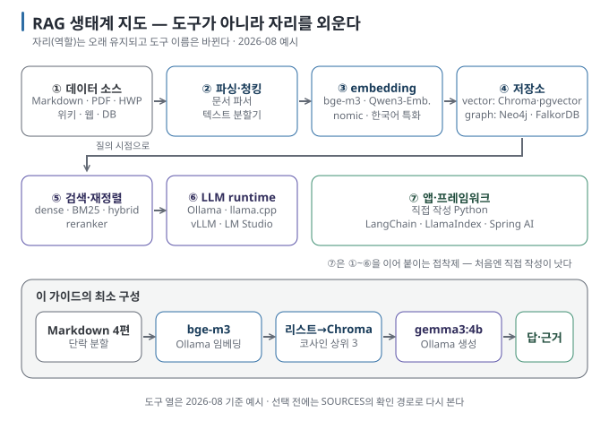

# 01 — RAG·Graph 생태계 지도: 무엇이 어느 자리에 있는가

RAG를 배우기 시작하면 embedding model, vector database, LangChain, GraphRAG 같은 이름이 한꺼번에 쏟아집니다.
이 문서는 그 이름들을 **파이프라인의 자리에** 하나씩 놓아, 이후 문서에서 어떤 도구가 나와도 "아, 그 자리의 것"이라고
읽을 수 있게 만드는 지도입니다.

← [README](README.md) · 다음 → [02 내 문서와 대화하는 AI 이해하기](02-rag-vs-long-context-vs-finetuning.md)

> **왜 읽나:** embedding, vector DB, LangChain, GraphRAG… 이름은 스무 개인데 자리는 일곱 개뿐입니다.
>
> **읽고 나면:** 어떤 도구 이름이 나와도 "아, 그 자리"라고 배치할 수 있고, 처음엔 프레임워크가 왜 방해가 되는지 설명할 수 있습니다.
>
> **바쁘면:** §0 "결론 먼저"와 ★ 절만 읽고 다음 문서로 넘어가도 흐름이 끊기지 않습니다.

---

## 0. 한 줄 정의 ★

**RAG는** 사용자의 질문에 답하기 **직전에** 관련 문서 조각을 찾아 모델에게 함께 건네는 방식입니다. 모델의 가중치는
바꾸지 않습니다. `[원리]`

**Graph(그래프)는** 문서에 등장하는 개체(사람·제품·규정)와 그 사이의 관계를 점과 선으로 저장한 구조이고, **GraphRAG는**
그 구조를 검색에 활용하는 RAG의 변형입니다. `[원리]`

두 용어는 대립 관계가 아닙니다. GraphRAG는 RAG의 한 갈래이며, 보통 벡터 검색과 **함께** 씁니다([08](08-graphrag.md)).

## 1. 생태계는 파이프라인의 자리로 읽는다

아래 그림은 RAG 시스템을 이루는 **자리(역할)와** 그 자리에 놓이는 대표 도구입니다. 도구 이름은 바뀌지만 자리는
오래 유지됩니다. 도구를 외우지 말고 자리를 외우세요.

| 자리 | 하는 일 | 대표 도구·기술 (예) | 이 가이드의 선택 |
| --- | --- | --- | --- |
| ① 데이터 소스 | 답의 근거가 될 원본 | Markdown·PDF·HWP·웹페이지·위키·DB | 작은 Markdown 묶음 |
| ② 파싱·청킹 | 원본을 텍스트로 풀고 조각으로 자름 | 문서 파서(PDF 추출기 등), 텍스트 분할기 | 단락 단위 분할 ([05](05-chunking-and-retrieval-quality.md)) |
| ③ embedding model | 조각과 질문을 벡터로 바꿈 | bge-m3, Qwen3-Embedding, nomic-embed-text, 한국어 특화 모델 | Ollama의 `bge-m3` ([04](04-embeddings-and-vector-search.md)) |
| ④ 저장소 | 벡터(또는 그래프)를 저장하고 빠르게 찾음 | **vector:** Chroma, LanceDB, pgvector, Qdrant, Milvus / **graph:** Neo4j, FalkorDB, NetworkX | 처음엔 리스트, 다음엔 Chroma ([04 §5](04-embeddings-and-vector-search.md)) |
| ⑤ 검색·재정렬 | 질문과 관련된 조각을 찾고 순위를 다듬음 | 벡터 검색, BM25(키워드), hybrid, reranker(bge-reranker 등) | 벡터 → hybrid → reranker 순으로 확장 ([05](05-chunking-and-retrieval-quality.md)) |
| ⑥ LLM runtime | 조각을 읽고 답을 생성 | Ollama, llama.cpp, vLLM, LM Studio + 모델 | Ollama ([내 장비에서 LLM 직접 실행하기](../local-llm/README.md)) |
| ⑦ 애플리케이션·프레임워크 | ①~⑥을 묶어 흐름을 만듦 | 직접 작성한 Python, LangChain, LlamaIndex, Haystack, Spring AI, LangChain4j | 직접 작성한 Python 한 파일 (핵심 함수 60줄 남짓) |

`[자료 확인 · 2026-08-23]` — 도구 열의 이름은 2026년 8월 기준 널리 쓰이는 예시이며 추천 순위가 아닙니다. 바뀌기 쉬운
항목이므로 선택 전에는 [SOURCES](SOURCES.md)의 확인 경로로 다시 봅니다.

> **초심자용 한 줄:** RAG 시스템은 "자르고(②) → 숫자로 바꾸고(③) → 저장하고(④) → 찾고(⑤) → 읽혀서 답하게(⑥)"
> 하는 다섯 동작이고, 프레임워크(⑦)는 이 다섯 동작을 이어 붙이는 접착제입니다.

## 2. 기술 셋 — 한 번은 알아야 하는 기본 개념

아래는 이 생태계를 읽는 데 필요한 최소 개념입니다. 각 항목은 본문 문서에서 자세히 다루므로 여기서는 **무엇인지만**
잡습니다.

| 개념 | 한 줄 | 자세히 |
| --- | --- | --- |
| chunk(조각) | 문서를 검색 단위로 자른 텍스트 덩어리. 너무 크면 잡음이, 너무 작으면 문맥이 사라짐 | [05 §1](05-chunking-and-retrieval-quality.md) |
| embedding(임베딩) | 텍스트의 의미를 수백~수천 차원의 숫자 벡터로 바꾼 것. 의미가 가까우면 벡터도 가까움 | [04 §1](04-embeddings-and-vector-search.md) |
| 유사도(similarity) | 두 벡터가 얼마나 가까운지의 점수. 보통 코사인 유사도 | [04 §2](04-embeddings-and-vector-search.md) |
| vector store / vector database | 벡터를 저장하고 "가장 가까운 k개"를 빠르게 찾아 주는 저장소 | [04 §5](04-embeddings-and-vector-search.md) |
| top-k | 검색에서 가져오는 조각 수. 프롬프트 길이와 잡음을 함께 결정 | [05 §3](05-chunking-and-retrieval-quality.md) |
| sparse / dense 검색 | 키워드 일치(BM25 등) / 의미 벡터. 서로 다른 실패를 보완하므로 섞어 씀(hybrid) | [05 §2](05-chunking-and-retrieval-quality.md) |
| reranker(재정렬기) | 1차 검색 결과를 질문과 함께 다시 읽고 순위를 정교하게 매기는 모델 | [05 §4](05-chunking-and-retrieval-quality.md) |
| context window(컨텍스트 창) | 모델이 한 번에 읽을 수 있는 토큰 수. 조각을 넣을 수 있는 예산의 상한 | [06 §3](06-generation-and-grounding.md) |
| grounding(근거 고정) | 답을 제공된 조각 안의 내용으로만 쓰게 하고 출처를 붙이는 것 | [06 §2](06-generation-and-grounding.md) |
| knowledge graph(지식 그래프) | 개체와 관계의 네트워크. "A는 B의 일부" 같은 사실을 선으로 저장 | [07](07-graph-basics.md) |
| 평가(evaluation) | 검색이 맞는 조각을 찾았는지, 답이 근거에 충실한지를 따로 재는 것 | [실습](../../labs/why-rag-fails/README.md), [09 §4](09-personal-vs-enterprise.md) |

## 3. 프레임워크를 언제 쓰는가

프레임워크는 ①~⑥을 이어 붙이는 코드를 대신 써 줍니다. 편리하지만, 처음 배울 때는 **오히려 방해가** 되기 쉽습니다.
각 자리에서 무슨 일이 일어나는지 보이지 않기 때문입니다. `[해석]`

| 상황 | 권장 |
| --- | --- |
| RAG를 처음 이해하는 중 | **직접 작성** — [튜토리얼](../../tutorials/local-rag-build/README.md)처럼 수십 줄로 충분합니다 |
| 파서·저장소·모델을 자주 바꿔 가며 실험 | 프레임워크의 커넥터가 시간을 아껴 줍니다 (LlamaIndex·LangChain·Haystack) |
| Java/Spring 환경에서 서비스로 만들기 | Spring AI 또는 LangChain4j — 앱 연결은 [별도 가이드](../local-llm-app-integration/README.md) |
| 팀이 여러 파이프라인을 운영 | 프레임워크 + 추적(tracing)·평가 도구까지 묶인 구성 ([09](09-personal-vs-enterprise.md)) |

`[자료 확인 · 2026-08-23]` — 프레임워크 이름과 기능 범위는 빠르게 바뀝니다. 2026년 8월 기준 Python에서는
LangChain·LlamaIndex·Haystack이, Java에서는 Spring AI·LangChain4j가 RAG 구성 요소를 제공합니다.

> 🔧 **한 단계 더 — 프레임워크가 숨기는 것**
>
> 프레임워크의 "RAG 한 줄" API는 보통 청킹 크기, top-k, 프롬프트 템플릿을 기본값으로 고정합니다. 결과가 나쁠 때
> 이 기본값들이 보이지 않으면 원인을 좁힐 수 없습니다. 프레임워크를 쓰더라도 **청크 크기·top-k·프롬프트 템플릿**
> 세 값은 반드시 명시적으로 지정하고 기록하세요([RAG-CARD](RAG-CARD.md)).

## 4. Graph 쪽 생태계는 어디에 붙는가

그래프는 ④ 저장소 자리에 **vector store와 나란히** 놓입니다. 색인 시점에 LLM이 조각에서 개체와 관계를 뽑아 graph
store에 넣고, 질의 시점에 벡터 검색으로 찾은 조각의 **이웃 개체를** 따라가며 근거를 넓힙니다. `[원리]`

| 자리 | Graph 쪽 도구 (예) |
| --- | --- |
| 저장소 | Neo4j(Cypher 질의), FalkorDB(경량 서버), NetworkX(Python in-memory, 학습용) |
| 추출·색인 파이프라인 | Microsoft GraphRAG, LightRAG, HippoRAG, 프레임워크의 graph index 모듈 |
| 질의 방식 | local search(개체 주변), global search(커뮤니티 요약), 경로 탐색(multi-hop) |

임베디드 graph database로 자주 추천되던 Kuzu는 2025년 10월 upstream 개발이 중단되고 저장소가 archive됐습니다(커뮤니티 포크는
있음). 오래된 글의 추천 목록은 확인일을 먼저 보세요. `[자료 확인 · 2026-08-30]` 세부는 [08](08-graphrag.md). 도구보다 먼저
확인할 것은 **실제 질문에 관계 연쇄·전체 요약이 반복되는가**입니다. 그래프가 필요하다는 신호는 그 질문 묶음에서 나옵니다. `[해석]`

## 5. 이 가이드가 고른 최소 구성

이 시리즈의 최소 구성은 [두 파이프라인 그림](diagrams/03-two-phases.svg)의 각 자리에 Markdown 4편, 단락 분할, Ollama의
`bge-m3`, Python 리스트(선택 단계에서는 Chroma), 코사인 상위 3개, `gemma3:4b`를 놓습니다. 외부 서비스를 쓰지 않고 각 자리가
한눈에 보이며, 실패를 일부러 만들기 쉽도록 고른 구성입니다. 실제 서비스에
그대로 쓰라는 권장이 아닙니다. `[해석]` 모델 태그는 Ollama library에서 확인할 수 있습니다. `[문서 확인 · 2026-08-23]`

---

**다음 →** [02 내 문서와 대화하는 AI 이해하기 — RAG·Long Context·Fine-tuning](02-rag-vs-long-context-vs-finetuning.md)
