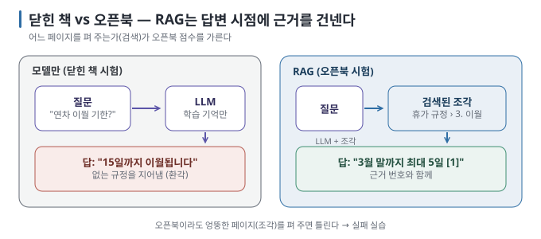
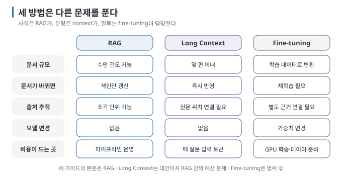

# 02 — 내 문서와 대화하는 AI 이해하기: RAG · Long Context · Fine-tuning

"내 문서를 AI에게 읽히고 싶다"는 한 문장에는 세 가지 다른 방법이 숨어 있습니다. 이 문서는 LLM이 **왜 내 문서를
모르는지에서** 출발해, 세 방법의 차이와 선택 기준을 정리합니다.

← [01 생태계 지도](01-ecosystem-map.md) · 다음 → [03 RAG 파이프라인 해부](03-pipeline-anatomy.md)

> **왜 읽나:** "문서를 AI에 학습시키자"는 표현만으로는 RAG·Long Context·Fine-tuning 중 무엇이 필요한지 알 수 없습니다. 문서가 적다면 별도 검색 시스템 없이 통째로 넣는 편이 더 단순할 수 있습니다.
>
> **읽고 나면:** 내 문서·내 질문에 RAG·Long Context·Fine-tuning 중 무엇이 맞는지 플로우 하나로 결정하고, "context가 커졌으니 RAG는 끝"이 왜 틀렸는지 말할 수 있습니다.
>
> **바쁘면:** §0 "결론 먼저"와 ★ 절만 읽고 다음 문서로 넘어가도 흐름이 끊기지 않습니다.

---

## 0. LLM은 왜 내 문서를 모르는가 ★

LLM은 학습 시점에 본 텍스트의 통계적 패턴을 가중치에 담고 있습니다. 그래서 세 가지 한계를 구조적으로 가집니다. `[원리]`

| 한계 | 뜻 | 내 문서에서 생기는 일 |
| --- | --- | --- |
| **지식 컷오프** | 학습 데이터가 끝난 시점 이후는 모름 | 지난주에 고친 사내 규정을 모름 |
| **비공개 데이터 부재** | 학습 데이터에 없던 것은 애초에 모름 | 우리 회사 장비 반납 절차는 세상에 공개된 적이 없음 |
| **환각(hallucination)** | 모르는 것도 그럴듯하게 생성함 | "연차는 15일까지 이월됩니다"라고 **없는 규정을 지어냄** |

환각은 특히 알아채기 어렵습니다. 모델은 빈칸을 그대로 두기보다 다음에 올 법한 문장을 생성하므로, 내 문서 없이 질문하면
**사실처럼 보이는 오답을 만들 수 있습니다.** 이것이 문서를 연결해야 하는 이유이자, 연결한 뒤에도 근거를 확인해야 하는 이유입니다.

> **초심자용 한 줄:** 모델만 쓰는 것은 **닫힌 책 시험**, RAG는 **오픈북 시험입니다**. 오픈북이라도 엉뚱한 페이지를
> 펴 주면 틀립니다 — 그래서 "어느 페이지를 펴 주는가"(검색)가 핵심입니다.

## 1. 세 가지 방법

| 방법 | 무엇을 하는가 | 모델을 바꾸는가 | 문서가 바뀌면 |
| --- | --- | --- | --- |
| **RAG** | 질문마다 관련 조각을 찾아 프롬프트에 넣음 | 아니오 | 색인만 다시 함 |
| **Long Context** | 문서 전체를 프롬프트에 통째로 넣음 | 아니오 | 다음 질문부터 바로 반영 |
| **Fine-tuning** | 문서로 모델을 추가 학습해 가중치에 녹임 | 예 | 다시 학습해야 함 |

`[원리]`

### 1.1 RAG — 질문 시점에 근거를 건넨다

장점은 **최신성**(색인만 갱신), **출처 추적**(어느 조각을 근거로 썼는지 제시 가능), **규모**(문서가 수만 건이어도 검색은
상위 몇 개만 가져옴), **비용**(모델을 학습하지 않음)입니다. 단점은 **정답 근거를 검색하지 못하면 신뢰할 만한 답도 만들기
어렵다는** 점과, 파이프라인 부품이 많아 어디가 틀렸는지 좁히는 기술이 필요하다는 점입니다. `[해석]`

### 1.2 Long Context — 통째로 넣는다

로컬에서 쓰는 open-weight 모델도 수만~수십만 토큰의 context window를 선언하는 경우가 있습니다. 문서가 몇 편이라면
검색 없이 전부 넣는 것이 가장 단순하고 충분할 수 있습니다. `[자료 확인 · 2026-08-30]`

다만 세 가지 제약이 있습니다. `[원리]`

- **비용과 속도:** 입력 토큰이 늘수록 매 질문의 처리 시간과 KV cache 메모리가 늘어납니다. 로컬에서는 메모리 한계에
  먼저 부딪힙니다([내 장비에서 LLM 직접 실행하기 02](../local-llm/02-model-anatomy.md)의 context 예산).
- **긴 입력에서의 주의력 저하:** 선언된 창 크기 안이라도 중간에 놓인 내용을 놓치는 현상이 보고됩니다. 창이
  크다고 전부 "읽는" 것은 아닙니다. `[자료 확인 · 2026-08-23]`
- **runtime의 실제 창:** 모델이 선언한 상한과 runtime이 실제로 적용한 값이 다를 수 있습니다. Ollama의 기본 context는
  장비 메모리와 설정에 따라 달라지고, 입력이 실제 창을 넘으면 일부 메시지가 제외될 수 있습니다. `[문서 확인 · 2026-08-30]` — [06 §3](06-generation-and-grounding.md)

### 1.3 Fine-tuning — 가중치에 녹인다

모델의 **말투·형식·도메인 어휘를** 바꾸는 데는 효과적이지만, **사실을 외우게 하는 데는 비효율적입니다**. 새 사실이
생길 때마다 재학습해야 하고, 어느 문서가 근거인지 제시할 수 없으며, 학습 데이터 준비와 GPU 비용이 큽니다. 이 가이드는
fine-tuning을 다루지 않습니다. `[해석]`

## 2. 선택 기준

다음 순서로 좁히면 됩니다.

1. 문서 전체가 실제 context 창에 여유 있게 들어가고, 질문마다 모두 읽는 비용도 괜찮다면 **Long Context부터** 시도합니다.
2. 문서가 계속 늘거나 바뀌고, 검색된 근거를 추적해야 한다면 **RAG를** 사용합니다.
3. 실제 질문에 여러 문서를 건너뛰는 관계 연쇄나 전체 요약이 반복해서 나타날 때만 **Graph 결합을** 검토합니다.
4. 목적이 사실 공급이 아니라 말투·출력 형식·행동 교정이라면 프롬프트를 먼저 조정하고, 필요할 때 **Fine-tuning을** 검토합니다.

`[해석]` — 기준선은 다음과 같습니다.

| 상황 | 선택 | 이유 |
| --- | --- | --- |
| 문서 몇 편, 질문 몇 번 | Long Context | 파이프라인을 만들 이유가 없음 |
| 문서 수십 편 이상, 계속 늘어남 | RAG | 검색이 필요해지는 규모 |
| "어느 규정 몇 조에 근거한 답인가"가 중요 | RAG | 검색된 조각 단위로 출처를 추적하기 쉬움 |
| 같은 문서에 질문을 수백 번 | RAG | Long Context는 매번 전부 다시 읽음 |
| 모델의 말투·출력 형식을 바꾸고 싶음 | Fine-tuning (또는 프롬프트) | 사실 주입이 아니라 행동 교정 |
| "A 프로젝트의 담당자가 속한 팀의 예산은?" 같은 다단 질문 | RAG + Graph | 한 조각에 답이 없고 관계를 따라가야 함 |

> **흔한 오해:** "context 창이 커졌으니 RAG는 끝났다." — 창이 커져도 **출처 추적, 비용, 권한 필터, 갱신은** 남습니다.
> 반대로 모든 경우에 RAG가 필요한 것도 아닙니다. 문서가 몇 편이면 통째로 넣는 방식이 더 단순한 출발점일 수 있습니다. `[해석]`

## 3. 세 방법은 섞어 쓴다

실무에서는 RAG로 근거를 가져오고, 그 조각들을 **넉넉한 context에** 넣으며, 필요하면 말투만 fine-tuning한 모델을
쓰는 식으로 **조합합니다**. 선택은 "하나를 고르는 것"이 아니라 "사실은 어디서 오고, 행동은 어디서 오는가"를 나누는
일입니다. `[해석]`

| 역할 | 담당 |
| --- | --- |
| 사실(facts) | RAG가 질문 시점에 공급 |
| 읽을 분량 | context 창이 상한, top-k가 조절 |
| 말투·형식 | 프롬프트(먼저) → fine-tuning(마지막 수단) |

## 4. 이 가이드의 위치

이 가이드는 **RAG를** 본문으로 다루고, Long Context는 RAG의 대안이자 RAG 안에서의 예산 문제로([06 §3](06-generation-and-grounding.md)),
Fine-tuning은 범위 밖으로 둡니다. 다음 문서부터는 RAG 파이프라인을 색인 시점과 질의 시점으로 나눠 해부합니다.

---

**다음 →** [03 RAG 파이프라인 해부 — 색인 시점과 질의 시점](03-pipeline-anatomy.md)
