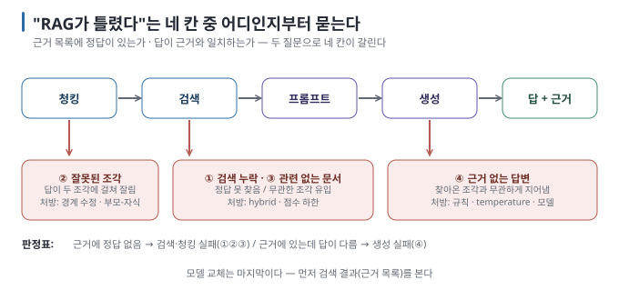

# 03 — RAG 파이프라인 해부: 색인 시점과 질의 시점

RAG는 하나의 프로그램이 아니라 **두 시점에 따로 도는 두 파이프라인입니다**. 이 구분을 먼저 잡아야 "어디가 틀렸는가"를
좁힐 수 있습니다.

← [02 세 가지 방법](02-rag-vs-long-context-vs-finetuning.md) · 다음 → [04 임베딩과 벡터 검색](04-embeddings-and-vector-search.md)

> **왜 읽나:** RAG가 틀렸을 때 모델을 바꾸는 것은 마지막 수단입니다. 그 전에 볼 곳이 일곱 군데 있습니다.
>
> **읽고 나면:** 색인 시점과 질의 시점을 나눠 그릴 수 있고, 틀린 답을 받았을 때 검색·청킹·생성 중 어디부터 볼지 플로우로 좁힐 수 있습니다.
>
> **바쁘면:** §0 "결론 먼저"와 ★ 절만 읽고 다음 문서로 넘어가도 흐름이 끊기지 않습니다.

---

## 0. 두 시점 ★

| 시점 | 언제 | 입력 → 출력 | 얼마나 자주 |
| --- | --- | --- | --- |
| **색인(indexing)** | 문서를 준비할 때 | 문서 → 조각 → 벡터 → 저장소 | 문서가 바뀔 때마다 |
| **질의(query)** | 사용자가 질문할 때 | 질문 → 검색 → 프롬프트 → 답 | 질문마다 |

`[원리]` 색인은 문서가 바뀔 때 실행되므로 질의보다 오래 걸려도 되지만, 파싱·청킹·메타데이터가 정확해야 합니다. 질의는
사용자가 기다리는 경로이므로 지연도 함께 관리합니다. 두 시점의 임베딩 벡터를 비교하려면 **같은 embedding model과 설정을** 써야 합니다.

## 1. 색인 시점 — 문서를 검색 가능한 형태로

위 그림의 윗줄이 색인 경로입니다. 원본에서 꺼낸 텍스트를 검색 단위로 나누고, 각 조각의 벡터·원문·메타데이터를 함께 저장합니다.

| 단계 | 하는 일 | 여기서 틀리면 |
| --- | --- | --- |
| (1) 파싱 | PDF·HWP·HTML에서 텍스트를 꺼냄. 표·머리글·각주가 뒤섞이기 쉬움 | 조각에 깨진 텍스트가 들어가 검색도 생성도 망가짐 |
| (2) 청킹 | 텍스트를 검색 단위로 자름. 크기·경계·겹침을 정함 | 답이 두 조각에 걸쳐 잘림 → [실습 ②](../../labs/why-rag-fails/01-retrieval-failures.md) |
| (3) embedding | 각 조각을 벡터로 바꿈 | 모델이 한국어에 약하면 의미 검색이 흐려짐 |
| (4) 저장 | 벡터 + 원문 + 메타데이터를 저장 | 메타데이터가 없으면 출처 제시와 필터가 불가능 |

`[원리]` 메타데이터는 선택이 아닙니다. "이 조각이 어느 파일의 어느 절인가"를 저장하지 않으면, 답에 출처를 붙일 수도,
"2025년 이후 문서만" 같은 필터도 걸 수 없습니다.

## 2. 질의 시점 — 질문에서 답까지

위 그림의 아랫줄이 질의 경로입니다. 질문을 같은 임베딩 공간으로 옮겨 관련 조각을 찾고, 규칙·근거·질문을 조립해 LLM에 전달합니다.

| 단계 | 하는 일 | 여기서 틀리면 |
| --- | --- | --- |
| (5) 질문 embedding | 색인과 **같은 모델로** 질문을 벡터화 | 다른 모델을 쓰면 비교 자체가 무의미 |
| (6) 검색 | 질문 벡터와 가까운 조각 k개를 찾음. 키워드 검색·reranker를 더할 수 있음 | 맞는 조각을 못 찾음 → [실습 ①](../../labs/why-rag-fails/01-retrieval-failures.md) / 엉뚱한 조각이 섞임 → 실습 ③ |
| (7) 프롬프트 조립 | "아래 근거만 보고 답하라" + 조각들 + 질문 | 조각이 context 창을 넘쳐 잘림, 지시가 약해 모델이 근거를 무시 |
| (8) 생성 | 모델이 답을 씀. 출처 표기를 요구 | 근거에 없는 내용을 지어냄 → [실습 ④](../../labs/why-rag-fails/02-generation-failure.md) |

## 3. 틀렸을 때 어디부터 보는가 ★

답이 틀렸을 때 생성 모델부터 바꾸면 원인을 가리기 쉽습니다. 먼저 검색 결과와 원문을 확인합니다. `[해석]`

1. 검색된 조각에 정답이 없으면 원문에 정답이 있는지 확인합니다. 원문에도 없으면 데이터 문제입니다.
2. 원문에는 있지만 한 조각에 온전히 들어 있지 않으면 청킹 문제, 조각은 온전한데 검색되지 않으면 검색 문제입니다.
3. 정답 조각이 들어왔는데 답에 빠졌거나 인용이 어긋나면 프롬프트·생성 문제입니다.
4. 답과 인용이 맞아도 조각 자체가 낡았거나 틀렸다면 원본 데이터와 갱신 경로를 고쳐야 합니다.

이 플로우를 손으로 돌릴 수 있게 만드는 것이 [튜토리얼](../../tutorials/local-rag-build/README.md)에서 **검색 결과를 항상 함께 출력하는**
이유입니다.

## 4. 부품 교체 가능성

파이프라인의 각 자리는 독립적으로 바꿀 수 있습니다. 단, 교체에 따라 다시 해야 하는 일이 다릅니다. `[원리]`

| 바꾸는 것 | 다시 해야 하는 일 |
| --- | --- |
| embedding model | **전체 재색인** (모든 조각을 새 모델로 다시 벡터화) |
| 청킹 규칙 | 전체 재색인 |
| vector store | 벡터를 옮기거나 재색인 |
| LLM(생성 모델) | 없음 — 색인은 그대로, 프롬프트만 조정 |
| top-k·프롬프트 템플릿 | 없음 |

embedding model이나 청킹 규칙을 바꾸면 전체 재색인이 필요합니다. 생성 모델·top-k·프롬프트는 기존 색인을 유지한 채 비교할 수
있으므로, 변경 비용과 검증 범위를 구분해 실험합니다. `[해석]`

## 5. 그래프는 어디에 끼는가

그래프를 쓰면 색인 시점에 (3)과 나란히 **(3′) 개체·관계 추출이** 추가되고, 질의 시점에 (6)과 나란히 **(6′) 그래프
탐색이** 추가됩니다. 둘 다 기존 파이프라인을 대체하지 않고 **옆에 붙습니다**. `[원리]` 상세는 [08](08-graphrag.md).

---

**다음 →** [04 임베딩과 벡터 검색 — 의미를 숫자로](04-embeddings-and-vector-search.md)
