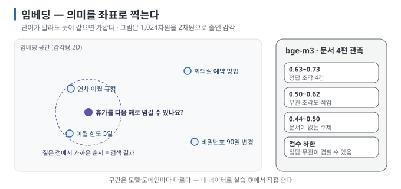
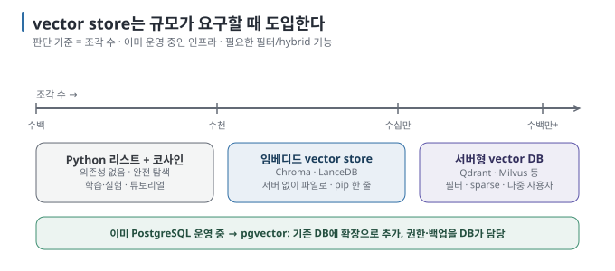

# 04 — 임베딩과 벡터 검색: 의미를 숫자로 바꾸고 가까운 것을 찾는다

검색이 "단어가 같은 문서"가 아니라 "뜻이 비슷한 문서"를 찾을 수 있는 이유는 **임베딩(embedding)** 때문입니다. 이
문서는 임베딩이 무엇인지, 유사도를 어떻게 재는지, embedding model과 vector store를 어떻게 고르는지 다룹니다.

← [03 파이프라인 해부](03-pipeline-anatomy.md) · 다음 → [05 청킹과 검색 품질](05-chunking-and-retrieval-quality.md)

> **왜 읽나:** "휴가 넘기기"와 "연차 이월"은 단어가 하나도 안 겹치는데 검색이 됩니다. 반대로 "EQ-2291"은 글자가 똑같은데 흐려집니다.
>
> **읽고 나면:** 임베딩이 무엇인지 좌표로 설명하고, 유사도 점수를 읽고, 내 문서에 맞는 embedding model과 저장소를 규모에 따라 고를 수 있습니다.
>
> **바쁘면:** §0 "결론 먼저"와 ★ 절만 읽고 다음 문서로 넘어가도 흐름이 끊기지 않습니다.

---

## 0. 결론 먼저 ★

- 임베딩은 텍스트를 **수백~수천 개의 숫자(벡터)로** 바꾼 것이고, 뜻이 비슷한 텍스트는 벡터도 가깝습니다. `[원리]`
- 검색은 "질문 벡터와 가장 가까운 조각 벡터 k개"를 찾는 일입니다. 가까움은 보통 **코사인 유사도로** 잽니다. `[원리]`
- 색인과 질의는 **반드시 같은 embedding model을** 써야 합니다. `[원리]`
- 한국어 문서라면 **다국어로 학습된 open-weight 모델**(예: bge-m3)에서 시작하는 것이 2026년 8월 기준 무난한 출발점입니다.
  `[자료 확인 · 2026-08-23]`
- vector store는 처음엔 필요 없습니다. 조각이 수천 개를 넘고 매번 전부 비교하기 느려질 때 도입합니다. `[해석]`

## 1. 임베딩 — 의미를 좌표로

embedding model은 텍스트를 받아 고정 길이의 숫자 배열을 돌려주는 모델입니다. 예를 들어 bge-m3는 어떤 길이의
텍스트를 넣어도 1,024개의 숫자를 돌려줍니다. `[문서 확인 · 2026-08-23]` 이 숫자들을 좌표로 보면, 텍스트 하나가
1,024차원 공간의 **한 점이** 됩니다.



핵심 성질은 하나입니다. **뜻이 비슷하면 점이 가깝다.** "연차를 다음 해로 넘길 수 있나요?"와 "휴가 이월 규정"은 단어가
거의 겹치지 않지만 점은 가까이 놓입니다. 키워드 검색이 놓치는 **표현의 차이를** 임베딩이 메웁니다. `[원리]`

> **초심자용 한 줄:** 임베딩은 "이 문장의 뜻을 지도 위의 한 점으로 찍는 것"이고, 검색은 "질문 점에서 가장 가까운 점들을
> 찾는 것"입니다.

### 임베딩이 못 하는 것

- **정확한 식별자 매칭:** "EQ-2291" 같은 코드, 제품번호, 고유명사는 의미 공간에서 흐려집니다. 키워드 검색이 필요한
  이유입니다([05 §2](05-chunking-and-retrieval-quality.md)). `[원리]`
- **긴 텍스트의 세부:** 한 조각이 길수록 벡터 하나에 여러 주제가 뭉개집니다. 청킹이 필요한 이유입니다([05 §1](05-chunking-and-retrieval-quality.md)). `[원리]`
- **부정·수량의 정밀한 구분:** "이월 가능"과 "이월 불가"는 벡터가 꽤 가깝습니다. 최종 판단은 생성 단계에서 원문을 읽어야
  합니다. `[해석]`

## 2. 유사도 — 가까움을 숫자로

두 벡터의 가까움은 보통 **코사인 유사도**(두 벡터 사이 각도의 코사인)로 잽니다. 1에 가까울수록 같은 방향, 0이면 무관,
음수면 반대입니다. `[원리]`

```text
cos(a, b) = (a · b) / (‖a‖ × ‖b‖)

  a · b  = a₁b₁ + a₂b₂ + … + aₙbₙ      (내적)
  ‖a‖    = √(a₁² + a₂² + … + aₙ²)        (길이)
```

많은 embedding model이 벡터 길이를 1로 정규화해 내놓으므로, 그 경우 코사인 유사도는 내적과 같습니다. vector store가
"distance"로 보고하는 값은 보통 `1 − cos`이거나 유클리드 거리이므로, **점수가 높을수록 좋은지 낮을수록 좋은지를** 도구마다
확인해야 합니다. `[원리]`

| 점수 (bge-m3, 규정 문서 4편에서 관측) | 실제로 무엇이 있었나 |
| --- | --- |
| 0.63~0.73 | 정답 조각 — 질문 4건의 정답이 전부 이 구간 |
| 0.50~0.62 | **회색 구간** — 정답도 있지만 "단어만 겹치는 무관한 조각"(0.61)도 여기 있음 |
| 0.50 이하 | 문서에 없는 주제를 물었을 때 딸려 온 조각들(0.44~0.50) |

`[실행 검증 · 2026-08-23]` — 이 구간은 한 모델·한 문서 묶음의 관측이며 절대 기준이 아닙니다. 요점은 두 가지입니다. 정답과
무관 조각의 점수는 **겹치는 구간이 있고**, 점수 하한(threshold)은 "전혀 무관한 것"만 걸러 내지 "단어가 겹치는 무관한 것"은
걸러 내지 못합니다. 내 데이터의 구간은 [실습 ③](../../labs/why-rag-fails/01-retrieval-failures.md)에서 직접 잡습니다. `[해석]`

## 3. 직접 해 보기 — Ollama에서 임베딩 얻기

Ollama는 embedding model을 같은 방식으로 내려받고 HTTP로 호출합니다. `[문서 확인 · 2026-08-23]`

```bash
ollama pull bge-m3
curl -s http://localhost:11434/api/embed \
  -d '{"model": "bge-m3", "input": ["연차 이월 규정", "회의실 예약 방법"]}' \
  | python3 -c "import sys, json; r = json.load(sys.stdin); print(len(r['embeddings']), 'vectors of', len(r['embeddings'][0]), 'dims')"
```

**★ 성공 판정:** `2 vectors of 1024 dims`가 출력되면 임베딩이 동작하는 것입니다. `[실행 검증 · 2026-08-23]` — 작성 환경에서 정확히 이
출력을 확인했습니다. 차원 수는 모델에 따라 다릅니다. 오류가 나면 먼저 `ollama list`로 모델이 있는지, `curl http://localhost:11434/`로 서버가 떠 있는지 확인합니다.

연결 방식은 프로그램에서 부를 때도 같습니다. 튜토리얼과 실습은 OpenAI 호환 endpoint를 씁니다.

```python
from openai import OpenAI

client = OpenAI(base_url="http://localhost:11434/v1", api_key="ollama")
resp = client.embeddings.create(model="bge-m3", input=["연차 이월 규정", "회의실 예약 방법"])
vectors = [d.embedding for d in resp.data]
print(len(vectors), len(vectors[0]))
```

`[문서 확인 · 2026-08-23]` — `api_key`는 로컬 runtime이 검증하지 않지만 SDK가 빈 값을 거부하므로 임의 문자열을 넣습니다.

> 🔧 **한 단계 더 — 질문용 접두어(instruction)**
>
> 일부 embedding model(예: Qwen3-Embedding, e5 계열)은 **질문 쪽에만** "다음 질문에 답할 문서를 찾아라" 같은 지시문을
> 앞에 붙이도록 설계돼 있습니다. 붙이지 않아도 동작하지만 검색 품질이 떨어집니다. 모델 카드의 usage 절을 확인하세요.
> bge-m3는 접두어 없이 씁니다. `[문서 확인 · 2026-08-23]`

## 4. embedding model 고르기

| 모델 (예) | 특징 | 어울리는 경우 |
| --- | --- | --- |
| **bge-m3** | 다국어 100+ 언어, 1,024차원, 긴 입력(8k 토큰), dense·sparse·multi-vector 동시 지원. Ollama library에 있음 | 한국어 문서 RAG의 무난한 출발점 |
| **Qwen3-Embedding** (0.6B·4B·8B) | 다국어, 출력 차원 가변, 지시문 기반. 8B가 MTEB 다국어 상위권 | 품질을 더 끌어올릴 때. 크기에 따라 메모리 부담 |
| **nomic-embed-text** | 경량, 8k 입력, CPU에서도 빠름 | 영어 중심·가벼운 환경 |
| 한국어 특화 모델 (예: KURE 계열) | 한국어 검색 벤치마크에 맞춰 조정 | 한국어 전용 문서, 다국어가 필요 없을 때 |

`[자료 확인 · 2026-08-23]` — 이 표는 2026년 8월 기준 공개 자료를 정리한 것으로 순위가 아닙니다. 모델 이름·차원·지원
언어는 Hugging Face 모델 카드에서 확인하고([SOURCES](SOURCES.md)), **내 문서로 직접 비교한** 결과를 우선합니다.

고를 때 확인할 네 가지 `[해석]`:

1. **언어:** 한국어 문서라면 다국어 학습 여부가 첫 조건
2. **최대 입력 길이:** 조각 크기보다 커야 함. 넘치면 뒤가 잘리거나 오류
3. **차원과 크기:** 차원이 크면 저장 공간과 검색 비용이 늘고, 모델이 크면 색인이 느림
4. **라이선스:** 모델마다 다름. 업무 사용 전 모델 카드 확인

> **흔한 오해:** "대화 모델(gemma·qwen)로 임베딩도 만들면 되지 않나?" — 일반 생성 모델의 내부 벡터는 검색 품질을
> 보장하는 인터페이스가 아닙니다. 검색용으로 학습·공개된 **embedding model을** 사용하고 내 골든셋으로 확인합니다. `[해석]`

## 5. vector store — 언제, 무엇을

### 5.1 무엇을 하는 물건인가

조각 벡터를 저장하고, 질문 벡터가 오면 **가장 가까운 k개를** 돌려줍니다. 학습용의 작은 문서 묶음은 Python 리스트로
전부 비교해도 구조를 확인하기에 충분합니다. 조각 수와 동시 요청이 늘면 **근사 최근접 탐색(ANN)** 인덱스(HNSW 등)로
검색 후보를 빠르게 좁힙니다. 전환 시점은 조각 수만이 아니라 실제 지연·메모리·필터 요구로 정합니다. `[해석]`



### 5.2 선택표

| 구간 | 선택 (예) | 특징 |
| --- | --- | --- |
| 수천 개 이하, 학습·실험 | **Python 리스트 + 코사인** | 의존성 없음. 파이프라인이 그대로 보임 |
| 수만~수십만, 개인·소규모 | **Chroma, LanceDB** | 서버 없이 파일로 동작. `pip install` 한 줄 |
| 이미 PostgreSQL 운영 중 | **pgvector** | 기존 DB에 확장으로 추가. 권한·백업을 DB가 담당 |
| 수백만 이상, 필터·hybrid·다중 사용자 | **Qdrant, Milvus, Weaviate** 등 서버형 | sparse 벡터·메타데이터 필터·복제 지원 |

`[자료 확인 · 2026-08-23]` — 제품 이름과 기능 경계는 바뀝니다. 판단 기준은 **규모, 이미 운영 중인 인프라, 필요한
필터·hybrid 기능** 세 가지이며, "전용 vector database가 항상 정답"은 아닙니다. `[해석]`

### 5.3 저장할 때 반드시 함께 넣을 것

```text
{ id, vector, text(원문 조각), metadata: { source: 파일명, section: 절 제목, updated: 날짜, ... } }
```

벡터만 저장하면 검색 결과를 사람이 읽을 수도, 출처를 붙일 수도 없습니다. `[원리]`

---

**다음 →** [05 청킹과 검색 품질 — 자르기·섞기·재정렬](05-chunking-and-retrieval-quality.md)
