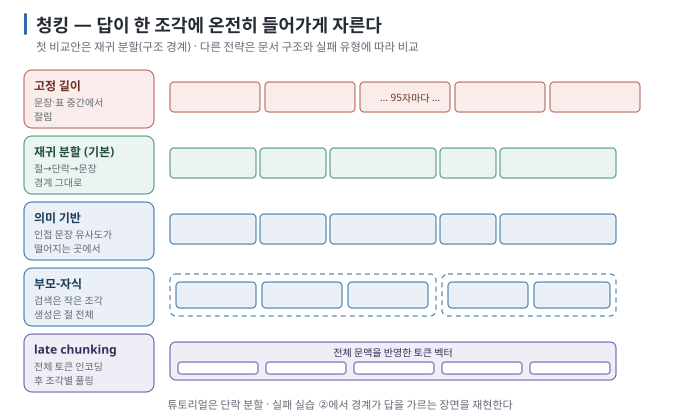
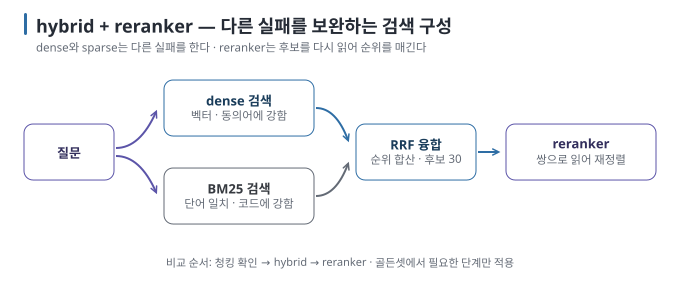
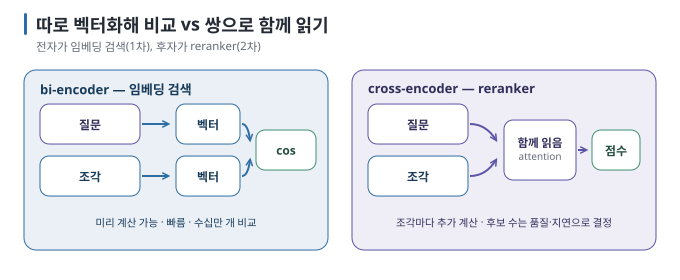

# 05 — 청킹과 검색 품질: 자르기 · 섞기 · 재정렬

RAG의 실패는 생성 모델뿐 아니라 **검색에서도** 자주 시작됩니다. 검색 품질을 좌우하는 **어떻게 잘랐는가(청킹)**,
**무엇으로 찾는가(dense·sparse·hybrid)**, **어떻게 다듬는가(reranker)를** 이 문서에서 다룹니다.

← [04 임베딩과 벡터 검색](04-embeddings-and-vector-search.md) · 다음 → [06 생성과 근거 제시](06-generation-and-grounding.md)

> **왜 읽나:** 실습에서 답이 "반만" 나온 이유는 모델이 아니라 조각 경계였습니다. 생성 모델을 바꾸기 전에 검색 결과와 조각 경계를 확인해야 하는 이유를 배웁니다.
>
> **읽고 나면:** 문서를 어떻게 자를지, 벡터와 키워드 검색을 왜 섞는지, reranker가 무엇을 더 해 주는지 알고 "청킹 → hybrid → reranker" 순서로 개선할 수 있습니다.
>
> **바쁘면:** §0 "결론 먼저"와 ★ 절만 읽고 다음 문서로 넘어가도 흐름이 끊기지 않습니다.

---

## 0. 결론 먼저 ★

- 청킹은 "답이 한 조각에 온전히 들어가도록" 자르는 일입니다. 문서의 **구조 경계**(절·단락)를 따르는 것이 기본입니다. `[해석]`
- 벡터 검색(dense)과 키워드 검색(sparse, BM25)은 **다른 실패를** 합니다. 코드·조항 번호와 자연어 질문이 함께 들어오면 두 결과를
  합치는 hybrid를 우선 비교해 볼 수 있습니다. `[자료 확인 · 2026-08-30]`
- **reranker는** 1차 검색 결과를 질문과 함께 다시 읽어 순위를 매기는 모델입니다. 품질을 높일 수 있지만 후보 수만큼 추가 계산이
  필요하므로, 실제 질문 묶음으로 개선 폭과 지연을 함께 잽니다. `[자료 확인 · 2026-08-30]`
- 이 가이드의 비교 순서는 **청킹 확인 → hybrid → reranker**입니다. 앞 단계의 문제가 남아 있으면 뒤의 부품만으로는 해결하기
  어렵기 때문입니다. 실제 시스템에서는 골든셋 결과에 따라 필요한 단계만 적용합니다. `[해석]`

## 1. 청킹 — 어떻게 자를 것인가

### 1.1 왜 잘라야 하는가

조각이 크면 벡터 하나에 여러 주제가 섞여 검색이 흐려지고, 프롬프트에 잡음이 많이 들어갑니다. 조각이 작으면 검색은
날카롭지만 답에 필요한 문맥(앞뒤 문장, 표의 머리글)이 잘려 나갑니다. `[원리]`



### 1.2 다섯 가지 전략

| 전략 | 방법 | 장점 | 단점 | 권장 |
| --- | --- | --- | --- | --- |
| **고정 길이** | N자(또는 N토큰)마다 자름, 일부 겹침(overlap) | 단순 | 문장·표 중간에서 잘림 | 첫 실험 외에는 피함 |
| **재귀 분할(구조 경계)** | 절 → 단락 → 문장 순으로 경계를 찾아 자르고, 너무 크면 한 단계 더 내려감 | 구조를 보존, 구현 쉬움 | 절이 지나치게 길면 그 안에서 다시 잘림 | **기본값** |
| **의미 기반** | 인접 문장의 임베딩 유사도가 떨어지는 지점에서 자름 | 주제 전환을 따라감 | 색인 비용 증가, 경계가 예측 불가 | 구조가 없는 긴 글 |
| **부모-자식** | 작은 조각(자식)으로 검색하고, 답변에는 그 조각이 속한 큰 단위(부모)를 넣음 | 검색 정밀 + 문맥 보존 | 구현이 한 단계 복잡 | 규정·매뉴얼처럼 절 단위 문맥이 중요한 문서 |
| **late chunking** | 문서 전체를 한 번에 임베딩한 뒤 조각 단위로 벡터를 나눔(긴 입력을 지원하는 모델 필요) | 조각이 문서 전체 문맥을 품음 | 지원 모델·도구 필요 | 상호 참조가 많은 문서 |

`[자료 확인 · 2026-08-23]` — 부모-자식과 late chunking은 2025~2026년에 널리 쓰이게 된 방식입니다. 튜토리얼과 실습은
**재귀 분할(단락 단위)을** 쓰고, 부모-자식은 🔧로 소개합니다.

### 1.3 크기의 기준선

```text
조각 크기  ≈ 200 ~ 500 토큰  (한국어 300~800자 내외)
겹침       ≈ 조각의 10 ~ 20 %
top-k      ≈ 3 ~ 8
프롬프트 예산 = top-k × 조각 크기  ≤  context 창의 절반
```

`[해석]` — 출발점일 뿐 정답이 아닙니다. 짧은 Q&A형 문서는 작게, 논증이 긴 문서는 크게 잡습니다. 중요한 것은 **한 질문의
답이 한 조각에 들어가는가를** [실습 ②](../../labs/why-rag-fails/01-retrieval-failures.md)에서 확인하는 일입니다.

### 1.4 메타데이터를 조각에 붙인다

조각 본문 앞에 **"파일명 › 절 제목"을** 한 줄 붙여 두면 임베딩에도 문맥이 들어가고, 답에 출처를 붙이기도 쉬워집니다.
`[해석]`

```text
[휴가 규정 › 3. 연차 이월]
사용하지 않은 연차는 다음 해 3월 말까지 최대 5일 이월할 수 있다. …
```

> 🔧 **한 단계 더 — 표와 코드**
>
> 표는 행 단위로 자르면 머리글을 잃습니다. 표 전체를 한 조각으로 두거나, 각 행에 머리글을 반복해 붙입니다. 코드 블록은
> 중간에서 자르지 않습니다. PDF 파싱에서 표가 깨지는 것은 청킹 이전 단계의 문제이며, 원본을 Markdown으로 변환해 두는
> 편이 대개 낫습니다. `[해석]`

## 2. dense vs sparse — 두 검색은 다른 것을 놓친다

| | dense (벡터) | sparse (BM25 등 키워드) |
| --- | --- | --- |
| 찾는 방식 | 의미 벡터의 가까움 | 단어 일치 빈도·희소성 |
| 잘 찾는 것 | 표현이 달라도 뜻이 같은 것 ("휴가 넘기기" ↔ "연차 이월") | 코드·고유명사·정확한 용어 ("EQ-2291", "제3조") |
| 놓치는 것 | 정확한 식별자, 드문 전문 용어 | 동의어, 바꿔 말하기 |
| 비용 | embedding model 필요 | 가볍고 빠름 |

`[원리]` 두 방식이 **서로 다른 질문에서 실패하므로** 섞으면 둘 다의 장점을 얻습니다. 이것이 hybrid입니다.

### 2.1 hybrid — 섞는 법 (RRF)

두 검색의 순위를 합치는 가장 단순하고 널리 쓰이는 방법이 **RRF(Reciprocal Rank Fusion)입니다**. 점수의 단위가 달라도
순위만 쓰므로 정규화가 필요 없습니다. `[원리]`

```text
RRF 점수(조각) = Σ_검색기  1 / (k + 그 검색기에서의 순위)      (k ≈ 60이 관례)

예) 조각 A: dense 1위, sparse 4위 → 1/61 + 1/64 ≈ 0.0320
    조각 B: dense 3위, sparse 1위 → 1/63 + 1/61 ≈ 0.0323  → B가 근소하게 앞섬
```



> 🔧 **한 단계 더 — 한국어 BM25**
>
> BM25는 "단어"를 세므로 한국어에서는 띄어쓰기만으로 자르면 조사·어미가 붙어 일치율이 떨어집니다("연차를" ≠ "연차").
> 형태소 분석기나 최소한 n-gram(2~3글자 조각) 토큰화를 쓰면 개선됩니다. 실습에서는 단순화를 위해 2-gram을 씁니다. `[해석]`

## 3. top-k와 점수 하한

| 값 | 작게 | 크게 |
| --- | --- | --- |
| top-k | 잡음 적음, 정답이 빠질 위험 | 정답 포함 확률↑, 잡음↑, 프롬프트 길어짐 |
| 점수 하한(threshold) | 높이면 무관한 조각 차단, 정답도 차단될 수 있음 | 낮추면 관련 없는 조각이 섞임 |

`[해석]` 첫 비교값으로 **top-k 5를** 사용할 수 있지만 정답은 아닙니다. 점수 하한은 내 데이터의 정답 질문과 문서에 없는 질문을
함께 재서 정합니다([실습 ③](../../labs/why-rag-fails/01-retrieval-failures.md)). 하한 아래의 조각밖에 없으면 모델을 호출하지 않고
"관련 문서를 찾지 못했습니다"라고 응답할 수 있습니다. 다만 실습처럼 무관한 질문의 점수가 정답보다 높으면 하한 하나로는 구분할 수 없습니다.

## 4. reranker — 후보를 다시 읽고 순위를 매긴다

embedding 검색은 질문과 조각을 **따로** 벡터화해 비교합니다(bi-encoder). reranker는 질문과 조각을 **한 쌍으로 함께**
읽어 관련도를 매깁니다(cross-encoder). 후보의 순서를 더 정교하게 만들 수 있지만, 조각마다 모델을 돌려야 하므로 느립니다. 그래서 1차 검색으로
후보를 넉넉히 뽑고, reranker로 최종 몇 개를 고르는 2단 구성이 흔합니다. 후보 수와 최종 개수는 지연·문서 길이·골든셋 결과로 정합니다. `[원리]`



| 모델 (예) | 특징 |
| --- | --- |
| bge-reranker-v2-m3 | 다국어, bge-m3와 짝. 로컬 CPU/GPU에서 실행 가능 |
| Qwen3-Reranker | Qwen3-Embedding과 짝, 크기 선택 가능 |

`[자료 확인 · 2026-08-30]` — 두 모델 모두 다국어 reranking에 사용할 수 있으며, Qwen3-Reranker는 0.6B·4B·8B 크기를 제공합니다.
어느 모델이 더 나은지는 검색 후보와 한국어 문서로 직접 비교합니다. 로컬에서는 추가 모델 하나가 메모리와 지연을 더한다는 비용도 함께 봅니다. `[해석]`

## 5. 질문 쪽을 손보는 방법 (🔧)

> 🔧 **한 단계 더 — 쿼리 변환**
>
> - **쿼리 재작성:** 구어체 질문을 검색에 맞는 형태로 LLM이 고쳐 씀("그거 몇 일까지였지?" → "연차 이월 기한")
> - **multi-query:** 질문을 3~5개로 바꿔 각각 검색한 뒤 합침(RRF)
> - **HyDE:** 질문에 대한 "가상의 답"을 LLM이 먼저 쓰고, 그 답을 임베딩해 검색 — 질문과 문서의 문체 차이를 줄임
> - **메타데이터 필터:** "2025년 이후", "휴가 규정 파일만" 같은 조건을 검색에 먼저 걸기
>
> 전부 LLM 호출이나 검색 횟수를 늘리므로 지연이 커집니다. 청킹·hybrid·reranker를 먼저 정리한 뒤에 손댑니다. `[해석]`

## 6. 이 문서의 점검표

- [ ] 조각이 절·단락 경계를 따르는가
- [ ] 한 질문의 답이 한 조각에 온전히 들어가는가 (실습 ②)
- [ ] 조각에 출처 메타데이터가 붙어 있는가
- [ ] 코드·고유명사 질문에서 dense만으로 못 찾는 경우가 있는가 → hybrid
- [ ] 점수 하한을 내 데이터로 정했는가 (실습 ③)
- [ ] top-k × 조각 크기가 context 창의 절반 이하인가

---

**다음 →** [06 생성과 근거 제시 — 조각을 읽혀 답하게 하기](06-generation-and-grounding.md)
