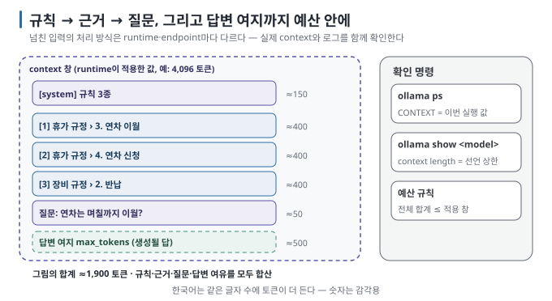

# 06 — 생성과 근거 제시: 조각을 읽혀 답하게 하기

검색이 맞는 조각을 찾아왔다면, 남은 일은 모델이 **그 조각만 보고** 답하게 만들고, **어느 조각을 근거로 썼는지**
드러내게 하는 것입니다. 이 문서는 프롬프트 조립, 근거 고정(grounding), context 예산을 다룹니다.

← [05 청킹과 검색 품질](05-chunking-and-retrieval-quality.md) · 다음 → [07 그래프 기초](07-graph-basics.md)

> **왜 읽나:** 맞는 조각을 찾아왔는데도 답이 어긋나면 프롬프트 규칙, 근거 배열, context 예산, 생성 모델을 차례로 확인해야 합니다.
>
> **읽고 나면:** 규칙 → 근거 → 질문으로 프롬프트를 조립하고, 번호 인용을 강제해 사람이 검증할 수 있는 답을 받으며, context 예산을 계산할 수 있습니다.
>
> **바쁘면:** §0 "결론 먼저"와 ★ 절만 읽고 다음 문서로 넘어가도 흐름이 끊기지 않습니다.

---

## 0. 결론 먼저 ★

- 프롬프트는 **역할·규칙 → 근거 조각(번호 붙여) → 질문** 순서로 조립합니다. `[해석]`
- "근거에 없으면 모른다고 답하라"와 "근거 번호를 인용하라"는 두 지시가 환각을 줄이는 가장 값싼 장치입니다. `[해석]`
- 입력이 context 창을 넘을 때의 처리 방식은 runtime·endpoint·버전에 따라 다릅니다. 잘림이나 오류를 답만 보고 알아채기 어려울 수 있으므로
  예산을 계산하고 runtime의 실제 창과 로그를 확인합니다. `[문서 확인 · 2026-08-30]`
- 답의 품질 판정은 "그럴듯한가"가 아니라 **"인용된 조각에 그 내용이 실제로 있는가"입니다**. `[원리]`

## 1. 프롬프트 조립



```text
[system]
너는 사내 문서 도우미다. 아래 <근거>에 있는 내용만으로 답한다.
근거에 없는 내용은 "문서에서 찾지 못했습니다"라고 답한다.
답의 각 문장 끝에 사용한 근거 번호를 [1], [2]처럼 붙인다.

[user]
<근거>
[1] (휴가 규정 › 3. 연차 이월) 사용하지 않은 연차는 다음 해 3월 말까지 최대 5일 이월할 수 있다. …
[2] (휴가 규정 › 4. 연차 신청) 연차는 3일 전까지 …
[3] (장비 규정 › 2. 반납) …
</근거>

질문: 연차는 며칠까지 이월할 수 있나요?
```

각 요소의 역할 `[해석]`:

| 요소 | 역할 | 빠지면 |
| --- | --- | --- |
| 역할 한 줄 | 모델이 "일반 상식"이 아니라 "문서 도우미"로 행동 | 학습 지식과 문서가 섞임 |
| "근거만으로" | 근거 밖 내용 차단 | 근거와 무관한 지어낸 답 |
| "없으면 모른다" | 검색 실패 시 출구 | 환각 (실패 ④) |
| 번호 인용 | 출처 추적 가능 | 어느 조각이 근거인지 사람이 확인 불가 |
| 조각에 출처 표기 | 답에 파일·절 이름을 옮길 수 있음 | "어디에 있는 규정인가"를 답 못함 |
| 질문을 맨 뒤에 | 모델이 가장 최근 내용에 주의를 더 둠 | 긴 근거 뒤에 질문이 묻힘 |

> **초심자용 한 줄:** 프롬프트는 "규칙 → 근거 → 질문"이고, 규칙의 핵심은 **"근거만, 없으면 모른다, 번호 달기"** 세 가지입니다.

## 2. 근거 고정(grounding)과 인용

인용 번호를 요구하면 두 가지를 얻습니다. `[해석]`

1. **사람이 검증할 수 있습니다.** "[1]에 정말 그 내용이 있는가"를 보면 됩니다. 이것이 실습의 판정 방법입니다.
2. **검증 지점을 명확히 만듭니다.** 답의 문장과 원문 조각을 번호로 연결해, 내용·인용·완전성을 따로 확인할 수 있습니다.

인용이 있어도 **틀린 인용은** 생깁니다 — 근거 [2]를 달고 [1]의 내용을 쓰거나, 번호만 달고 근거에 없는 문장을 쓰는 경우.
그래서 최종 판정은 항상 사람(또는 평가 도구)이 조각 원문과 대조합니다([09 §4](09-personal-vs-enterprise.md)).

### "모른다"를 말하게 하기

로컬 소형 모델도 "없으면 모른다"는 지시를 어길 수 있습니다. 보완책은 검색 단계에 있습니다 — **점수 하한 아래면 아예 모델을
부르지 않고** "관련 문서를 찾지 못했습니다"를 프로그램이 직접 답하는 것입니다([05 §3](05-chunking-and-retrieval-quality.md)).
모델의 자제력에 기대지 않는 것이 더 확실합니다. `[해석]`

## 3. context 예산

프롬프트 전체(규칙 + 조각 + 질문)와 생성할 답이 **모두** context 창 안에 들어가야 합니다. `[원리]`

```text
필요한 창  =  규칙(≈100~200 토큰)
           + top-k × 조각 크기  (예: 5 × 400 = 2,000)
           + 질문(≈50)
           + 답변 여지 max_tokens (예: 500)
           ≈ 2,800 토큰   →  여유를 두어 4,096 이상 확보
```

한국어는 토큰당 글자 수가 영어보다 적어(대략 1~2자), 같은 글자 수에 토큰이 더 듭니다. 정확한 값은 tokenizer에 따라
다르므로 위 숫자는 감각용입니다. `[해석]`

### runtime의 실제 창을 확인한다

모델이 선언한 상한(예: 128k)과 runtime이 이번 실행에 배정한 값은 다를 수 있습니다. Ollama의 현재 기본 context는 장비 메모리에
따라 달라지며, `ollama ps`에서 실제 배정값을 확인할 수 있습니다. context를 넘긴 채팅 요청은 최신 메시지와 system 메시지를
보존하면서 앞선 대화 메시지를 제외하는 방식으로 조정될 수 있고, endpoint에 따라 입력 일부가 잘리거나 오류가 날 수도 있습니다.
따라서 **"규칙부터 잘린다"고 단정하지 말고**, 실제 요청 구성·처리한 토큰 수·서버 로그를 함께 확인합니다. 로그의
`truncating input` 메시지는 중요한 신호지만, 클라이언트가 항상 별도 오류를 받는 것은 아닙니다. `[문서 확인 · 2026-08-30]`

```bash
ollama ps          # 실행 중 모델의 CONTEXT 열 = 이 실행에 적용된 창
ollama show gemma3:4b   # context length = 모델이 선언한 상한
```

OpenAI 호환 endpoint로 호출할 때 창을 늘리는 방법은 runtime마다 다릅니다. Ollama의 OpenAI 호환 API는 요청마다 context 크기를
바꾸는 필드를 제공하지 않으므로, Modelfile이나 실행 환경의 `OLLAMA_CONTEXT_LENGTH`로 모델을 준비해야 합니다. 자체 API에서는
`options.num_ctx`를 사용할 수 있습니다. 앱 쪽 상세는 [별도 가이드](../local-llm-app-integration/04-parameters-and-context.md)에서
다룹니다. `[문서 확인 · 2026-08-30]`

> 🔧 **한 단계 더 — 순서와 위치**
>
> 긴 근거에서 모델은 **처음과 끝에** 주의를 더 두고 중간을 놓치는 경향이 보고됩니다. reranker 점수가 높은 조각을 맨 앞과
> 맨 뒤에 배치하는 식의 재배열이 도움이 될 수 있습니다. 효과는 모델마다 다르므로 실습 방식으로 직접 확인합니다. `[자료 확인 · 2026-08-23]`

## 4. 생성 파라미터

| 파라미터 | RAG에서의 권장 | 이유 |
| --- | --- | --- |
| temperature | 낮게 (0~0.3) | 근거 요약에 창의성은 불필요. 일관된 인용 |
| max_tokens | 답 길이 + 여유 | 중간에 끊기면 인용이 누락됨 |
| stop | 필요 시 | 모델이 근거를 다시 되뇌는 것을 막을 때 |

`[해석]` 파라미터의 의미 자체는 [별도 가이드 04](../local-llm-app-integration/04-parameters-and-context.md)가 다룹니다.

## 5. 답의 형태를 정한다

사용자에게 보여 줄 것은 답만이 아닙니다. 튜토리얼과 실습의 스크립트는 항상 세 가지를 함께 출력합니다. `[해석]`

```text
답변:  연차는 다음 해 3월 말까지 최대 5일 이월할 수 있습니다 [1].

근거:
 [1] 휴가 규정 › 3. 연차 이월   (score 0.81)
 [2] 휴가 규정 › 4. 연차 신청   (score 0.62)
 [3] 장비 규정 › 2. 반납        (score 0.41)

판정 힌트: [1]에 "3월 말", "5일"이 실제로 있는가?
```

근거 목록이 있어야 03 §3의 진단 플로우를 돌릴 수 있습니다. 서비스로 만들 때도 **근거 목록은 숨기더라도 저장해** 두어야
나중에 "왜 그렇게 답했는가"를 되짚을 수 있습니다([09 §3](09-personal-vs-enterprise.md)).

---

여기까지가 RAG의 뼈대입니다. **직접 만들어 보려면 →** [튜토리얼: 내 문서에 답하는 Local RAG 만들기](../../tutorials/local-rag-build/README.md)

**계속 읽으려면 →** [07 그래프 기초와 지식 그래프](07-graph-basics.md)
