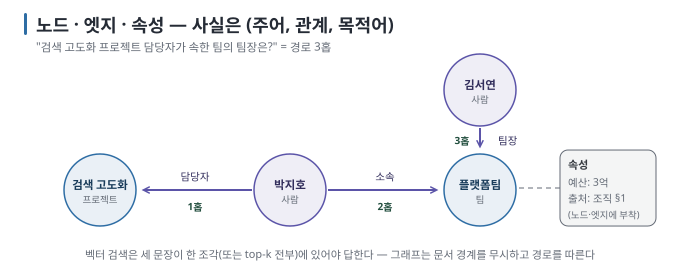

# 07 — 그래프 기초와 지식 그래프: 점과 선으로 관계를 저장한다

벡터 검색은 "비슷한 조각"을 찾지만, "A의 담당자가 속한 팀의 팀장"처럼 **관계를 따라가는** 질문에는 약합니다. 이 문서는
그래프가 무엇인지, 지식 그래프가 문서를 어떻게 다르게 저장하는지, graph database가 vector store와 어디가 다른지를
다룹니다.

← [06 생성과 근거 제시](06-generation-and-grounding.md) · 다음 → [08 GraphRAG](08-graphrag.md)

> **왜 읽나:** "검색 고도화 담당자가 속한 팀의 팀장은?" — 답은 세 문장에 흩어져 있고, 벡터 검색은 세 문장을 동시에 집어야 합니다. 그래프는 선을 따라갑니다.
>
> **읽고 나면:** 노드·엣지·트리플로 사실을 표현하고, 그래프가 벡터와 다른 질문을 푼다는 것과 그래프를 만드는 비용이 어디서 오는지 설명할 수 있습니다.
>
> **바쁘면:** §0 "결론 먼저"와 ★ 절만 읽고 다음 문서로 넘어가도 흐름이 끊기지 않습니다.

---

## 0. 결론 먼저 ★

- 그래프는 **노드(점)와** **엣지(선)로** 이루어진 구조이고, 지식 그래프는 노드가 개체(사람·팀·제품), 엣지가 관계(소속·담당)인
  그래프입니다. `[원리]`
- 사실 하나는 **트리플** `(주어, 관계, 목적어)`로 저장합니다. "박지호는 플랫폼팀 소속" → `(박지호, 소속, 플랫폼팀)`. `[원리]`
- 그래프의 강점은 **여러 관계를 건너뛰는 질문(multi-hop)과** **전체 구조 파악이고**, 약점은 **만드는 비용**(문서에서 개체·관계를
  뽑아야 함)입니다. `[해석]`
- vector store와 graph store는 대체재가 아니라 **다른 질문을 푸는 저장소이며**, 보통 함께 씁니다. `[해석]`

## 1. 그래프의 구성 요소



| 요소 | 뜻 | 예 |
| --- | --- | --- |
| 노드(node, vertex) | 개체 하나 | `김서연`, `플랫폼팀`, `검색 고도화 프로젝트` |
| 엣지(edge, relationship) | 두 노드 사이의 관계. 방향과 이름이 있음 | `김서연 —팀장→ 플랫폼팀` |
| 속성(property) | 노드·엣지에 붙는 값 | 팀 노드의 `예산: 3억`, 엣지의 `출처: 조직 문서 §1` |
| 라벨(label, type) | 노드·엣지의 종류 | 노드 `사람`·`팀`·`프로젝트`, 엣지 `소속`·`담당` |

`[원리]` 속성에 **출처를** 넣어 두는 것이 RAG에서 중요합니다. 그래프를 따라 찾은 사실도 "어느 문서의 어느 문장에서 왔는가"를
답해야 하기 때문입니다.

> **초심자용 한 줄:** 벡터 저장소는 "비슷한 글 조각의 창고"이고, 그래프는 "누가 무엇과 어떻게 연결돼 있는지의 지도"입니다.

## 2. 트리플 — 사실의 최소 단위

```text
문장:   "플랫폼팀의 팀장은 김서연이다. 플랫폼팀에는 박지호가 소속되어 있다."

트리플: (김서연, 팀장, 플랫폼팀)
        (박지호, 소속, 플랫폼팀)

문장:   "검색 고도화 프로젝트의 담당자는 박지호다."
트리플: (박지호, 담당자, 검색 고도화 프로젝트)
```

세 트리플을 이으면 질문 "검색 고도화 프로젝트 담당자가 속한 팀의 팀장은?"은 위 그림을 질문의 출발점부터 따라 풀립니다.
프로젝트에서 `담당자` 엣지를 역방향으로 따라 박지호를 찾고(1홉), `소속`을 따라 플랫폼팀으로 간 뒤(2홉), `팀장` 엣지를
역방향으로 따라 김서연에 도착합니다(3홉). `[원리]`

벡터 검색으로 이 질문에 답하려면 세 문장이 **한 조각에** 있거나, 세 조각이 **모두** top-k에 들어와야 합니다. 조각이 다른
문서에 흩어져 있으면 어렵습니다. 그래프는 경로를 따라가므로 문서의 경계를 무시합니다. 이것이 multi-hop 질문에서
그래프가 유리한 이유입니다. `[원리]`

관계의 방향은 데이터 모델이 정합니다. 예를 들어 `김서연 —팀장→ 플랫폼팀`과 `플랫폼팀 —팀장→ 김서연`은 둘 다 설계할 수
있지만, 한 그래프 안에서는 같은 관계를 같은 방향으로 저장해야 질의가 단순해집니다. 이 가이드는 **사람에서 소속·담당 대상으로**
향하는 방향을 사용합니다. 외부 데이터나 LLM 추출 결과를 가져올 때는 방향을 이 규칙에 맞게 정규화합니다. `[해석]`

## 3. 그래프는 어디서 오는가

| 출처 | 방법 | 비용·정확도 |
| --- | --- | --- |
| 이미 구조화된 데이터 | DB 테이블·조직도·제품 카탈로그를 노드·엣지로 변환 | 싸고 정확 |
| 문서(비구조) | **LLM이 문장에서 트리플을 추출** | 비싸고(조각마다 LLM 호출) 오류 섞임 |
| 사람 | 직접 작성·검수 | 가장 정확, 가장 느림 |

`[해석]` GraphRAG가 비싼 이유는 두 번째 줄입니다. 문서 전체를 LLM에 한 번씩 읽혀야 하고, 같은 개체가 "김서연"·"김 팀장"·"서연님"으로
흩어지면 **개체 통합(entity resolution)이** 추가로 필요합니다. 로컬 소형 모델로 추출하면 속도와 정확도 모두 제한이 있으므로
[08 §4](08-graphrag.md)에서 현실적인 범위를 다룹니다.

## 4. graph database — 무엇이 다른가

| | vector store | graph database |
| --- | --- | --- |
| 저장 단위 | 조각 벡터 + 원문 | 노드·엣지·속성 |
| 찾는 방식 | 가장 가까운 k개 | 경로 탐색, 패턴 매칭 |
| 잘 푸는 질문 | "…에 대해 설명해 줘" (유사) | "A와 B는 어떻게 연결되나", "X에 속한 것 전부" (관계) |
| 질의 언어 | SDK 호출 | Cypher, Gremlin, SPARQL 등 |
| 도구 (예) | Chroma, pgvector, Qdrant | Neo4j, FalkorDB, (학습용) NetworkX |

`[자료 확인 · 2026-08-30]` — 여러 제품이 벡터 인덱스와 그래프를 **한 저장소에서** 지원하기도 합니다. 경계는
제품마다 다르므로 "둘 중 하나"보다 "두 종류의 질의가 필요한가"로 판단합니다. `[해석]`

### Cypher 한 줄 감각

Neo4j 계열의 질의 언어 Cypher는 패턴을 **그림 그리듯** 씁니다. 위 3홉 질문은 이렇게 됩니다. `[문서 확인 · 2026-08-30]`

```cypher
MATCH (p:프로젝트 {이름: "검색 고도화 프로젝트"})<-[:담당자]-(사람)-[:소속]->(팀)<-[:팀장]-(팀장)
RETURN 팀장.이름
```

`(노드)-[:관계]->(노드)` 표기가 곧 트리플입니다. 이 가이드의 실습은 Cypher 대신 Python의 NetworkX로 같은 탐색을 구현해
원리를 드러냅니다([실습 ⑤](../../labs/why-rag-fails/03-multi-hop.md)).

## 5. 그래프가 약한 것

- **모호한 의미 질문:** "분위기가 좋은 팀은?" — 관계로 정의되지 않는 것은 그래프에 없습니다. 벡터의 영역입니다. `[원리]`
- **긴 설명 텍스트:** 트리플은 사실을 압축하므로 원문의 뉘앙스·조건·예외가 사라집니다. 답변에는 원문 조각이 여전히
  필요합니다. `[해석]`
- **추출 오류:** LLM이 잘못 뽑은 관계는 그래프에 **사실처럼** 남습니다. 검수나 출처 표시 없이는 위험합니다. `[해석]`

그래서 실무의 결론은 "그래프 **대신**"이 아니라 "벡터 **+** 그래프"입니다. 다음 문서가 그 결합을 다룹니다.

---

**다음 →** [08 GraphRAG — 언제 그래프가 필요한가](08-graphrag.md)
