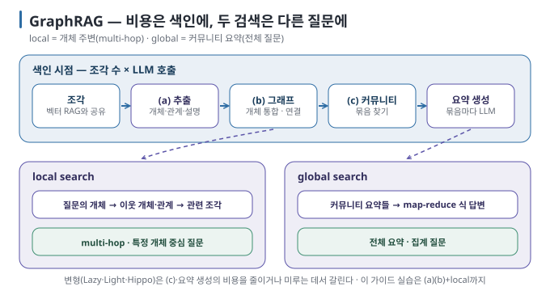
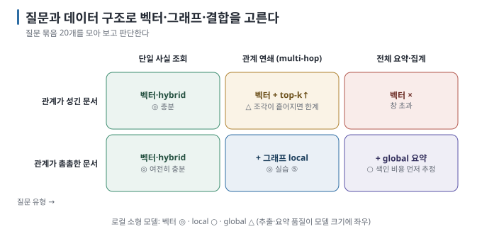

# 08 — GraphRAG: 언제 그래프가 필요한가

GraphRAG는 색인 시점에 문서에서 지식 그래프를 뽑아 두고, 질의 시점에 그래프를 따라가며 근거를 모으는 RAG의 변형입니다.
이 문서는 **어떤 질문에서 벡터 RAG가 막히는지**, GraphRAG의 대표 구조, 변형들, 비용, 그리고 **벡터·그래프·결합의 선택
규칙을** 다룹니다. 손으로 돌려 보는 실습은 별도 자료([실습 ⑤](../../labs/why-rag-fails/03-multi-hop.md))에 있습니다.

← [07 그래프 기초](07-graph-basics.md) · 다음 → [09 개인 RAG와 기업 RAG](09-personal-vs-enterprise.md)

> **왜 읽나:** GraphRAG는 모든 질문의 기본값이 아닙니다. 벡터 검색만으로 근거를 모으기 어려운 관계 연쇄·전체 요약 질문이 실제로 있는지 판단하는 것이 이 문서의 핵심입니다.
>
> **읽고 나면:** multi-hop·global 질문을 알아보고, GraphRAG의 구조와 변형을 비용 관점에서 비교하며, 실습 ⑤에서 최소 GraphRAG를 돌려 오추출까지 눈으로 볼 준비가 됩니다.
>
> **바쁘면:** §0 "결론 먼저"와 ★ 절만 읽고 다음 문서로 넘어가도 흐름이 끊기지 않습니다.

---

## 0. 결론 먼저 ★

- 단일 사실 조회("연차 이월 기한은?")는 먼저 **벡터·hybrid RAG로** 검증합니다. 그래프를 더해도 이득이 작을 수 있습니다. `[해석]`
- **여러 관계를 건너뛰는 질문**(multi-hop)과 **전체를 훑는 질문**("이 문서 묶음의 주요 주제는?")은 그래프를 검토할 신호입니다. `[자료 확인 · 2026-08-30]`
- 그래프 검색도 답변 근거로는 원문 조각을 함께 사용하는 편이 안전합니다. 그래프는 관계 경로를 찾고, 원문은 조건·예외와 출처를 보존합니다. `[해석]`
- GraphRAG의 비용은 **색인 시점에** 몰려 있습니다(문서 전체를 LLM이 읽고 추출). 로컬 소형 모델로는 작은 문서 묶음에서
  개념을 익히는 데 적합하고, 대규모 적용은 별도 설계가 필요합니다. `[해석]`

## 1. 벡터 RAG가 막히는 두 종류의 질문

| 질문 유형 | 예 | 벡터 RAG의 문제 |
| --- | --- | --- |
| **multi-hop** (관계 연쇄) | "검색 고도화 프로젝트 담당자가 속한 팀의 올해 예산은?" | 답이 3개 조각에 흩어져 있고, 질문 문장과 개별 조각의 유사도는 낮음 |
| **global** (전체 요약·집계) | "우리 규정 문서들에서 가장 자주 등장하는 의무 사항은?" "모든 프로젝트의 담당자 목록" | top-k 조각으로는 전체를 볼 수 없음. k를 늘리면 context 초과 |

`[원리]` 첫 번째는 **경로 탐색**, 두 번째는 **집계·요약이** 필요한데, 둘 다 "가장 비슷한 k개"라는 벡터 검색의 형태와 맞지
않습니다.

## 2. 대표 구조 — 추출 → 그래프 → 커뮤니티 요약

널리 알려진 구조(Microsoft GraphRAG가 대표)는 색인 시점에 세 단계를 둡니다. `[문서 확인 · 2026-08-30]`

| 단계 | 하는 일 | 비용 |
| --- | --- | --- |
| (a) 추출 | 조각마다 LLM이 개체·관계·설명을 뽑음 | 조각 수 × LLM 호출 |
| (b) 그래프 구성 | 개체를 합치고(같은 이름 통합) 엣지를 연결 | 계산 |
| (c) 커뮤니티 요약 | 촘촘히 연결된 개체 묶음(커뮤니티)을 찾고, 묶음마다 LLM이 요약문 작성. 여러 층(계층)으로 | 커뮤니티 수 × LLM 호출 |

질의 시점에는 두 가지 검색이 있습니다.

| 검색 | 방법 | 푸는 질문 |
| --- | --- | --- |
| **local search** | 질문의 개체에서 출발해 이웃 개체·관계·관련 조각을 모아 답함 | multi-hop, 특정 개체 중심 |
| **global search** | 커뮤니티 요약들을 모아 map-reduce식으로 답함 | 전체 요약·집계 |

`[문서 확인 · 2026-08-30]` — 이 구현은 **GraphRAG 구조를 이해하기 위한 대표 사례이지, 모든 환경의 기본 추천 도구는** 아닙니다.
원형 구조의 큰 색인 비용을 줄이거나 다른 검색 방식을 결합한 후속 접근도 함께 비교해야 합니다. 도구의 개발 상태와 지원 기능은
도입 시점에 공식 문서에서 다시 확인합니다.

## 3. 변형들 — 비용을 어디서 줄였나

| 변형 | 아이디어 | 비용을 줄인 곳 |
| --- | --- | --- |
| **LazyGraphRAG** | 커뮤니티 요약을 **색인 때 미리 만들지 않고** 질의 때 필요한 만큼만 생성 | 색인 비용 (보고에 따라 수십 배 절감) |
| **LightRAG** | 그래프와 벡터를 **이중 인덱스로** 두고, 개체·관계에도 임베딩을 붙여 검색. 문서 추가 시 **증분 갱신** | 재색인 비용, 질의 지연 |
| **HippoRAG 2** | 개체 그래프 위에서 **Personalized PageRank로** 질문과 연관된 노드를 퍼뜨려 찾음 | 요약 생성 없이 multi-hop |

`[자료 확인 · 2026-08-30]` — 이름·세부는 빠르게 바뀝니다. 공통 흐름은 두 가지입니다. `[해석]`

1. **그래프 + 벡터 결합이** 기본형이 됐다 — 그래프만으로 답하지 않고 원문 조각을 함께 넣는다.
2. **색인 비용 절감이** 경쟁의 축이다 — 요약을 미루거나, 증분 갱신을 지원하거나, 요약 자체를 생략한다.

## 4. 로컬에서의 현실

로컬 소형 모델(4~8B)로 GraphRAG를 돌릴 때 부딪히는 것들입니다. `[해석]`

| 문제 | 증상 | 대응 |
| --- | --- | --- |
| 추출 속도 | 조각 100개에 수 분~수십 분 | 작은 문서 묶음으로 시작, 구조화 출력으로 파싱 실패 제거 |
| 추출 품질 | 관계 이름이 들쭉날쭉("팀장"·"리더"·"책임자"), 개체 표기 불일치 | 프롬프트에 관계 이름 목록을 예시로 고정, 이름 정규화 단계 추가 |
| 환각 트리플 | 문장에 없는 관계를 생성 | 트리플에 출처 문장을 저장하고 검수 |
| 커뮤니티 요약 | 요약 품질이 모델 크기에 크게 좌우 | 처음엔 local search만 사용 |

그래서 [실습 ⑤](../../labs/why-rag-fails/03-multi-hop.md)는 **추출 → 그래프 → local search(이웃 탐색)까지만** 구현하고, 커뮤니티 요약(global)은
개념으로 둡니다.

## 5. 실습으로 확인한 것

[실습 ⑤](../../labs/why-rag-fails/03-multi-hop.md)는 조직·프로젝트 문서 몇 편에서 LLM으로 트리플을 뽑아 NetworkX 그래프를 만들고, 질문의 개체에서
이웃을 따라가 답합니다. 커뮤니티 요약(global)은 구현하지 않고 local search까지만 만듭니다. 작성 환경에서 눈에 띈 것은 두 가지입니다.
`[실행 검증 · 2026-08-30]`

- **관계 방향이 문장과 다르게 잡힙니다.** "플랫폼팀의 팀장은 김서연"을 모델이 `플랫폼팀 —팀장→ 김서연`으로 뽑기도 합니다. 틀린 것은
  아니지만 [07 §2](07-graph-basics.md)의 그림과 반대이고, 그래서 실습의 탐색은 **무방향입니다**.
- **원문에 없는 관계가 사실처럼 들어갑니다.** §4의 "환각 트리플"이 문서 몇 편짜리 실습에서도 나옵니다. 트리플마다 출처를 저장하고
  `--build` 출력을 눈으로 대조하는 절차가 실습에 들어 있는 이유입니다.

같은 multi-hop 질문을 벡터 RAG로 던졌을 때 무엇이 달라지는지 — 문서가 한 편일 때와 여러 편으로 흩어졌을 때 — 는 실습 ⑤의 실측 표를
보세요. 그 차이가 §6 "출발은 벡터"의 근거입니다.

## 6. 선택 규칙 — 벡터 · 그래프 · 결합

선택은 다음 순서로 좁힙니다. `[해석]`

1. 실제 사용자가 물을 질문을 20개쯤 모읍니다.
2. 단일 사실 조회가 대부분이면 벡터·hybrid RAG를 먼저 평가합니다.
3. 관계를 두 번 이상 따라가야 하는 질문이 반복되면 그래프 local search를 더해 같은 골든셋으로 비교합니다.
4. 문서 전체의 주제·집계가 필요하면 global search를 검토하되, 색인 비용과 갱신 주기를 먼저 계산합니다.

기본 출발점은 벡터·hybrid 검색이지만 절대 규칙은 아닙니다. 이미 신뢰할 수 있는 조직도·카탈로그·관계형 데이터가 있고 질문도
관계 중심이라면 그래프에서 시작하는 편이 자연스럽습니다. 중요한 것은 도구 유행이 아니라 **실제 질문과 보유 데이터 구조를**
기준으로 고르는 것입니다.

| 조건 | 벡터·hybrid | + 그래프 local | + global 요약 |
| --- | --- | --- | --- |
| 질문이 단일 사실 | ◎ | ○ (이득 적음) | × |
| 관계 연쇄 질문이 잦음 | △ | ◎ | ○ |
| 전체 요약·집계 질문 | × | △ | ◎ |
| 문서가 자주 바뀜 | ◎ (재색인 쉬움) | ○ (증분 지원 도구 필요) | △ (요약 재생성) |
| 로컬 소형 모델 | ◎ | ○ | △ |

---

**다음 →** [09 개인 RAG와 기업 RAG — 파이프라인 아키텍처 비교](09-personal-vs-enterprise.md)
