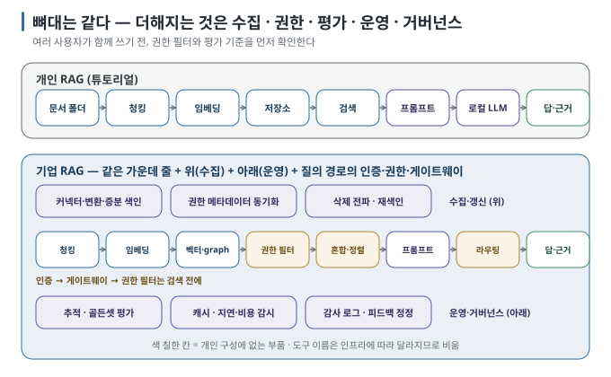
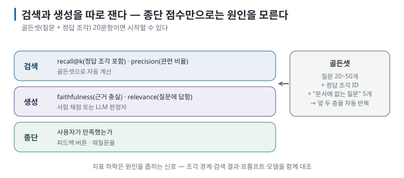

# 09 — 개인 RAG와 기업 RAG: 파이프라인 아키텍처 비교

튜토리얼에서 만든 60줄 남짓의 RAG와 기업이 운영하는 RAG는 **같은 뼈대를** 가집니다. 차이는 뼈대가 아니라, 여러 사람이 안전하게
오래 쓰게 만들기 위해 뼈대 주변에 붙는 부품들입니다. 이 문서는 기업 RAG 파이프라인의 기본 아키텍처를 보여 주고, 개인
구성과 **무엇이 같고 무엇이 다른지** 대조합니다.

← [08 GraphRAG](08-graphrag.md) · 다음 → [10 용어집](10-glossary.md)

> **왜 읽나:** 튜토리얼의 60줄과 기업 RAG는 뼈대가 같습니다. 다른 것은 "누가 볼 수 있는가"와 "틀렸는지 어떻게 아는가"입니다.
>
> **읽고 나면:** 기업 파이프라인 그림에서 내 구성에 없는 부품을 짚고, 권한 필터를 검색 전에 두는 이유와 골든셋 20문항으로 평가를 시작하는 법을 말할 수 있습니다.
>
> **바쁘면:** §0 "결론 먼저"와 ★ 절만 읽고 다음 문서로 넘어가도 흐름이 끊기지 않습니다.

---

## 0. 결론 먼저 ★

- 뼈대(파싱 → 청킹 → 임베딩 → 저장 → 검색 → 생성)는 **같습니다**. 튜토리얼의 코드가 곧 기업 파이프라인의 축소판입니다. `[원리]`
- 기업 구성이 더하는 것은 다섯 묶음입니다 — **수집·갱신 자동화, 권한 필터, 평가·관측, 운영 경로(게이트웨이·캐시), 거버넌스**. `[해석]`
- 개인 구성에서 기업용으로 확장할 때 먼저 확인할 것은 **권한 필터와** **평가입니다**. 누락되면 정보 노출과 품질 회귀를 알아채지 못할 수 있습니다. `[해석]`
- 이 문서는 기업 구성의 **지도이지** 설계서가 아닙니다. 각 부품의 완성된 설계는 범위 밖입니다.

## 1. 두 아키텍처를 나란히

`[해석]` 가운데 줄(검색 → 생성)은 튜토리얼과 같습니다. 위(수집)와 아래(운영)가 더해졌고, 질의 경로에 **인증·권한 필터·게이트웨이가**
끼어들었습니다.

## 2. 추가되는 부품 — 무엇을, 왜

| 묶음 | 부품 | 개인 구성에서는 | 기업에서 필요한 이유 |
| --- | --- | --- | --- |
| **수집·갱신** | 소스별 커넥터, 변환(PDF·HWP·표), 증분 색인, 삭제 전파 | 폴더에 파일 넣고 재실행 | 문서가 수만 건·여러 시스템·매일 바뀜. 지운 문서가 검색에 남으면 사고 |
| **권한** | 문서별 ACL(접근 권한 목록)을 조각 메타데이터로 동기화, 질의 시 사용자 권한으로 **검색 전** 필터 | 없음 (내 문서는 다 내 것) | 인사 문서가 일반 직원 답변에 섞이면 안 됨. **검색 후 필터는 늦다** — 모델이 이미 읽음 |
| **검색 품질** | hybrid + reranker, 쿼리 재작성, 메타데이터 필터, 캐시 | dense, 필요시 hybrid | 질문 다양성이 크고 품질 기준이 높음 |
| **생성 경로** | 게이트웨이(인증·라우팅·마스킹), 모델 라우팅(로컬/외부), 프롬프트 버전 관리 | 로컬 모델 직접 호출 | 여러 앱·여러 모델·민감 정보 차단을 한곳에서 |
| **평가·관측** | 골든셋, 자동 판정(검색 recall, 근거 충실도), 추적(trace), 지연·비용 대시보드 | 눈으로 근거 대조 | 사람이 전부 볼 수 없음. 바꿨을 때 나빠졌는지 **수치로** 알아야 함 |
| **거버넌스** | 감사 로그(누가 무엇을 물었고 어떤 근거로 답했나), 보존 기간, 피드백·정정 절차 | 없음 | 규제·책임 추적·개선 루프 |

`[해석]` — 도구 이름을 일부러 적지 않았습니다. 각 칸에 어떤 제품을 놓을지는 이미 운영 중인 인프라(DB·인증·로그)에 따라
달라지며, 프레임워크·관측 도구·게이트웨이 제품이 빠르게 바뀝니다. `[자료 확인 · 2026-08-30]`

> **초심자용 한 줄:** 기업 RAG = 개인 RAG + "문서가 알아서 들어오고(수집)", "볼 사람만 보고(권한)", "틀리면 숫자로 알고(평가)",
> "누가 뭘 물었는지 남는(감사)" 네 가지.

## 3. 권한 필터 — 가장 먼저 빠지는 것

개인 구성에서 기업 구성으로 갈 때 가장 먼저 설계해야 하는 부품입니다. 핵심 원칙 두 가지. `[해석]`

1. **검색 전 필터(pre-filter):** 사용자가 볼 수 있는 문서의 조각만 검색 대상에 넣습니다. 검색 후 걸러 내면 top-k가 줄어
   품질이 떨어지고, 더 나쁘게는 필터 누락 시 모델이 이미 읽은 내용이 답에 섞입니다.
2. **권한의 단일 기준 원본(Single Source of Truth, SSoT)은 원본 시스템:** 조각의 권한 메타데이터는 원본(파일서버·위키)의
   ACL을 **주기적으로 동기화한 사본입니다.** 원본에서 권한이 바뀌면 색인도 따라가야 합니다.

질의 시점에는 **사용자 인증 → 읽을 수 있는 문서 집합 계산 → vector database의 metadata filter → 검색** 순서로 처리합니다.

튜토리얼의 코드로 흉내 내려면 조각 메타데이터에 `allowed_groups`를 넣고, 검색 전에 `[c for c in chunks if user_group in c["allowed_groups"]]`
로 거르면 됩니다. 원리는 그것뿐이고, 어려운 것은 **동기화와 누락 방지입니다**.

## 4. 평가 — 눈 대신 숫자로

실습에서 한 "근거 판정"을 **반복 가능하게** 만든 것이 평가입니다. `[해석]`

| 층 | 재는 것 | 방법 |
| --- | --- | --- |
| 검색 | 정답 조각이 top-k에 들어왔는가 (recall@k), 들어온 조각 중 관련 비율 (precision) | **골든셋**: 질문 + 정답 조각 ID 목록. 20~50문항이면 시작 가능 |
| 생성 | 답이 근거에 충실한가(faithfulness), 질문에 답했는가(relevance) | 사람이 채점 또는 **LLM 판정자**(다른 모델에게 "근거에 있는가"를 묻기) |
| 종단 | 사용자가 만족했는가 | 피드백 버튼, 재질문율 |

원칙: **검색과 생성을 따로 잽니다.** 종단 점수만 보면 "왜 나빠졌는지"를 알 수 없습니다. 청킹을 바꿨는데 recall이 떨어졌다면
청킹 문제, recall은 같은데 faithfulness가 떨어졌다면 프롬프트·모델 문제 — 실습의 진단표가 그대로 지표가 됩니다.

`[자료 확인 · 2026-08-23]` — 이 층 구조를 자동화한 오픈소스 평가 도구들이 있으며, 대부분 faithfulness·relevance·context
precision/recall류의 지표를 제공합니다. 도구보다 **골든셋을 먼저 만드는 것이** 중요합니다.

> 🔧 **한 단계 더 — 골든셋 20문항 만들기**
>
> 튜토리얼의 문서 4편으로 바로 만들 수 있습니다. 질문 20개를 쓰고, 각 질문의 정답 조각 번호(`--show`의 #)를 적습니다. 이 중
> 5개는 "문서에 없는 질문"으로 두고 정답을 "없음"으로 둡니다. 그다음 검색만 20번 돌려 질문별 필수 근거를 모두 찾았는지
> 질문 성공률(`question success@3`)로, 필수 구절을 몇 개 찾았는지 필수 구절 재현율(`phrase recall@3`)로 셉니다. 청킹·top-k·hybrid를 바꿀 때마다 같은
> 숫자를 비교하세요. 스크립트와 실측은 [실습 ④](../../labs/why-rag-fails/04-golden-set.md)에 있습니다.

## 5. 도입 순서 — 개인 구성에서 한 단계씩

1. 튜토리얼의 작은 RAG로 검색 결과와 근거를 눈으로 확인합니다.
2. 실제 질문을 골든셋으로 만들고 검색·생성 품질의 기준선을 잽니다.
3. 기준선에서 드러난 문제에 따라 hybrid·reranker·점수 하한을 하나씩 추가합니다.
4. 문서 수와 갱신 빈도가 커질 때 영속 저장소와 증분 색인을 도입합니다.
5. 여러 사용자가 쓰기 전에는 권한 메타데이터와 검색 전 필터를 검증합니다.
6. 운영 단계에서 게이트웨이·추적·감사 로그를 붙입니다. multi-hop·global 질문이 확인되면 GraphRAG를 별도로 비교합니다.

측정 없이 도구부터 늘리면 변경 전보다 나아졌는지 알 수 없습니다. 각 단계에서 같은 골든셋을 다시 실행하고, 다음 부품이 해결할
문제가 확인됐을 때만 확장합니다. `[해석]`

## 6. 이 가이드가 멈추는 지점

S4 이후의 부품 — 인증 연동, 게이트웨이, DLP·마스킹, 감사 로그 보존, 규제 대응 — 은 RAG가 아니라 **조직의 AI 운영 체계의**
일부입니다. 그 체계는 RAG 하나가 아니라 여러 앱과 모델에 공통으로 적용되므로 별도 주제로 다루는 것이 맞습니다. 이
가이드는 "그런 부품이 어디에 끼는지"까지만 보여 줍니다. `[해석]`

---

**다음 →** [10 용어집](10-glossary.md)
