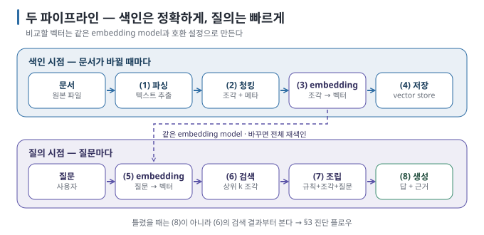

# 내 문서와 대화하는 AI 이해하기 — RAG와 Graph


로컬 LLM에게 "우리 회사 연차는 며칠까지 이월돼?"라고 물어보면, 모델은 실제 규정을 모른 채 그럴듯한 답을 만들 수 있습니다.
회사 내부 규정은 모델의 학습 데이터에 없기 때문입니다. 이 가이드는 모델이 **내 PC의 문서를 검색해 근거와 함께 답하도록 만드는
원리와, 답이 틀렸을 때 검색·청킹·생성 중 어느 단계부터 확인할지** 설명합니다. 이 방식을 **RAG(Retrieval-Augmented Generation,
검색 증강 생성)라고** 하며, 핵심 구조는 Python 함수 다섯 개로도 직접 확인할 수 있습니다.

이 가이드는 세 편으로 이어지는 시리즈의 첫 편입니다. **이해(이 가이드) → 만들기([튜토리얼](../../tutorials/local-rag-build/README.md))
→ 틀리는 이유([실습](../../labs/why-rag-fails/README.md))** 순서이며, 원리를 먼저 알고 싶으면 여기서, 손부터 움직이고 싶으면
튜토리얼에서 시작해도 됩니다.

**가이드 작성 중 직접 확인한 검증 기록** — 실습 자료에 실행 결과와 함께 수록되어 있습니다.

- 같은 문서, 같은 질문인데 "조각을 어떻게 잘랐는가"에 따라 답이 **반만** 나왔습니다. 모델 탓이 아니었습니다. (실습 ②)
- 문서에 없는 "연차 교육"을 묻자 모델이 "보안 교육 연 1회" 조각을 보고 **"연차 교육은 연 1회"라고** 지어냈습니다 — 근거 번호까지 달아서. (실습 ③′)
- 문서에서 뽑은 지식 그래프에 **원문에 없는 관계가** 사실처럼 들어가 있었고, 홉 수가 하나 모자라자 모델이 빈칸을 채워 틀린 팀장을
  답했습니다. 같은 질문에 벡터 RAG는 top-k 3에서 "못 찾았다", 5에서 **엉뚱한 팀**, 8에서야 정답이었습니다. (실습 ⑤)
- 벡터 검색이 놓칠 거라 예상한 자산 코드 "EQ-2291"을 bge-m3는 찾아냈습니다. 다만 정답과 다음 조각의 점수 차이는 0.06으로,
  키워드 검색보다 구분이 흐렸습니다. 작은 실습에서는 맞았지만 더 많은 문서에서도 유지되는지는 별도 검증이 필요합니다. (실습 ①)

RAG의 뼈대에서 시작해 임베딩·청킹·근거 고정을 지나, 문서에 흩어진 개체 사이의 **관계가** 중요해질 때 검토하는
**Graph·GraphRAG까지** 간 뒤,
개인이 만든 구성과 기업이 운영하는 구성이 어디서 갈라지는지 비교합니다.

> 이 가이드는 모델이 이미 내 장비에서 실행되고 있다는 전제에서 출발합니다. 모델을 띄우는 방법 자체는
> [내 장비에서 LLM 직접 실행하기](../local-llm/README.md)에서 다룹니다. 본문 명령과 실습의 실제 검증 범위는
> [검증 기록](VALIDATION.md)에서 먼저 확인하세요.

**[개념부터 시작 → 01 RAG·Graph 생태계 지도](01-ecosystem-map.md)** ·
**[바로 만들기 → 튜토리얼: 내 문서에 답하는 Local RAG 만들기](../../tutorials/local-rag-build/README.md)**

## 학습 달성 목표(Learning Objective) — 이 가이드를 끝내면 할 수 있는 것

- LLM이 내 문서를 "모르는" 이유와, RAG·Long Context·Fine-tuning 중 무엇을 언제 고르는지 설명할 수 있습니다.
- 문서 → 조각(chunk) → 벡터 → 검색 → 프롬프트 → 근거 있는 답변으로 이어지는 파이프라인을 단계별로 그릴 수 있습니다.
- 답이 틀렸을 때 검색·청킹·생성 중 **어느 단계가 틀렸는지** 진단 플로우로 좁힐 수 있습니다.
- 그래프가 벡터 검색과 무엇이 다른지, 어떤 질문에서 GraphRAG를 비교할지 판단할 수 있습니다.
- 기업 RAG 파이프라인의 구성 요소를 읽고, 개인 구성에서 무엇이 빠져 있는지 짚을 수 있습니다.

## 가장 짧은 경로 — 30분 안에 내 문서에 답하는 RAG

원리보다 결과를 먼저 보고 싶다면 이 가이드를 건너뛰고 튜토리얼로 가도 됩니다. Ollama가 실행 중인 PC에서 다음 두 모델만 받아
두면 바로 시작할 수 있습니다. `[실행 검증 · 2026-08-30]`

```bash
ollama pull bge-m3      # 임베딩 모델
ollama pull gemma3:4b   # 대화 모델
```

**[튜토리얼: 내 문서에 답하는 Local RAG 만들기 →](../../tutorials/local-rag-build/README.md)** — 가상 규정 4편, Python 한 파일,
벡터 데이터베이스 없이 **임베딩 + 리스트 + 코사인 유사도만으로** 근거 있는 답을 받는 데까지 갑니다. 답이 나왔다고 끝내지 말고
[실습: RAG는 왜 틀리는가](../../labs/why-rag-fails/README.md)로 이어가세요. 같은 스크립트로 실패를 일부러 만들어 보는 것이
이 시리즈에서 가장 많이 배우는 구간입니다.

## 이 가이드의 사용법 — Index → Ask → Prove

RAG는 "모델을 바꾸는 일"이 아니라 "모델에게 답변 시점에 근거를 건네는 일"입니다. 그래서 작업은 항상 세 단계로
나뉘고, 문제가 생기면 세 단계 중 어디가 틀렸는지부터 좁힙니다.

| 단계 | 확인할 것 | 이 시리즈에서 찾을 곳 |
| --- | --- | --- |
| **Index** | 문서를 어떻게 잘랐고, 무엇으로 벡터화했고, 어디에 저장했는가 | 03 → 04 → 05 |
| **Ask** | 질문으로 무엇이 검색됐고, 프롬프트에 어떻게 들어갔고, 모델이 무엇을 근거로 답했는가 | 05 → 06 → 튜토리얼 |
| **Prove** | 근거 조각이 답을 실제로 뒷받침하는가, 틀렸다면 검색·조각·생성 중 어디가 틀렸는가 | 실습 → 09 |

매번 같은 형식으로 남기려면 **[내 RAG 구성 카드를](RAG-CARD.md)** 복사해 사용하세요. "답이 나왔다"에서 끝내지 않고
**무엇을 색인했는지(Index), 무엇이 검색돼 들어갔는지(Ask), 근거가 답을 뒷받침하는지(Prove)를** 함께 남기는 것이
이 시리즈의 핵심 습관입니다.

## 먼저 구분할 세 가지

| 구분 | 뜻 | 흔한 혼동 |
| --- | --- | --- |
| **검색(retrieval)** | 질문과 관련된 문서 조각을 **찾아오는** 일. 모델이 아니라 검색 시스템의 역할 | "모델이 똑똑하면 검색은 대충 해도 된다" — 반대입니다. 못 찾으면 모델은 모르는 채로 답합니다 |
| **생성(generation)** | 찾아온 조각을 읽고 **답을 쓰는** 일. 모델의 역할 | "답이 틀렸으니 모델을 바꾸자" — 먼저 검색 결과를 확인합니다 |
| **그래프(graph)** | 문서에 등장하는 **개체와 관계(누가-무엇을-어떻게)를** 점과 선으로 저장한 것 | "벡터DB의 상위 호환" — 아닙니다. 푸는 질문의 종류가 다릅니다 |

이 세 가지의 경계를 흐리면 "RAG가 틀렸다"는 말이 아무 정보도 담지 못합니다. 실습은 이 경계를 몸으로 익히는 구간입니다.

## Local이라고 문서가 자동으로 안전한 것은 아니다

RAG는 내 문서를 통째로 파이프라인에 흘려보냅니다. 모델이 로컬이어도 다음 지점에서 문서 내용이 밖으로 나갈 수 있습니다.

- 호스팅 embedding·reranking API를 쓰는 경우 — **문서 조각 전체가** 전송됩니다. 이 시리즈는 로컬 embedding만 씁니다.
- 관리형 vector database의 클라우드 서비스를 쓰는 경우
- 프레임워크·도구의 사용 현황 전송(telemetry), 실험 추적(tracing) 서비스로 프롬프트가 전송되는 경우
- 색인한 문서에 접근 권한 구분이 없어, 검색을 통해 **보면 안 되는 문서의 조각이** 답변에 섞이는 경우

마지막 항목은 네트워크가 아니라 설계의 문제이며, 기업 구성과 개인 구성이 가장 크게 갈리는 지점입니다([09](09-personal-vs-enterprise.md)).

## 이 가이드의 핵심 그림



질문 벡터와 조각 벡터가 **같은 embedding model로** 만들어져야 비교가 성립합니다. 색인과 질의에서 모델을 바꾸면
검색은 조용히 망가집니다. `[원리]` 이 그림의 각 화살표가 곧 문서 03~06의 제목입니다.

## 문서 지도

| # | 문서 | 이럴 때 읽기 |
| --- | --- | --- |
| **1부 — 이해** | | |
| 01 | [RAG·Graph 생태계 지도](01-ecosystem-map.md) | 기술 셋·도구·프레임워크 이름이 쏟아지는데 무엇이 어느 자리인지 모를 때 |
| 02 | [RAG · Long Context · Fine-tuning](02-rag-vs-long-context-vs-finetuning.md) | 세 방법 중 무엇을 골라야 할지 모를 때 |
| 03 | [RAG 파이프라인 해부](03-pipeline-anatomy.md) | 색인 시점과 질의 시점에 각각 무슨 일이 일어나는지 그리고 싶을 때 |
| 04 | [임베딩과 벡터 검색](04-embeddings-and-vector-search.md) | "의미를 숫자로 바꾼다"가 무슨 뜻인지, embedding model과 vector store를 고를 때 |
| 05 | [청킹과 검색 품질](05-chunking-and-retrieval-quality.md) | 문서를 어떻게 자를지, 키워드 검색과 벡터 검색을 왜 섞는지, reranker가 무엇인지 알고 싶을 때 |
| 06 | [생성과 근거 제시](06-generation-and-grounding.md) | 검색된 조각을 프롬프트에 어떻게 넣고, 답에 출처를 붙이고, "모르면 모른다"를 시킬 때 |
| **2부 — Graph** | | |
| 07 | [그래프 기초와 지식 그래프](07-graph-basics.md) | 노드·엣지·트리플이 무엇이고 graph database가 vector store와 어떻게 다른지 알고 싶을 때 |
| 08 | [GraphRAG — 언제 그래프가 필요한가](08-graphrag.md) | 여러 문서를 건너뛰는 질문, 전체 요약 질문에서 벡터 RAG가 막힐 때 |
| **3부 — 심화** | | |
| 09 | [개인 RAG와 기업 RAG](09-personal-vs-enterprise.md) | 기업 파이프라인의 기본 아키텍처를 보고 내 구성에 무엇이 없는지 비교할 때 |
| 10 | [용어집](10-glossary.md) | 처음 보는 약어와 혼동하기 쉬운 용어를 찾을 때 |
| — | [내 RAG 구성 카드](RAG-CARD.md) | 색인·검색·판정 조건을 같은 형식으로 기록할 때 |

### 이어지는 자료

| 유형 | 자료 | 무엇을 하나 |
| --- | --- | --- |
| 튜토리얼 | [내 문서에 답하는 Local RAG 만들기](../../tutorials/local-rag-build/README.md) | 가상 규정 4편으로 검색 → 프롬프트 → 근거 있는 답변까지 한 경로로 완성 |
| 실습 | [RAG는 왜 틀리는가](../../labs/why-rag-fails/README.md) | 검색 누락·잘못된 조각·관련 없는 문서·근거 없는 답변·multi-hop을 재현하고 판정, 골든셋으로 숫자화 |

### 목적별 추천 경로

- **오늘 하나만 만들기:** 튜토리얼 → 실습
- **개념부터 정독:** 01 → 02 → 03 → 04 → 05 → 06 → 튜토리얼 → 실습 → 07 → 08 → 09
- **"RAG를 쓸지 말지"만 판단:** 02 → 09 §1
- **검색 품질이 나빠서 온 경우:** 05 → 실습 → 06
- **"그래프가 필요한가"만 판단:** 07 §0 → 08 §1·§6
- **남에게 설명해야 하는 경우:** 01 → 03 → 09

모르는 용어는 순서와 무관하게 [용어집](10-glossary.md)에서 찾을 수 있습니다.

## 검증 상태를 읽는 법

| 표기 | 뜻 |
| --- | --- |
| `원리` | 특정 제품 version보다 오래 유지되는 구조·수학·물리 설명 |
| `실행 검증 · YYYY-MM-DD` | 기록한 환경에서 명령과 성공 조건을 실제로 확인함 |
| `부분 검증 · YYYY-MM-DD` | 명시한 단계만 실제로 확인함 |
| `문서 확인 · YYYY-MM-DD` | 공식 문서나 발표를 확인했지만 직접 실행하지는 않음 |
| `자료 확인 · YYYY-MM-DD` | 공개 자료를 확인했지만 1차 출처나 직접 실행으로 확정하지 못함 |
| `미검증` | 아직 직접 확인하지 못함 |
| `해석` | 근거를 바탕으로 저자가 정리한 판단 |

각 표기의 근거는 [출처](SOURCES.md)와 [검증 기록](VALIDATION.md)에 연결합니다. embedding model, vector database,
GraphRAG 도구는 특히 빠르게 바뀌므로 확인일이 오래됐다면 명령을 실행하기 전에 공식 문서를 다시 확인하세요.

## 범위

이 가이드가 끝나는 지점은 **RAG 파이프라인의 각 자리에서 무슨 일이 일어나는지 설명하고, 답이 틀렸을 때 어느 자리부터 볼지
말할 수 있는 순간입니다.** 직접 만드는 절차는 튜토리얼, 실패를 재현하고 숫자로 재는 일은 실습이 맡습니다. 09에서 기업 구성을
비교하지만, 그 구성의 완성된 설계를 제시하지는 않습니다.

다음 내용은 여기서 완성된 해법을 제시하지 않습니다.

- 모델 학습과 fine-tuning의 절차
- 조직 단위의 gateway, 권한 통합(SSO·ACL), 정보 유출 방지(DLP), 감사 로그와 규제 대응
- 수백만 건 이상 문서의 분산 색인, 고가용성과 용량 계획
- 멀티모달(이미지·표·음성) RAG의 완성된 구현
- 모든 vector database·graph database·프레임워크 조합의 지원 보장

## 변경과 출처

- [이 가이드의 변경 기록](CHANGELOG.md)
- [핵심 정보의 1차 출처](SOURCES.md)
- [환경별 실행 검증 기록](VALIDATION.md)

**다음 →** [01 RAG·Graph 생태계 지도](01-ecosystem-map.md)
