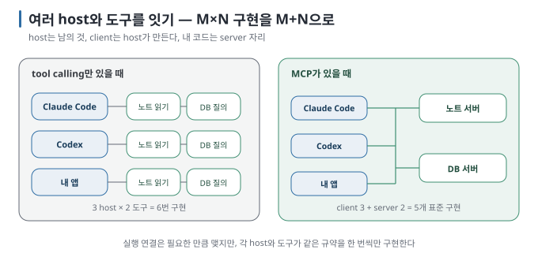

# 01. MCP가 푸는 문제 — 도구를 한 번 만들어 여러 agent에 꽂기

> 이 문서는 [`README.md`](README.md)의 1장입니다. 다음 → [`02-what-a-server-offers.md`](02-what-a-server-offers.md)

## 이 장에서 답하는 질문

- tool calling만으로 안 되는 것은 무엇인가
- host · client · server는 각각 무엇이고 내 코드는 어디에 놓이는가
- 2026-07-28 개정판에서 무엇이 달라졌고 왜 옛 예제가 안 도는가

## 1. 먼저, MCP가 필요한가

MCP는 모든 도구 연결의 정답이 아닙니다. 한 프로그램 안에서만 쓸 함수라면 기존 SDK의 tool calling으로 충분합니다. 이미 Agent에
내장된 파일·shell·브라우저 도구도 다시 MCP로 감쌀 이유가 없습니다.

| 상황 | 먼저 고를 방법 |
| --- | --- |
| 내 프로그램 하나에서만 쓰는 함수 | 모델 SDK의 tool calling |
| 사람이 직접 실행할 단순 작업 | CLI·스크립트 |
| Agent에 이미 내장된 능력 | 내장 도구와 권한 설정 |
| 같은 파일·DB·API 능력을 여러 AI 앱에서 재사용 | **MCP 서버** |
| 능력보다 반복 절차·출력 형식이 필요 | **skill** |

MCP를 고르는 신호는 "AI를 쓴다"가 아니라 **같은 능력을 여러 host에 연결하고 실행 경계를 서버 코드로 관리해야 한다는 점입니다.**

## 2. tool calling의 M×N 문제




모델에게 도구를 주는 기본 원리는 [tool calling](../local-llm-app-integration/06-tool-calling-workflow-agent.md)입니다. 도구의 이름·설명·입력 schema를 모델에게 알려 주고, 모델이 "이 도구를 이 인자로 불러 달라"고 답하면 앱이 실행해 결과를 돌려줍니다. 이 왕복 자체는 단순합니다. 문제는 **도구를 누가 어디에 구현하느냐입니다.**

같은 "노트 읽기"를 쓰는 도구(host)가 넷이면 네 번 구현해야 합니다. host마다 도구 정의 형식과 호출 규약이 다르기 때문입니다. MCP(Model Context Protocol)는 이 사이를 **표준 규약 하나로** 묶습니다. 도구를 MCP 서버로 한 번 만들면, MCP를 말하는 host는 모두 그 서버를 꽂을 수 있습니다. 이 가이드의 실습에서는 Python 80줄짜리 노트 서버 하나를 Claude Code와 Codex 양쪽에 연결해 같은 도구를 호출했습니다 [실행 검증 · 실습 02·03].

## 3. 세 역할 — host · client · server

규격은 세 역할을 정의합니다 [문서 확인 · 규격 2026-07-28].

| 역할 | 무엇 | 예 |
| --- | --- | --- |
| **host** | 연결을 시작하는 LLM 앱. 모델을 돌리고 사용자와 대화한다 | Claude Code, Codex, IDE, 내 채팅 앱 |
| **client** | host 안에서 서버 하나와 1:1로 대화하는 커넥터 | host가 내부적으로 만든다. 서버가 셋이면 client도 셋 |
| **server** | 컨텍스트와 능력을 제공하는 서비스 | 노트 서버, DB 서버, GitHub 서버 |

내 코드가 놓이는 자리는 보통 **server입니다.** host는 대개 남이 만든 것(코딩 에이전트)을 쓰고, client는 host가 알아서 만듭니다. 그래서 "MCP를 배운다"는 대부분 "서버를 만들고 host에 꽂는 법을 배운다"는 뜻입니다. host를 직접 만드는 경우(내 앱에 MCP 서버를 꽂고 싶을 때)는 SDK의 client 쪽을 쓰며, 실습 01이 그 최소형입니다. LLM 없이 Python client로 서버를 직접 부릅니다.

모델은 MCP 서버와 직접 통신하지 않습니다. host가 서버의 tool 정의를 모델이 이해하는 형식으로 보여 주고, 모델이 낸 호출 제안을
client가 MCP 메시지로 바꿉니다. 실제 파일 접근과 입력 검사는 server 코드에서 일어납니다.

## 4. 규약의 뼈대

- **메시지 형식은 JSON-RPC 2.0입니다.** 요청·응답·알림 세 종류이며 UTF-8을 사용합니다. 어떤 전송(stdio·HTTP)을 쓰든 메시지 의미는 같습니다 [문서 확인].
- **서버가 주는 것 세 가지**: tools(모델이 호출을 요청하는 함수), resources(읽을 데이터), prompts(템플릿). 2장에서 다룹니다.
- **전송은 둘**: 서버를 서브프로세스로 띄우는 stdio, 단일 endpoint로 HTTP를 쓰는 Streamable HTTP. 3장에서 다룹니다.
- **보안 원칙**: 사용자 동의와 통제, 데이터 프라이버시, 도구 안전. 규격은 "도구는 임의 코드 실행이며 host는 도구 호출 전 사용자 동의를 얻어야 한다"고 명시한다 [문서 확인]. 5장의 출발점입니다.

## 5. 2026-07-28 개정판 — 무엇이 달라졌나

이 가이드는 **규격 2026-07-28 개정판과** **Python SDK 2.x를** 기준으로 씁니다. 웹에 흔한 예제 대부분은 그 이전 판이라 그대로 실행되지 않습니다 [실행 검증 · 아래].

| 이전 (2025-xx 판) | 2026-07-28 판 |
| --- | --- |
| 연결 시작 시 `initialize` 핸드셰이크로 세션·capability 협상 | **stateless**. 핸드셰이크 없음. 모든 요청이 `_meta`에 프로토콜 버전·client capability를 싣고 다닌다 |
| 서버도 클라이언트에게 요청을 보낼 수 있음(sampling·roots·elicitation) | 서버→클라이언트 **요청 폐지**. 추가 입력이 필요하면 도구 결과로 `resultType: "input_required"`를 돌려주고 클라이언트가 다시 부른다(multi round-trip) |
| 결과에 `content`·`isError` | `resultType`("complete"/"input_required")이 추가 |
| 알림은 세션에 붙어 옴 | `subscriptions/listen` 스트림을 열어야 목록 변경 알림을 받음 |
| Python SDK 1.x: `from mcp.server.fastmcp import FastMCP` | **SDK 2.x: `from mcp.server.mcpserver import MCPServer`**. 필드명 camelCase → snake_case(`inputSchema`→`input_schema`), 전송 옵션이 생성자에서 `run()`으로 이동 |

작성 환경에서 `mcp==2.1.1`을 설치하고 v1 import를 시도하자 다음 오류가 발생했습니다 [실행 검증].

```text
No module named 'mcp.server.fastmcp'. This is mcp 2.x, where FastMCP was renamed to MCPServer
(from mcp.server.mcpserver import MCPServer) and other APIs changed; see the migration guide … or pin 'mcp<2'
```

오류 메시지가 친절하게 알려 주지만, 튜토리얼을 따라 하다 여기서 멈추는 사람이 많을 것입니다. Claude Code는 2.1.232부터 이 개정판(SDK 2.0)을 기본으로 쓰고, 이전 판 서버와는 호환 모드로 대화합니다 [문서 확인 · Claude Code 2.1.251]. 새 서버를 만든다면 개정판으로 만드는 편이 맞습니다.

## 6. MCP가 아닌 것

- **skill이 아닙니다.** skill은 모델이 읽고 따르는 절차 지시문이고, MCP는 모델이 호출하는 **능력입니다.** 둘의 역할 분담은 6장과 [agent-skills 가이드 03장](../agent-skills/03-same-thing-different-names.md)에 있습니다.
- **모델 API가 아닙니다.** MCP는 모델과 대화하는 규약이 아니라 host와 도구 서버 사이의 규약입니다. 모델은 MCP를 모릅니다. host가 MCP 서버의 도구 목록을 모델이 아는 tool calling 형식으로 바꿔 보여 줍니다.
- **에이전트 프레임워크가 아닙니다.** 제어 흐름(무엇을 언제 부를지)은 여전히 host와 모델의 몫입니다.

## 이 장을 끝내면

- "MCP는 도구 서버와 host 사이의 표준 규약이고 내 코드는 서버 자리"라고 말할 수 있습니다.
- 2026-07-28 개정판의 핵심 변화(stateless·서버→클라이언트 요청 폐지·SDK 2.x 개명)를 알고, v1 예제 오류를 보면 원인을 설명할 수 있습니다.
