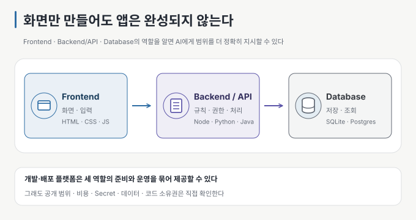

# 00 — 코드를 둘러싼 큰 그림

← [가이드 README](README.md) · 다음 → [01 무엇을 만들지부터 정한다](01-decide-first.md)

> **왜 읽나:** AI가 화면을 빠르게 만들어 줘도, 그 뒤에서 무엇이 실행되고 어디에 데이터가 저장되는지 모르면 요청 범위와
> 위험을 판단하기 어렵습니다.
>
> **읽고 나면:** 웹앱의 세 역할을 구분하고, 어떤 도구가 무엇을 대신해 주는지 살펴본 뒤 내 프로젝트에 필요한 범위를 정할 수
> 있습니다.
>
> **바쁘면:** §0의 대비와 §2의 그림만 보고 [01](01-decide-first.md)로 넘어가도 됩니다.

---

## 0. 빠른 시작을 오래 쓸 수 있는 결과로 이어 가기

바이브 코딩은 코드를 모르는 사람도 웹사이트나 작은 앱을 직접 만들어 볼 수 있게 했습니다. 개발자에게도 반복 작업을 줄이고,
구체적인 계획을 더 빠르게 구현하는 수단이 됩니다. 아이디어를 시험하고 첫 화면을 확인하는 데 필요한 시간과 진입 장벽이 낮아진
것은 분명한 장점입니다. `[해석]`

하지만 AI가 코드를 빠르게 작성한다는 사실이 품질까지 보장하지는 않습니다. 처음에는 동작해도 기능을 붙일수록 구조가 뒤엉키기
쉽고, 비슷한 역할의 기술이 중복되거나 테스트·문서·보안 설정이 빠지기도 합니다. 데이터 저장 위치와 서비스 비용, 다른 플랫폼으로
옮길 수 있는지는 나중에야 드러나는 경우가 많습니다. `[해석]`

좋고 나쁜 결과를 가르는 기준을 직업으로만 나누기는 어렵습니다.

| 만드는 사람과 방식 | 결과의 가능성 |
| --- | --- |
| 비개발자이지만 목표·구조·기술의 역할을 익히고 작게 확인한다 | 직접 만들 수 있는 범위와 결과의 품질이 함께 높아질 수 있음 |
| 개발자이지만 계획 없이 짧은 지시만 반복하고 결과를 검토하지 않는다 | 익숙한 기술을 써도 구조가 흔들리고 유지보수가 어려워질 수 있음 |
| 개발 지식이 있고 계획·검증·review까지 수행한다 | AI의 속도를 활용하면서 기존 품질 기준을 적용하기 쉬움 |

이 비교는 정량적으로 검증한 우열을 뜻하지 않습니다. **경험은 중요한 자산이지만, 결과를 책임지는 작업 절차를 대신하지
않습니다.**

## 1. 개발자라면 만든 코드를 설명할 수 있어야 한다

코드를 잘 모르는 사람에게도 이 질문은 유용합니다. 결과물을 다른 사람에게 보여 주거나 개발자에게 넘기는 순간, 무엇을 만들었고
어디까지 확인했는지 설명해야 하기 때문입니다.

AI가 작성한 코드를 매번 한 줄씩 외울 필요는 없습니다. 그래도 개발자로서 다른 사람에게 제공하는 코드라면 다음 질문에는 답할 수
있어야 합니다. `[해석]`

- 사용자의 입력이 어디로 가고 어디에 저장되는가?
- 주요 파일과 구성 요소는 각각 무슨 역할을 하는가?
- 왜 이 기술과 구조를 골랐고, 알려진 한계는 무엇인가?
- 문제가 생겼을 때 어디부터 확인하고 어떻게 되돌릴 것인가?
- 자동 검사와 직접 확인으로 무엇을 검증했고, 무엇은 아직 확인하지 않았는가?

설명하지 못한 부분은 **아직 내 것이 되지 않은 부분입니다.** 공개하거나 다른 사람에게 넘기기 전에 AI에게
구조를 설명하게 하고, 실제 파일과 실행 결과가 그 설명과 맞는지 확인합니다. 문제가 생기면 고칠 수 있도록 이해하는 일도 구현의
일부입니다.

## 2. 웹앱을 이루는 세 역할

웹앱은 대개 세 역할로 나눠 생각할 수 있습니다. 이를 흔히 3-tier라고 부르지만, 반드시 서버 세 대로 나눈다는 뜻은 아닙니다.
작은 앱이나 통합 플랫폼에서는 한 프로젝트 안에 함께 들어갈 수도 있습니다. 역할마다 **책임이 다르다는 점을** 구분하면 됩니다.
`[문서 확인 · 2026-09-01]`

| 역할 | 하는 일 | 처음 알아둘 기술 예시 |
| --- | --- | --- |
| **Frontend** | 화면을 보여 주고 사용자 입력을 받음 | HTML·CSS·JavaScript, React·Vue·Svelte |
| **Backend / API** | 업무 규칙·권한·외부 서비스 호출을 처리함 | Node.js·Python·Java, HTTP·API |
| **Database** | 데이터를 저장하고 조건에 맞게 조회함 | SQLite·PostgreSQL, 문서형 database |

여기서 말하는 기술 조합(tech stack)은 역할을 이해하기 위한 예시입니다. 처음에는 익숙하거나 단순한 조합 하나로 시작하고, AI가
새 framework나 database를 추가하려 하면 **왜 필요한지와 기존 기술로 할 수 없는지를** 먼저 묻습니다.

## 3. 도구는 무엇을 대신해 주는가

바이브 코딩에 쓰이는 도구는 코드 작성만 하는 것이 아닙니다. 화면·서버·database를 준비하고, 미리 보기와 배포까지 한곳에서
제공하는 서비스도 있습니다. 제품의 경계와 기능은 자주 바뀌므로 아래는 2026-09-01 공식 문서를 기준으로 한 역할별 예시입니다.
`[문서 확인 · 2026-09-01]`

| 필요한 도움 | 대표적인 예 | 주로 대신해 주는 일 |
| --- | --- | --- |
| AI로 만들기부터 실행·배포까지 | Replit, Lovable, Bolt | 코드 생성, 개발 환경, 미리 보기, database 연결, 공개 URL |
| AI로 화면과 full-stack 앱 만들기 | v0 + Vercel | UI·Next.js 코드 생성, backend endpoint, 배포 |
| Backend as a Service(BaaS) | Supabase, Firebase | database, 로그인·권한, 파일 저장, serverless 기능 |
| 웹 배포·호스팅 | Vercel, Netlify | build, 배포, domain 연결, 환경 변수 관리 |

하나의 서비스가 여러 줄에 걸친 기능을 제공할 수 있습니다. 이 표는 내가 도구에 맡긴 일을 구분하기 위한 지도입니다. 제품을
선택할 때는 현재 기능·가격·제한을 각 공식 문서에서 다시 확인해야 합니다.

서비스 밖에서도 작업 안전장치를 만들 수 있습니다. 프로젝트 규칙과 계획 문서, test·lint·type check, review 도구를 하나의
harness로 묶으면 AI가 같은 범위와 완료 조건을 반복해서 확인하도록 도울 수 있습니다.

## 4. 편해져도 남는 책임

버튼 한 번으로 배포할 수 있다는 말은 **버튼 한 번으로 공개될 수 있다는 뜻이기도 합니다.** 서비스를 고르거나 공개하기 전에 다음을
확인합니다. `[해석]`

- 공개 URL을 누구나 볼 수 있는가, 로그인한 사람만 볼 수 있는가?
- 무료 한도를 넘으면 어떤 비용이 발생하고 사용량을 어디서 확인하는가?
- API Key와 비밀번호를 코드가 아니라 환경 변수나 Secret 저장소에 넣었는가?
- 사용자의 데이터가 어디에 저장되며 backup·export·삭제가 가능한가?
- domain과 계정의 소유자는 누구인가?
- 코드를 Git에 동기화하거나 내려받아 다른 환경에서 실행할 수 있는가?
- 플랫폼을 바꾸면 다시 만들어야 하는 부분은 무엇인가?

AI 도구나 harness는 실수를 줄이고 확인 절차를 반복하는 데 도움이 됩니다. 그러나 목표·공개 범위·비용·데이터·최종 승인에 대한
책임까지 넘겨주지는 않습니다.

## 5. 이 가이드에서 쓰는 기준선

이 가이드는 특정 플랫폼 계정이나 자동화 harness 없이도 적용할 수 있는 기본 작업 흐름을 다룹니다. 먼저 순정 상태에서
**목표 정하기 → Git에 저장 → 한 번에 하나씩 지시 → 직접 확인 → 공개 전 점검을** 익힙니다. 이후 사용하는 도구에 계획·규칙·검사
기능이 있다면 이 기준선을 자동화하는 방향으로 활용하면 됩니다.

Git을 아직 쓰지 않는다면 [AI로 코딩하는 사람을 위한 Git](../git-for-vibe-coders/README.md)의 10분 경로를 먼저 따라 해보세요.
AI가 여러 파일을 바꾸는 환경에서는 되돌릴 지점이 곧 실험할 수 있는 여유가 됩니다.

---

**다음 →** [01 무엇을 만들지부터 정한다](01-decide-first.md)
