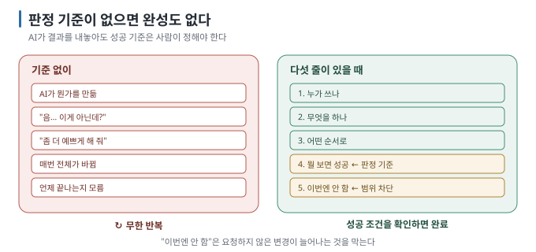

# 01 — 무엇을 만들지부터 정한다

← [00 코드를 둘러싼 큰 그림](00-big-picture.md) · 다음 → [02 되돌릴 수 있게 만들어 두기](02-safety-net.md)

> **왜 읽나:** "일단 만들어 줘"로 시작하면 AI가 결과를 내놓더라도 **그게 내가 원한 것인지 판단할 기준이 없다는
> 것입니다**. 기준이 없으면 무엇을 고쳐야 하는지도 매번 다시 정하게 됩니다.
>
> **읽고 나면:** 만들기 전에 한 장으로 적고, 그것을 판정 기준으로 쓸 수 있습니다.
>
> **바쁘면:** §2의 다섯 줄만 적고 시작하세요.

---

## 0. 기준부터 만든다

- **판정 기준이 없으면 완성도 없습니다.** "다 됐다"를 무엇으로 판단할지 미리 정합니다. `[해석]`
- 필요한 것은 문서가 아니라 **다섯 줄입니다** — 누가 · 무엇을 · 어떤 순서로 · 뭘 보면 성공 · 이번엔 안 하는 것. `[해석]`
- **"안 하는 것"을 적는 것이 절반입니다.** 이게 없으면 AI가 자꾸 뭔가를 더 만듭니다. `[해석]`
- 처음부터 완벽할 필요 없습니다. **한 바퀴 돌 때마다 고칩니다.**

## 1. "일단 만들어 줘"가 실패하는 이유



| 기준 없이 | 기준 있게 |
| --- | --- |
| AI가 뭔가를 만듦 | AI가 뭔가를 만듦 |
| "음… 이게 아닌데?" | "3번 성공 조건이 안 됨" |
| "좀 더 예쁘게 해 줘" | "이 조건만 다시" |
| 매번 전체가 바뀜 | 바뀐 부분만 확인 |
| 언제 끝나는지 모름 | 다섯 줄이 다 채워지면 끝 |

`[해석]` — AI는 모호한 요청에도 그럴듯한 결과를 내놓을 수 있습니다. 그래서 요청을 받아들이는 것과 내가 원한 결과를 만드는 것은
다릅니다. 무엇을 성공으로 볼지는 사람이 먼저 정해야 합니다.

## 2. 다섯 줄 — 이게 전부입니다

시작 전에 메모장에 다섯 줄을 적습니다. 완성된 기획서가 아니라, 첫 결과를 판정할 수 있는 정도면 충분합니다.

```text
1. 누가 쓰나:      나 혼자 / 우리 팀 / 인터넷의 아무나
2. 무엇을 하나:    할 일 목록을 적고 지운다
3. 어떤 순서로:    앱 열기 → 할 일 입력 → 목록에 추가 → 체크하면 사라짐
4. 뭘 보면 성공:   할 일 3개를 넣고 새로고침해도 남아 있으면 성공
5. 이번엔 안 함:   로그인, 다른 사람과 공유, 디자인 다듬기
```

| 줄 | 왜 필요한가 |
| --- | --- |
| 1. 누가 | 혼자 쓰는 도구와 여러 사람이 쓰는 서비스는 필요한 로그인·권한 범위가 다릅니다 |
| 2. 무엇을 | 한 문장으로 못 쓰면 아직 너무 큽니다 |
| **3. 어떤 순서로** | AI에게 그대로 붙여넣을 수 있는 가장 유용한 줄 |
| **4. 뭘 보면 성공** | **판정 기준.** 이게 없으면 끝이 없습니다 |
| **5. 이번엔 안 함** | AI가 더 만들지 않게 막는 줄 |

> 💬 **AI에게 이렇게 말하세요:** 다섯 줄을 그대로 붙여넣고 — "이 다섯 줄을 보고, 가장 작게 시작하려면 첫 요청이 뭐가
> 되어야 할지 알려 줘. 아직 만들지는 말고."

## 3. "이번엔 안 함"이 절반인 이유

AI가 요청하지 않은 로그인 화면, 설정 페이지, 애니메이션, 오류 처리까지 추가할 수 있습니다. 결과를 더 완성된 형태로 만들려는
시도일 수 있지만, 지금 필요한 범위가 아니라면 확인할 것만 늘어납니다. `[해석]`

- 확인할 것이 늘어납니다
- 어디서 깨졌는지 찾기 어려워집니다
- 정작 필요한 것이 뒤로 밀립니다

**"이번엔 안 함"에 적힌 것은 요청할 때마다 다시 알려 줍니다.** "로그인은 아직 넣지 마세요"처럼 이번 변경의 경계를 함께 적습니다.

## 4. 처음 세 바퀴는 이렇게

| 바퀴 | 목표 | 성공 조건 예 |
| --- | --- | --- |
| 1 | **화면이 뜬다** | 브라우저에서 페이지가 열리고 제목이 보임 |
| 2 | **한 가지가 된다** | 할 일을 입력하면 목록에 추가됨 (저장은 아직) |
| 3 | **남는다** | 새로고침해도 목록이 남아 있음 |

`[해석]` — 각 바퀴 끝에 **저장(커밋 — 되돌릴 수 있는 저장 지점)을** 만듭니다([02](02-safety-net.md)). "화면이 뜬다"만 되어도 저장 가치가 있습니다.

## 5. 다섯 줄을 바꿔야 할 때

만들다 보면 처음 생각이 틀렸다는 걸 알게 됩니다. 그때는 **다섯 줄을 고치고 다시 시작합니다**. 고치지 않은 채 요청만
바꾸면 기준이 사라집니다.

| 신호 | 무엇을 고치나 |
| --- | --- |
| 성공 조건을 만족했는데 마음에 안 듦 | 4번(성공 조건)이 잘못됨 |
| 요청할 때마다 범위가 커짐 | 5번(안 함)에 항목 추가 |
| 순서대로 안 됨 | 3번을 실제 동작에 맞게 |

---

**다음 →** [02 되돌릴 수 있게 만들어 두기](02-safety-net.md)
