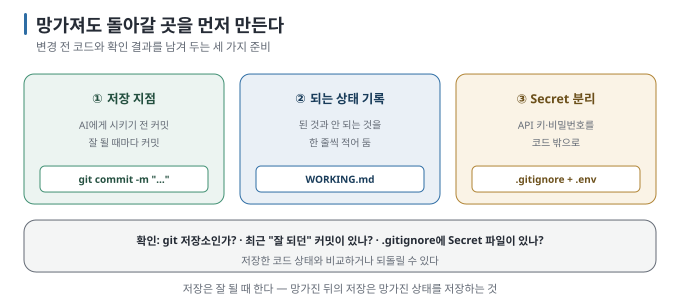

# 02 — 되돌릴 수 있게 만들어 두기

← [01 무엇을 만들지부터 정한다](01-decide-first.md) · 다음 → [03 AI에게 말하는 법](03-how-to-ask.md)

> **왜 읽나:** 잘 되던 상태가 변경 뒤에 깨질 수 있습니다. 저장 지점이 없으면 어느 상태로 돌아가야 할지 찾기 어렵고,
> 커밋하지 않은 변경은 복구하지 못할 수도 있습니다.
>
> **읽고 나면:** 이 가이드의 나머지가 기대는 안전망 셋을 갖추게 됩니다.
>
> **바쁘면:** §1의 명령 두 줄만.

---

## 0. 세 가지 안전망

- 안전망 셋 — **① 저장 지점(커밋) ② 되는 상태의 기록 ③ Secret 분리.** `[해석]`
- **AI에게 변경을 지시하기 전에 커밋합니다.** 짧은 절차지만, 돌아갈 기준점을 남깁니다. `[해석]`
- Git을 아직 안 쓴다면 [Git 가이드](../git-for-vibe-coders/README.md)의 10분 경로를 먼저 하세요. 이 가이드의 나머지가
  그 위에 있습니다.
- 저장은 **잘 될 때** 합니다. 망가진 뒤에 하는 저장은 망가진 상태를 저장하는 것입니다. `[해석]`

## 1. 안전망 ① — 저장 지점

터미널에 입력합니다(터미널이 처음이면 [Git 가이드 03](../git-for-vibe-coders/03-setup-mac-windows.md)). 아래 💬처럼 AI에게 시켜도 됩니다.

```bash
git add .
git commit -m "AI에게 (하려는 일) 시키기 전"
```

**언제 하나** `[해석]`:

| 시점 | 이유 |
| --- | --- |
| **AI에게 큰 요청을 하기 직전** | 되돌릴 지점 |
| **뭔가 잘 될 때** | 잘 되는 상태가 가장 저장 가치가 큼 |
| 하루 작업 끝 | 최소한 |

> 💬 **AI에게:** "지금 상태를 '(하려는 일) 전'이라는 메시지로 커밋하고, 그다음 (하려는 일)을 해 줘."

**되돌리는 법은** [Git 가이드 10 S3](../git-for-vibe-coders/10-scenarios-solo.md)에 상황별로 있습니다. 요약하면:

- 아직 커밋 안 한 변경 되돌리기 → `git restore 파일`
- 이미 커밋한 것 취소 → `git revert 해시` (해시 = 커밋마다 붙는 고유 번호, `git log`에 보임)
- ⛔ `git reset --hard`는 커밋 안 된 작업을 **영구 삭제합니다**

## 2. 안전망 ② — "되는 상태"의 기록

커밋 메시지만으로는 나중에 **어느 커밋이 잘 되던 상태인지** 찾기 어렵습니다. 잘 될 때마다 한 줄씩 적어 둡니다.



```text
# 잘 되던 지점 (WORKING.md 같은 파일에 적어 둡니다)

2026-08-24  할 일 추가·삭제 됨. 새로고침하면 사라짐 (저장 아직)   ← 커밋 a1b2c3d
2026-08-24  새로고침해도 남음. 브라우저 저장 사용             ← 커밋 e4f5g6h
2026-08-25  디자인 적용. 모바일에서는 깨짐                    ← 커밋 i7j8k9l
```

`[해석]` — 세 줄이면 충분하고, **"안 되는 것"도 함께 적는 것이** 요점입니다. 나중에 "모바일이 언제부터 깨졌지?"를 여기서 찾습니다.

> 💬 **AI에게:** "지금 커밋하고, WORKING.md에 오늘 된 것과 아직 안 되는 것을 한 줄씩 추가해 줘."

## 3. 안전망 ③ — Secret 분리

API 키·비밀번호를 코드 안에 직접 쓰면 **커밋에 들어가고, 올리면 공개됩니다.** 처음부터 분리합니다.

```text
# .gitignore 에 넣을 것
.env
.env.local
*.key
```

`[해석]` — 이미 커밋해 버렸다면 [Git 가이드 11 S10](../git-for-vibe-coders/11-scenarios-share.md)의 단계별 대응을 보세요.
**올린 뒤라면 파일에서 지우는 것만으로는 부족합니다.** 노출된 키를 폐기하고 새 키를 발급받아야 합니다.

> 💬 **AI에게:** 처음 시작할 때 — "이 프로젝트에 맞는 .gitignore를 만들어서 API 키나 비밀번호가 들어갈 만한 파일이
> 커밋되지 않게 해 줘."

## 4. 세 가지 확인

지금 만들고 있는 프로젝트에 이 셋이 있는지 봅니다.

```text
□ git 저장소인가?            → 아니면 [Git 가이드] 10분 경로
□ 최근 "잘 되던" 커밋이 있나?  → 없으면 지금 상태가 잘 되면 지금 커밋
□ .gitignore에 Secret 파일이 있나? → 없으면 지금 추가
```

셋 다 준비되면 이후 변경에서 문제가 생겨도 마지막으로 확인한 상태와 비교하거나 그 지점으로 돌아갈 수 있습니다.

---

**다음 →** [03 AI에게 말하는 법](03-how-to-ask.md)
