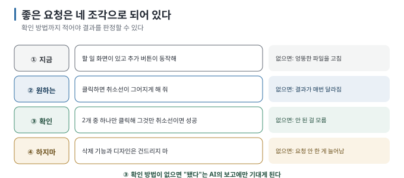

# 03 — AI에게 말하는 법

← [02 되돌릴 수 있게 만들어 두기](02-safety-net.md) · 다음 → [04 한 번에 하나만](04-one-at-a-time.md)

> **왜 읽나:** 같은 목표를 말했는데 결과가 자꾸 달라진다면, 현재 상태·완료 기준·변경 범위가 요청마다 다르게 전달됐는지
> 먼저 확인해야 합니다. 반복해서 쓸 수 있는 요청 형태가 있으면 이 차이를 줄일 수 있습니다.
>
> **읽고 나면:** 네 조각으로 된 요청 형식을 쓰고, 나쁜 요청을 알아볼 수 있습니다.
>
> **바쁘면:** §1의 네 조각과 §3의 문장 모음만.

---

## 0. 요청에는 네 조각이 필요하다

- 좋은 요청은 네 조각 — **① 지금 상태 ② 원하는 결과 ③ 확인 방법 ④ 하지 말 것.** `[해석]`
- **③ 확인 방법은** 빠뜨리기 쉽습니다. 이게 없으면 완료 여부를 AI의 보고에만 기대게 됩니다. `[해석]`
- "예쁘게", "잘", "제대로" 같은 말은 **판정할 수 없으므로** 빼거나 구체화합니다. `[해석]`
- 코드를 몰라도 됩니다. **화면에서 일어나는 일로** 말하면 충분합니다. `[해석]`

## 1. 네 조각



```text
① 지금:    할 일 목록 화면이 있고, 입력칸과 추가 버튼이 동작해.
② 원하는:  추가한 할 일을 클릭하면 취소선이 그어지고, 다시 클릭하면 풀리게 해 줘.
③ 확인:    할 일 2개를 넣고 하나만 클릭했을 때 그것만 취소선이 생기면 성공이야.
④ 하지마:  삭제 기능이나 디자인은 이번엔 건드리지 마.
```

| 조각 | 없으면 생기는 일 |
| --- | --- |
| ① 지금 | AI가 이미 있는 걸 다시 만들거나 엉뚱한 파일을 고침 |
| ② 원하는 | 결과가 매번 달라짐 |
| **③ 확인** | **"됐습니다"만 듣고 안 된 걸 모름** |
| ④ 하지마 | 요청 안 한 게 늘어남 ([01 §3](01-decide-first.md)) |

## 2. 판정할 수 없는 말들

| 이렇게 말하면 | 이렇게 바꿉니다 |
| --- | --- |
| "예쁘게 해 줘" | "글자를 더 크게, 버튼을 화면 가운데로" |
| "잘 되게 해 줘" | "버튼을 눌렀을 때 목록에 추가되게" |
| "빠르게" | "첫 화면이 2초 안에 뜨게"처럼 측정할 조건을 정하기 |
| "사용자 친화적으로" | "입력칸이 비었을 때 '할 일을 입력하세요'가 보이게" |
| "전체적으로 개선" | (요청을 쪼갭니다 — [04](04-one-at-a-time.md)) |
| "에러 처리 좀" | "인터넷이 끊겼을 때 '연결을 확인하세요'가 뜨게" |

`[해석]` — 기준은 하나입니다. **"이걸 어떻게 확인하지?"에 답할 수 있으면 좋은 요청입니다**.

## 3. 상황별 문장 모음

### 시작할 때

> "다음 다섯 줄이 내가 만들려는 거야. (다섯 줄 붙여넣기) 가장 작게 시작하려면 첫 요청이 뭐가 되어야 할지 알려 줘. 아직 만들지는 말고."

### 만들 때

> "① 지금 (상태)야. ② (원하는 것)을 만들어 줘. ③ 내가 (확인 방법)으로 확인할 수 있게 해 줘. ④ (하지 말 것)은 건드리지 마."

### 확인할 때

> "지금 만든 걸 내가 어떻게 확인하면 돼? 클릭하거나 입력할 순서를 알려 줘."

### 안 될 때

> "(했는데) (이런 결과)가 나왔어. 화면에 보이는 건 (본 것)이야. 원인이 뭘지 후보를 두세 개 알려 주고, 가장 가능성 높은 것부터 하나씩 확인하자."

### 이해가 안 될 때

> "방금 뭘 바꿨는지 코드를 모르는 사람에게 설명하듯 알려 줘. 어느 파일이 왜 바뀌었는지."

### 되돌릴 때

> "방금 변경이 마음에 안 들어. 먼저 무엇이 바뀌었는지 파일 목록으로 보여 주고, 내가 확인하면 그 파일들만 마지막 커밋 상태로 되돌려 줘. 다른 파일은 건드리지 말고."

## 4. AI의 답을 읽는 법

AI가 "완료했습니다"라고 할 때 확인할 세 가지. `[해석]`

1. **뭘 바꿨다고 하는가** — 파일 이름이 내 예상과 맞는지
2. **확인 방법을 줬는가** — 안 줬으면 물어봅니다
3. **"~할 수도 있습니다" 같은 말이 있는가** — 불확실하다는 신호. 그 부분을 콕 집어 확인합니다

> ⚠️ **"완료했습니다"는 확인 결과가 아닙니다.** 도구에 따라 AI가 파일을 고친 뒤 테스트나 명령을 실행할 수는 있습니다.
> 그래도 그 결과가 내가 원한 동작인지, 화면과 사용 흐름이 맞는지는 사람이 직접 확인해야 합니다([05](05-verify-without-reading.md)).

## 5. 한 줄 요약

> **"이걸 어떻게 확인하지?"에 답하기 어렵다면, 원하는 결과를 한 번 더 구체화합니다.**

---

**다음 →** [04 한 번에 하나만](04-one-at-a-time.md)
