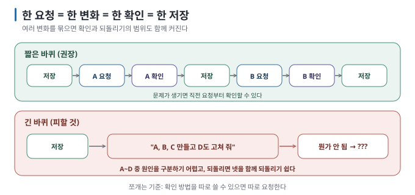

# 04 — 한 번에 하나만

← [03 AI에게 말하는 법](03-how-to-ask.md) · 다음 → [05 코드를 몰라도 하는 확인](05-verify-without-reading.md)

> **왜 읽나:** 한 번에 여러 변화를 맡기면 결과가 잘못됐을 때 어느 변경이 원인인지 찾기 어렵습니다. 요청을 나누면 확인과
> 되돌리기의 범위도 함께 작아집니다.
>
> **읽고 나면:** 요청을 쪼개는 기준을 갖고, 한 바퀴를 짧게 도는 습관이 생깁니다.
>
> **바쁘면:** §1 그림과 §2 규칙만.

---

## 0. 한 바퀴를 짧게

- **한 요청 = 한 가지 변화 = 한 번의 확인 = 한 번의 저장.** 이게 한 바퀴입니다. `[해석]`
- 여러 개를 한 번에 시키면 **어느 변경이 문제를 만들었는지 구분하기 어렵습니다.** `[해석]`
- 쪼개는 기준: **확인 방법을 따로 쓸 수 있으면 따로 요청합니다.** `[해석]`
- 급할 때도 최소한 확인 방법이 다른 변화는 나눕니다. 그래야 실패한 단계만 다시 시도할 수 있습니다. `[해석]`

## 1. 한 바퀴

`[해석]` — 긴 바퀴의 문제는 요청 횟수가 아니라 변경 범위입니다. 여러 변화가 한 덩어리로 남으면 문제가 생겼을 때 정상인
변경과 잘못된 변경을 함께 되돌리기 쉽습니다.

## 2. 쪼개는 규칙 넷

| 규칙 | 예 |
| --- | --- |
| **① 확인 방법이 다르면 따로** | "추가 기능"(입력해서 확인)과 "디자인"(눈으로 확인)은 별개 요청 |
| **② 만드는 것과 고치는 것을 섞지 않는다** | 새 기능을 만들면서 기존 코드를 리팩터링(동작은 그대로 두고 구조만 바꾸기)하지 않기 |
| **③ 되는 걸 먼저, 예쁜 건 나중** | 동작 → 저장 → 디자인 → 저장 |
| **④ 안 되면 더 쪼갠다** | 한 요청이 실패하면 그것을 둘로 나눠 다시 |

## 3. 쪼개는 예시

**나쁜 요청 하나:**

> "할 일 앱을 만들어 줘. 추가·삭제·완료 체크가 되고, 새로고침해도 남아 있고, 디자인도 깔끔하게, 모바일에서도 잘 보이게."

**쪼갠 요청 여섯:**

| # | 요청 | 확인 방법 |
| --- | --- | --- |
| 1 | 할 일 입력칸과 추가 버튼이 있는 화면 | 페이지가 열리고 입력칸이 보임 |
| 2 | 추가 버튼을 누르면 목록에 나타나기 | 3개 넣으면 3줄이 보임 |
| 3 | 각 줄에 삭제 버튼 | 가운데 것 삭제하면 그것만 사라짐 |
| 4 | 클릭하면 완료 표시 | 하나 클릭하면 그것만 취소선 |
| 5 | 새로고침해도 남기 | 3개 넣고 새로고침 → 3개 그대로 |
| 6 | 디자인 다듬기 | 눈으로 |

`[해석]` — 각 단계 끝에 **저장(커밋)합니다**. 5번에서 뭔가 깨져도 4번 상태로 돌아갈 수 있습니다.

## 4. "그럼 요청이 너무 많아지지 않나요?"

요청 횟수는 늘어납니다. 대신 각 결과를 바로 확인할 수 있고, 실패하면 그 단계만 다시 진행할 수 있습니다. 어느 방식이 실제로
빠른지는 작업과 도구에 따라 다르므로 이 가이드는 시간을 약속하지 않습니다. 다만 코드를 읽기 어려운 사람에게는 **문제가 생긴
범위를 좁힐 수 있다는 것 자체가** 중요한 안전장치입니다. `[해석]`

## 5. 한 요청이 너무 클 때의 신호

- 확인 방법을 한 문장으로 못 쓴다
- "그리고", "또한", "~도"가 들어간다
- 예상보다 많은 파일이나 관련 없어 보이는 파일을 건드린다
- 결과를 보고 어디부터 봐야 할지 모르겠다

**하나라도 해당하면 쪼갭니다.**

> 💬 **AI에게:** 쪼개는 것도 시킬 수 있습니다 — "내가 하려는 건 (전체 목표)야. 이걸 한 번에 하나씩 확인할 수 있는 작은
> 단계로 쪼개 줘. 각 단계마다 내가 뭘 보면 성공인지도 적어 줘. 아직 만들지는 말고."

---

**다음 →** [05 코드를 몰라도 하는 확인](05-verify-without-reading.md)
