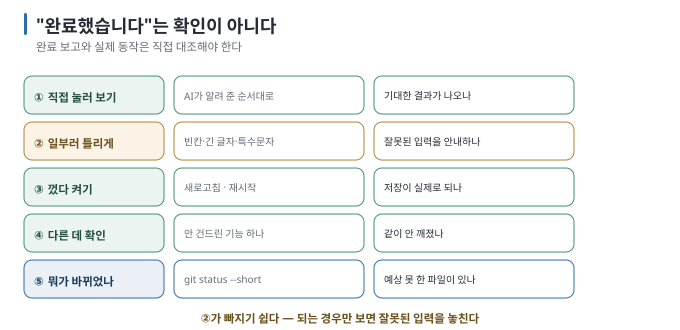

# 05 — 코드를 몰라도 하는 확인

← [04 한 번에 하나만](04-one-at-a-time.md) · 다음 → [06 막혔을 때 빠져나오기](06-getting-unstuck.md)

> **왜 읽나:** "AI가 다 만들었다는데 진짜 되는지 모르겠어요." 코드를 읽지 못해도 동작과 변경 범위를 확인할 수 있는
> 다섯 가지 방법이 있습니다.
>
> **읽고 나면:** 다섯 가지 확인을 순서대로 할 수 있고, "AI가 됐다고 했다"와 "내가 확인했다"를 구분할 수 있습니다.
>
> **바쁘면:** §1의 다섯 가지만.

---

## 0. 완료 보고보다 확인

- **"완료했습니다"는 확인 결과가 아닙니다.** AI가 테스트를 실행했더라도 내 요구와 사용 흐름에 맞는지는 따로 확인합니다. `[해석]`
- 코드를 몰라도 하는 확인 다섯 — **① 직접 눌러 보기 ② 일부러 틀리게 하기 ③ 껐다 켜기 ④ 다른 데가 안 깨졌나 ⑤ 무엇이 바뀌었나.** `[해석]`
- ②는 빠뜨리기 쉽습니다. **되는 경우만 확인하면 잘못된 입력에서 어떻게 동작하는지 알 수 없습니다.** `[해석]`
- 확인은 매 요청마다 합니다. 모아서 하면 원인을 못 찾습니다([04](04-one-at-a-time.md)).
- 이 다섯 가지를 **고정된 예제로 연습하려면** → [실습: 다섯 가지 확인](../../labs/five-checks/README.md). AI 없이, 브라우저만으로 세 판을 판정합니다.

이 다섯 가지는 초심자가 수행할 수 있는 **최소 동작 확인입니다.** 내부 코드의 품질·보안·성능·접근 권한이 올바르다는 증명은
아니며, 그런 판단이 필요한 경우에는 테스트와 code review, 분야별 검토가 추가로 필요합니다.

코드를 잘 모르는 사람도 결과물을 다른 사람에게 넘길 때는 무엇을 만들었고 어디까지 확인했는지 설명할 수 있어야 합니다. AI에게
구조와 데이터 흐름을 설명하게 하고 그 내용을 기록해 두는 것부터 시작할 수 있습니다.

개발자로서 결과물을 제공한다면 동작 확인에서 한 걸음 더 나아갑니다. 주요 구성 요소와 데이터 흐름, 선택한 기술의 이유, 알려진
한계와 복구 방법을 설명하고, 문제가 생겼을 때 코드를 고칠 수 있는 상태까지 책임집니다. `[해석]`

## 1. 다섯 가지 확인



### ① 직접 눌러 보기

AI가 알려 준 순서대로 실제로 해 봅니다. 안 알려 줬으면 물어봅니다.

> 💬 "지금 만든 걸 내가 어떻게 확인하면 돼? 클릭하거나 입력할 순서를 알려 줘."

**기대한 결과가 나오는지만** 봅니다. 화면이 안 뜨면 거기서 끝, [06](06-getting-unstuck.md)으로 갑니다.

### ② 일부러 틀리게 하기

정상 경로만 확인하면 절반입니다. **잘못된 입력을** 넣어 봅니다.

| 만든 것 | 일부러 해 볼 것 |
| --- | --- |
| 입력 폼 | 빈칸으로 제출, 아주 긴 글자, 숫자칸에 글자 |
| 목록 | 아무것도 없을 때 화면이 어떻게 되나 |
| 검색 | 없는 걸 검색 |
| 로그인 | 틀린 비밀번호 |
| 파일 업로드 | 엉뚱한 형식 파일 |

**기대하는 것:** 조용히 깨지지 않고 **뭐라도 안내가 나오는 것**. 하얀 화면이나 아무 반응 없음은 실패입니다. `[해석]`

### ③ 껐다 켜기

새로고침하거나, 앱을 닫았다 열거나, 서버를 재시작합니다. **저장이 실제로 되는지를** 봅니다.
화면에는 보이지만 새로고침하면 사라지는 상태라면 저장까지 완료된 것이 아닙니다.

### ④ 다른 데가 안 깨졌나

이번에 건드리지 않은 기능 하나를 눌러 봅니다. AI는 관련 없어 보이는 파일도 고칠 때가 있습니다.

> 💬 "이번 변경으로 영향받을 수 있는 다른 기능이 뭐가 있어? 내가 확인해 볼 것 두세 개만 알려 줘."

### ⑤ 무엇이 바뀌었나

터미널에서 — 또는 💬 "바뀐 파일 목록과 각 파일의 바뀐 줄 수를 보여 줘."

```bash
git status --short      # 어떤 파일이 바뀌었나
git diff --stat         # 얼마나 바뀌었나
```

**파일 이름과 변경량만 봐도** 예상하지 않은 범위가 있는지 확인할 수 있습니다. 관련 없어 보이는 파일이 생겼거나, 작은 요청에 비해
변경량이 크다면 이유를 먼저 묻습니다.
자세한 읽는 법은 [Git 가이드 10 S5](../git-for-vibe-coders/10-scenarios-solo.md).

## 2. 확인 결과를 어떻게 다루나

| 결과 | 다음 |
| --- | --- |
| 다섯 개 다 통과 | **커밋합니다.** 그리고 다음 요청 |
| ①이 실패 | [06](06-getting-unstuck.md) |
| ②가 실패 | "빈칸으로 제출하면 아무 반응이 없어. 안내 문구가 뜨게 해 줘" (새 요청) |
| ③이 실패 | "새로고침하면 사라져. 저장되게 해 줘" (새 요청) |
| ④가 실패 | **되돌리는 것을 먼저 고려합니다.** 새 기능보다 기존 기능이 중요합니다 |
| ⑤가 이상함 | "왜 (파일)까지 바뀌었어?"를 물어봅니다 |

## 3. AI에게 확인을 시킬 수 있나

일부는 됩니다. `[해석]`

| 시킬 수 있는 것 | 시킬 수 없는 것 |
| --- | --- |
| 테스트 코드 작성·실행 | **내가 원한 게 맞는지** |
| 오류 메시지 읽고 해석 | 화면이 보기 좋은지 |
| 바뀐 파일 요약 | 이 정도면 됐다는 판단 |
| 안 깨졌나 확인할 목록 제안 | 최종 승인 |

> 💬 **테스트를 시키려면:** "지금 만든 기능에 대한 간단한 테스트를 작성하고 실행해 줘. 정상 경우와 잘못된 입력 경우를
> 둘 다 포함해 줘. 결과를 보여 줘."

**테스트가 통과해도 ①③은 직접 합니다.** 테스트는 "코드가 의도대로"를 확인하고, 내 눈은 "의도가 내가 원한 것인지"를 확인합니다.

## 4. 확인 기록 남기기

[프로젝트 카드](PROJECT-CARD.md)나 `WORKING.md`에 한 줄이면 충분합니다.

```text
2026-08-24  할 일 추가·삭제 ✓ / 빈칸 제출 시 안내 ✓ / 새로고침 후 유지 ✓ / 모바일 미확인
```

**"미확인"을 적는 것이** 요점입니다. 나중에 "이거 확인했었나?"를 여기서 봅니다.

---

**다음 →** [06 막혔을 때 빠져나오기](06-getting-unstuck.md)
