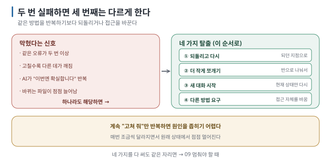

# 06 — 막혔을 때 빠져나오기

← [05 코드를 몰라도 하는 확인](05-verify-without-reading.md) · 다음 → [07 대화가 길어지면 생기는 일](07-context-limits.md)

> **왜 읽나:** 같은 오류와 비슷한 수정이 반복되는데도 나아지지 않는다면, 지시를 한 번 더 반복하기보다 접근을 바꿔야 합니다.
>
> **읽고 나면:** 막힌 상태를 알아보고, 네 가지 탈출 방법을 순서대로 시도할 수 있습니다.
>
> **급하면:** §2의 네 방법을 순서대로 시도하세요.

---

## 0. 같은 시도를 반복하지 않는다

- 이 가이드에서는 같은 증상과 비슷한 수정이 두 번 반복된 상태를 **막힘이라고** 부릅니다. 세 번째 시도부터는 방법을 바꿉니다. `[해석]`
- 네 가지 탈출 — **① 되돌리고 다시 ② 더 작게 쪼개기 ③ 새 대화 시작 ④ 다른 방법 요구.** 이 순서로 시도합니다. `[해석]`
- 같은 증상에 계속 "고쳐 줘"라고만 지시하면 변경은 쌓이지만 원인을 좁히지 못할 수 있습니다. `[해석]`
- 저장 지점이 있으면 언제든 되돌릴 수 있습니다. 없으면 이 문서의 절반이 불가능합니다([02](02-safety-net.md)).

## 1. 막혔다는 신호



| 신호 | 뜻 |
| --- | --- |
| 같은 오류 메시지가 두 번 이상 | AI가 같은 자리를 맴돌고 있음 |
| 고칠수록 다른 데가 깨짐 | 원인이 아닌 증상을 고치고 있음 |
| 근거 없이 "이번엔 확실합니다"를 반복 | 확인보다 추측에 기대고 있을 수 있음 |
| 바뀌는 파일이 점점 늘어남 | 범위가 번지고 있음 |
| 처음 요청이 뭐였는지 기억 안 남 | 대화가 너무 길어짐 ([07](07-context-limits.md)) |

`[해석]` — 두 번은 모든 상황에 통하는 법칙이 아니라 이 가이드의 전환 기준입니다. 같은 증상에 비슷한 수정만 쌓이지 않도록
세 번째에는 되돌리기, 분할, 새 대화, 다른 접근 중 하나를 고릅니다.

## 2. 네 가지 탈출 — 이 순서로

### ① 되돌리고 다시 (가장 먼저)

**되던 지점으로 돌아가서** 다시 시작합니다. 지금까지의 변경을 계속 고치는 것보다 기준선과 비교하는 편이 문제 범위를 좁히기
쉬울 수 있습니다.

> 💬 "지금까지 시도한 걸 버리고 (마지막으로 잘 되던 커밋) 상태로 돌아가고 싶어. 아직 커밋 안 한 변경은 버려도 돼(남길 게 있으면
> 먼저 커밋해 줘). `reset --hard`는 쓰지 말고 `restore`·`revert`로 하고, **실행할 명령을 먼저 보여 준 뒤** 내가 확인하면 실행해. 그다음
> 다르게 접근해 보자."

`[해석]` — "돌아가 줘"만 말하면 AI가 `git reset --hard`를 고를 수 있습니다. 그 명령은 커밋 안 한 작업을 **영구 삭제합니다**([02 §1](02-safety-net.md)).
명령을 먼저 보여 달라는 한 마디가 안전망입니다.

`[해석]` — 되돌린 뒤 **같은 요청을 그대로 다시 하지 마세요.** ②~④ 중 하나를 함께 적용합니다.

### ② 더 작게 쪼개기

실패한 요청을 반으로 나눕니다. 절반만 되게 하고, 되면 저장하고, 나머지 절반을 요청합니다.

> 💬 "이 기능을 만드는 걸 더 작은 단계로 쪼개 줘. 첫 단계는 화면에 뭐가 보이기만 해도 되는 수준으로. 각 단계마다 내가
> 확인할 방법도 알려 줘."

요청 범위가 컸다면 첫 단계의 성공 조건만 남기고 나눕니다. 범위가 이미 작다면 ③이나 ④로 넘어갑니다. `[해석]`

### ③ 새 대화 시작

대화가 길어지면 초기 규칙이나 실패한 가정이 현재 답변에 충분히 반영되지 않을 수 있습니다. **새 대화에 확인된 현재 상태만 다시
설명합니다**.

> 💬 (새 대화에서) "(프로젝트 설명) 을 만들고 있어. 지금 (되는 것)까지 됐고, (안 되는 것)에서 막혔어. 오류 메시지는
> (메시지)야. 파일은 (파일명)들이 있어. 어디부터 볼지 알려 줘."

자세한 판단 기준은 [07](07-context-limits.md)에 있습니다.

### ④ 다른 방법 요구

같은 접근으로 안 되면 접근 자체를 바꿉니다.

> 💬 "지금 방법으로 세 번 시도했는데 계속 (증상)이야. **완전히 다른 방법으로** 같은 목표를 이룰 수 있는 방법 두세 가지를
> 알려 줘. 각각의 장단점도. 아직 만들지는 말고."

`[해석]` — 마지막 문장이 중요합니다. **먼저 방법을 듣고 고른 뒤** 만들게 합니다.

## 3. 오류 메시지 다루는 법

빨간 글씨가 나와도 코드를 읽을 필요는 없습니다. **그대로 복사해서** 전달합니다.

> 💬 "이런 오류가 나왔어: (오류 메시지 전체 붙여넣기). 이게 무슨 뜻인지 코드를 모르는 사람에게 설명해 주고, 원인 후보를
> 두세 개 알려 줘."

**요령** `[해석]`:

- **전체를 붙여넣습니다.** 앞부분만 자르면 정작 중요한 줄이 빠집니다
- **언제 났는지 함께 말합니다** — "버튼을 눌렀을 때", "페이지를 열자마자"
- **화면에 보이는 것도 말합니다** — "하얀 화면", "이전 화면 그대로"

## 4. 그래도 안 되면

```text
□ ①~④를 다 해 봤나?
□ 새 대화에서도 같은 증상인가?
□ 되돌려서 다시 해도 같은 자리인가?
```

셋 다 예라면 [09 멈춰야 할 때](09-when-to-stop.md)로 갑니다. AI에게 더 많은 수정을 맡기기보다 다른 방법이나 사람의 검토가
필요한지 판단합니다.

## 5. 막힌 기록 남기기

같은 곳에서 또 막히지 않으려면 적어 둡니다.

```text
2026-08-24  파일 업로드에서 막힘. "413 Payload Too Large" 반복.
            시도: 코드 수정 3회(실패), 되돌리기 후 쪼개기(성공 — 업로드 크기 제한을 먼저 설정)
            배운 것: 서버 설정 문제였는데 코드만 고치고 있었음
```

---

**다음 →** [07 대화가 길어지면 생기는 일](07-context-limits.md)
