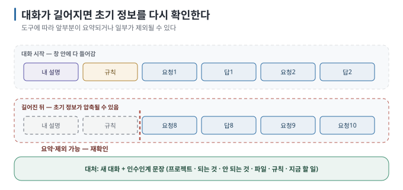

# 07 — 대화가 길어지면 생기는 일

← [06 막혔을 때 빠져나오기](06-getting-unstuck.md) · 다음 → [08 남에게 보여 주기 전 점검](08-before-sharing.md)

> **왜 읽나:** AI가 처음 정한 규칙이나 이미 끝낸 작업을 놓치기 시작했다면 컨텍스트 한계를 의심할 수 있습니다. 다만 같은
> 증상이 모호한 지시나 잘못된 가정 때문에 생길 수도 있으므로, 현재 상태를 다시 확인하는 일이 먼저입니다.
>
> **읽고 나면:** 컨텍스트 한계의 증상을 알아보고, 새 대화를 언제 어떻게 시작할지 판단할 수 있습니다.
>
> **바쁘면:** §2의 증상표와 §3의 인수인계 문장만.

---

## 0. 대화보다 현재 상태를 남긴다

- AI는 **한 번에 읽을 수 있는 양(컨텍스트 창)이** 정해져 있습니다. 대화가 그 양에 가까워지면 도구는 **앞부분을 요약해 바꿔치기하거나,
  잘라내거나, 오류를 냅니다** — 어느 쪽인지는 도구마다 다릅니다. `[원리]` `[자료 확인 · 2026-08-30]`
- 요약되거나 제외된 내용은 현재 답변에 충분히 반영되지 않을 수 있습니다. 어떤 내용이 먼저 약해지는지는 도구와 대화 내용에 따라
  다르므로, 처음 규칙이 반드시 먼저 사라진다고 단정할 수는 없습니다. `[해석]`
- 초기 규칙 누락이 의심되면 **새 대화를 시작하고 확인된 현재 상태와 지켜야 할 규칙을 다시 전달합니다.** `[해석]`
- 요청 하나가 끝나고 커밋한 시점은 대화를 나누기 좋은 경계입니다. 잘 진행 중인 대화를 일부러 끊을 필요는 없습니다. `[해석]`

## 1. 왜 잊어버리나



`[자료 확인 · 2026-08-30]` — AI 코딩 도구 다수는 창이 차기 전에 **앞부분을 자동으로 요약해 압축합니다**. 모델을 직접 호출하는
프로그램은 잘라내거나 오류를 냅니다(로컬 runtime은 앞을 조용히 잘라내는 경우가 있음 — [앱 연결 가이드 04 §2](../local-llm-app-integration/04-parameters-and-context.md)).
요약에 무엇이 남는지, 입력의 어느 부분을 제외하는지, 사용자에게 경고하는지는 도구와 version에 따라 다릅니다. 따라서 특정 규칙이
반드시 먼저 사라진다고 보지 않고, 현재 답변에서 빠진 조건이 있는지 결과로 확인합니다. `[해석]`

> **초심자용 한 줄:** 긴 회의록을 짧게 요약하면 세부 조건이 빠질 수 있는 것과 비슷합니다. 중요한 규칙은 대화에만 두지 않고
> 프로젝트 파일과 인수인계 문장에도 남깁니다.

## 2. 증상표

| 증상 | 컨텍스트 문제일 가능성 | 확인 |
| --- | --- | --- |
| "이건 하지 말랬는데" 한 걸 또 함 | 있음 | 규칙이 현재 답변에 반영됐는지 다시 확인 |
| 앞에서 정한 이름·형식을 다르게 씀 | 있음 | 현재 규칙 파일과 대화 요약 확인 |
| 이미 고친 걸 또 고치려 함 | 있음 | 실제 파일 상태를 먼저 읽게 하기 |
| 답이 점점 짧아지거나 뭉뚱그려짐 | 불명확 | 답변 스타일이나 요청 범위 때문일 수도 있음 |
| 같은 오류를 반복 | 낮음 | [06](06-getting-unstuck.md) 참조 — 다른 문제일 수 있음 |
| 처음부터 못 했음 | 낮음 | 요청이 모호했을 가능성 ([03](03-how-to-ask.md)) |

`[해석]` — 위 증상만으로 컨텍스트 문제라고 확정할 수는 없습니다. 실제 파일과 규칙을 다시 읽게 했는데도 같은 누락이 반복된다면
새 대화로 현재 상태를 인계합니다.

## 3. 새 대화 인수인계 문장

새 대화에 이것만 붙여넣으면 됩니다. 미리 만들어 두고 갱신하며 쓰세요.

```text
[프로젝트] 할 일 목록 웹앱. 혼자 쓰는 용도.
[지금 되는 것] 할 일 추가·삭제, 새로고침해도 유지됨
[지금 안 되는 것] 모바일 화면에서 버튼이 겹침
[파일] index.html, style.css, app.js
[규칙] 로그인은 만들지 않음. 라이브러리 추가하지 않음.
[지금 할 일] 모바일에서 버튼 겹침을 고치고 싶어. 어디부터 볼지 알려 줘.
```

`[해석]` — **[규칙]은 현재 작업과 직접 관련된 것만** 넣습니다. 프로젝트 전체 규칙은 도구가 읽는 규칙 파일에 남기고, 인수인계
문장에는 이번 작업에서 지켜야 할 경계만 다시 적습니다.

> 💬 **AI에게 만들게 할 수도 있습니다:** (지금 대화에서) "새 대화를 시작하려고 해. 지금까지의 프로젝트 상태를 새 대화에
> 붙여넣을 인수인계 문장으로 정리해 줘. 프로젝트 설명, 되는 것, 안 되는 것, 파일 목록, 지켜야 할 규칙 순으로."

## 4. 언제 끊나

| 시점 | 끊기 |
| --- | --- |
| 요청 하나가 끝나고 커밋했을 때 | ✅ 좋은 지점 |
| 실제 상태를 다시 읽혀도 §2의 누락이 반복될 때 | ✅ 고려 |
| 주제가 바뀔 때 (기능 → 디자인) | ✅ |
| 막혀서 세 번째 시도할 때 | ✅ [06 ③](06-getting-unstuck.md) |
| 잘 진행 중일 때 | ✖ 굳이 |

대화가 길다는 이유만으로 버릴 필요는 없습니다. 다만 중요한 결정과 확인 결과는 대화 밖의 프로젝트 파일과 커밋에도 남겨야 다음
대화나 다른 도구에서 이어갈 수 있습니다. `[해석]`

## 5. 대화를 짧게 유지하는 습관

- **요청 하나 = 대화 한 토막.** 끝나면 저장하고 넘어갑니다([04](04-one-at-a-time.md))
- **규칙은 파일에 적습니다.** 대화에만 있으면 요약되거나 밀려납니다 — 많은 AI 코딩 도구가 프로젝트 폴더의 규칙 파일을 매
  대화 시작 시 자동으로 읽습니다. 파일 이름은 도구마다 다르므로 사용하는 도구의 문서를 확인하세요([출처](SOURCES.md)) `[문서 확인 · 2026-08-30]`
- **긴 자료는 파일로 두고 필요한 범위를 지목합니다.** 파일 전체를 읽히는 것도 컨텍스트를 사용하므로, 관련 절이나 경로를 함께
  알려 주는 편이 좋습니다
- **결정은 커밋 메시지에 남깁니다.** 대화보다 오래갑니다([Git 가이드 08](../git-for-vibe-coders/08-commit-messages.md))

---

**다음 →** [08 남에게 보여 주기 전 점검](08-before-sharing.md)
