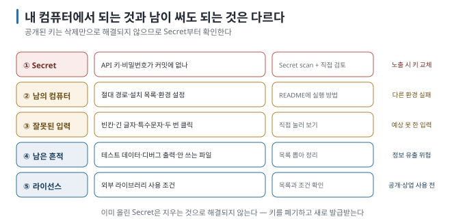

# 08 — 남에게 보여 주기 전 점검

← [07 대화가 길어지면 생기는 일](07-context-limits.md) · 다음 → [09 멈춰야 할 때](09-when-to-stop.md)

> **왜 읽나:** 내 컴퓨터에서 동작하는 것과 다른 사람에게 안전하게 공개할 수 있는 것은 다릅니다. 특히 Secret이 공개되면
> 파일을 지우는 것 외에 키 폐기와 재발급까지 필요할 수 있습니다.
>
> **읽고 나면:** 공유·배포·제출 전 다섯 가지를 점검할 수 있습니다.
>
> **바쁘면:** §1의 다섯 줄만.

---

## 0. 공개 전에는 별도의 확인이 필요하다

- 점검 다섯 — **① Secret ② 남의 컴퓨터에서도 되나 ③ 잘못된 입력 ④ 남은 흔적 ⑤ 라이선스·출처.** `[해석]`
- **① Secret 확인을 먼저 합니다.** 공개된 키는 삭제만으로 안전해지지 않으며 폐기와 재발급이 필요합니다. `[해석]`
- 다른 환경에서 실행하려면 설치 항목·환경 변수·파일 경로가 문서에 드러나야 합니다. `[해석]`
- AI에게 점검을 지시할 수 있지만, 공개 범위와 위험 수용 여부는 사람이 결정합니다.

## 1. 다섯 가지 점검



### ① Secret이 안 들어갔나 ★

```bash
git status --short         # 아직 커밋하지 않은 파일
git ls-files               # 현재 Git이 추적하는 파일
git log --all --name-only --format=   # 이전 커밋에 들어간 파일 이름
```

이 명령들은 **파일 이름과 범위를 찾는 출발점일 뿐, Secret이 없다는 증명은 아닙니다.** `.env`·인증서·내보낸 설정 파일처럼
민감할 가능성이 있는 이름을 찾고, 실제 내용은 별도의 Secret scan과 검토로 확인합니다.

> 💬 "현재 추적 중인 파일과 Git history 전체에서 API 키, 비밀번호, 토큰, 개인정보로 보이는 내용을 검사해 줘. 값 자체는
> 출력하지 말고 파일명·줄 번호·의심 유형만 알려 줘. 검사하지 못한 범위도 따로 적어 줘."

| 상태 | 대응 |
| --- | --- |
| 아직 커밋 안 함 | `.gitignore`에 추가하고 끝 |
| 커밋했지만 안 올림 | [Git 가이드 11 S10 ③](../git-for-vibe-coders/11-scenarios-share.md) |
| **이미 올림** | **키를 새로 발급받습니다.** 지우는 것으로 해결되지 않습니다 |

GitHub의 Secret scanning은 알려진 형식의 일부 Secret을 찾아 주지만 모든 민감정보를 발견하는 것은 아닙니다. 공개 저장소로
전환하거나 새 version을 배포할 때 `github-release-guide` Skill을 사용할 수 있다면, 공개 범위와 release surface를 함께
점검하는 용도로 활용할 수 있습니다. `[문서 확인 · 2026-09-01]`

### ② 남의 컴퓨터에서도 되나

"내 컴퓨터에서는 되는데" 의 흔한 원인 `[해석]`:

| 원인 | 확인 |
| --- | --- |
| 내 컴퓨터에만 있는 파일을 쓰고 있음 | 절대 경로(`/Users/내이름/...`처럼 **내 컴퓨터에서만** 맞는 위치)가 코드에 있나 |
| 설치한 걸 안 적어 뒀음 | 새로 받은 사람이 뭘 설치해야 하나 적혀 있나 |
| 환경 설정이 내 것에만 있음 | `.env.example`(실제 값은 비우고 항목 이름만 적은 견본) 같은 파일이 있나 |

> 💬 "다른 사람이 이 프로젝트를 처음 받아서 실행하려면 뭘 해야 하는지 단계별로 알려 주고, 그걸 README에 적어 줘.
> 내 컴퓨터에만 있는 경로나 설정에 의존하는 부분이 있으면 알려 줘."

### ③ 잘못된 입력에 안 깨지나

[05 ②](05-verify-without-reading.md)의 확인을 다시 합니다. 남이 쓰면 **내가 상상 못 한 입력이** 들어옵니다.

- 빈칸 제출 / 아주 긴 입력 / 특수문자 / 뒤로가기 / 두 번 클릭

### ④ 남은 흔적

| 흔적 | 왜 |
| --- | --- |
| 테스트용 데이터 (홍길동, test123) | 남이 보면 이상함 |
| 화면에 뜨는 디버그 메시지 | 지저분하고 정보가 샐 수 있음 |
| 주석 처리된 옛날 코드 덩어리 | 혼란 |
| 안 쓰는 파일 | 혼란 |

> 💬 "배포 전 정리할 것들을 찾아 줘 — 테스트 데이터, 디버그 출력, 안 쓰는 파일, 주석 처리된 코드. 목록만 먼저 보여 줘."

### ⑤ 라이선스·출처

AI가 라이브러리를 추가했다면 그 라이브러리의 조건이 따라옵니다. 공개·상업적 사용 전에 확인합니다. `[해석]`

> 💬 "이 프로젝트가 쓰는 외부 라이브러리 목록과 각각의 라이선스를 알려 줘. 상업적으로 써도 되는지, 출처를 표시해야 하는지 정리해 줘."

`[해석]` — 이 가이드는 법률 판단을 하지 않습니다. **확인이 필요하다는 것까지만** 알려 드립니다.

## 2. 저장소 공개 범위를 정할 때

저장소 공개 범위는 운영 안전을 판단하는 여러 항목 중 하나입니다. 아래 표에서는 누가 저장소를 볼 수 있는지만 구분합니다.

| 범위 | 언제 | 주의 |
| --- | --- | --- |
| 나만 (Private 저장소) | 백업·개인 작업 | 접근 범위는 좁지만 Secret을 저장해도 된다는 뜻은 아님 |
| 특정인에게 링크 | 보여 주기 | 링크가 퍼질 수 있음 |
| 완전 공개 | 포트폴리오·오픈소스 | ①⑤를 반드시 |

`[문서 확인 · 2026-09-01]` — GitHub 저장소는 만들 때 Private/Public을 고르고 나중에 공개 범위를 바꿀 수 있습니다.
Public 상태에서 노출된 내용은 저장소를 Private으로 바꿔도 다른 사람이 이미 복제했거나 별도로 보관했을 가능성을 없앨 수 없습니다.

## 3. hosting 서비스에 올리기 전

개발·배포 플랫폼에서 `Publish`나 `Deploy`를 누르는 순간 공개 URL이 만들어질 수 있습니다. 제품마다 기본 공개 범위와 비용 정책이
다르고 기능도 바뀌므로, 실제 화면과 공식 문서를 기준으로 확인합니다. `[해석]`

```text
□ 공개 URL을 볼 수 있는 사람을 확인했다
□ 무료 한도·과금 기준·사용량 확인 위치를 찾았다
□ API Key와 비밀번호가 환경 변수나 Secret 저장소에 있다
□ 데이터의 저장 위치·backup·export·삭제 방법을 확인했다
□ domain과 서비스 계정의 소유자를 확인했다
□ 코드를 Git에 동기화하거나 내려받아 다른 곳에서 실행할 수 있다
```

서비스가 서버와 database를 대신 관리해도 공개 승인과 비용·데이터에 대한 판단까지 대신하지는 않습니다. 플랫폼 역할을 먼저
구분하려면 [00 코드를 둘러싼 큰 그림](00-big-picture.md)을 참고하세요.

## 4. 최소 README

남이 볼 거라면 이 다섯 줄은 있어야 합니다.

```text
# 프로젝트 이름
한 줄 설명.

## 실행 방법
1. (설치할 것)
2. (실행 명령)

## 아직 안 되는 것
- (알려진 한계)
```

**"아직 안 되는 것"이** 가장 유용합니다. 보는 사람이 버그를 발견했다고 생각하지 않게 합니다. `[해석]`

## 5. 점검표

```text
□ Secret이 커밋에 없다 (또는 이미 올렸다면 키를 교체했다)     → 아니오면 §1 ①
□ 다른 사람이 실행하는 방법이 README에 있다                    → 아니오면 §1 ② · §4
□ 빈칸·긴 입력·특수문자로 눌러 봤다                            → 아니오면 §1 ③
□ 테스트 데이터와 디버그 출력을 지웠다                          → 아니오면 §1 ④
□ 외부 라이브러리 라이선스를 확인했다                           → 아니오면 §1 ⑤
□ 공개 범위를 의도적으로 골랐다                                 → 아니오면 §2
□ hosting의 비용·Secret·데이터·코드 export를 확인했다            → 아니오면 §3
```

---

**다음 →** [09 멈춰야 할 때](09-when-to-stop.md)
