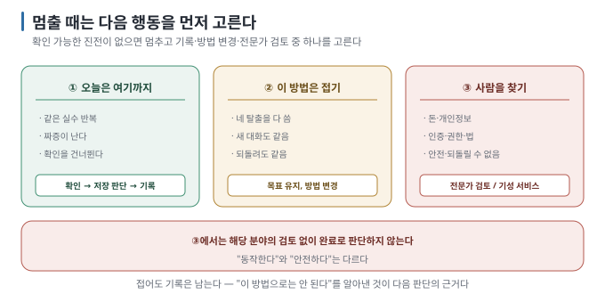

# 09 — 멈춰야 할 때

← [08 남에게 보여 주기 전 점검](08-before-sharing.md) · 다음 → [10 용어집](10-glossary.md)

> **왜 읽나:** 같은 시도를 계속할지, 접근을 바꿀지, 사람의 검토를 구할지 구분하지 않으면 변경과 불확실성만 쌓일 수 있습니다.
> 이 장에서는 서로 다른 세 종류의 멈춤을 다룹니다.
>
> **읽고 나면:** 세 종류의 멈춤을 구분하고, 각각의 신호를 알아볼 수 있습니다.
>
> **바쁘면:** §1의 세 가지와 §2 표만.

---

## 0. 멈춤도 작업의 일부다

- 멈춤은 세 종류 — **① 오늘은 여기까지 ② 이 방법은 접기 ③ 사람을 찾기.** 셋은 다릅니다. `[해석]`
- **가장 위험한 영역:** 돈·개인정보·법·안전이 걸린 것. 여기서는 "일단 되니까"가 통하지 않습니다. `[해석]`
- 계속할지 판단할 때는 시간만 보지 않고 **확인 가능한 진전이 있는지** 봅니다. `[해석]`
- **접는 것도 결과입니다.** "이 방법으로는 안 된다"를 알아낸 것이 남습니다.

## 1. 세 종류의 멈춤



### ① 오늘은 여기까지

**신호:** 같은 실수를 반복하고 있다, 짜증이 난다, 확인을 건너뛰기 시작했다.

**할 일:** 현재 상태가 확인된 경우에만 커밋합니다. 동작이 깨진 상태라면 무리해서 커밋하지 말고 `git status --short`와
`git diff --stat`, 오류 메시지, 마지막으로 잘 되던 커밋을 `WORKING.md`에 적고 닫습니다. 다음에는 새 대화로 시작합니다
([07 §3](07-context-limits.md)).

`[해석]` — 피곤하거나 조급할 때는 확인을 건너뛰기 쉽습니다. 확인 없이 변경을 계속 쌓으면 어느 시점부터 문제가 생겼는지
찾기 어려워집니다.

### ② 이 방법은 접기

**신호:** [06](06-getting-unstuck.md)의 네 방법을 다 써도 같은 자리다. 새 대화에서도 같다. 되돌려서 다시 해도 같다.

**할 일:** 목표는 유지하고 **방법을 바꿉니다.**

> 💬 "(목표)를 이루려고 (방법)으로 시도했는데 (증상) 때문에 계속 막혀. 완전히 다른 접근 두세 가지와 각각이 이 문제를
> 어떻게 피하는지 알려 줘. 더 간단한 방법이 있으면 그것부터."

`[해석]` — **"더 간단한 방법"도 함께 묻습니다.** 현재 접근이 목표에 비해 복잡한 경우라면 필요한 조건만 남긴 방법을 다시
고를 수 있습니다.

### ③ 사람을 찾기

**여기서는 AI를 더 밀어붙이지 않습니다.**

| 영역 | 왜 |
| --- | --- |
| **돈이 오가는 것** | 결제·정산·환불. 틀리면 실제 손해가 생깁니다 |
| **개인정보** | 이름·연락처·주민번호·건강 정보를 저장·전송 |
| **인증·권한** | 로그인, "누가 무엇을 볼 수 있는가" |
| **법·규제** | 계약, 의료, 금융, 개인정보 처리 |
| **안전** | 사람이 다칠 수 있는 것 |
| **되돌릴 수 없는 것** | 데이터 영구 삭제, 대량 발송 |

`[해석]` — AI는 이 영역에서도 **그럴듯한 코드를 만들어 냅니다.** 문제는 그게 맞는지 판단할 사람이 없다는 것입니다.
"동작한다"와 "안전하다"는 다릅니다.

**할 일:** 해당 분야의 전문가에게 검토를 요청하거나, 그 부분을 검증된 서비스에 맡기는 방안을 검토합니다. 결제는 결제 대행
서비스, 로그인은 인증 서비스를 사용할 수 있지만, 서비스를 선택하고 올바르게 설정하는 일에도 검토가 필요합니다.

## 2. 판단표

| 상황 | 계속 | 멈춤 |
| --- | --- | --- |
| 시간이 걸려도 확인 가능한 진전이 있음 | ✅ | |
| 같은 증상과 비슷한 수정이 두 번 반복됨 | | ① 또는 ② |
| 확인을 건너뛰기 시작 | | ① |
| [06]의 네 방법을 다 씀 | | ② |
| 돈·개인정보·인증·법·안전이 걸림 | | **③** |
| "일단 되니까 나중에" 라는 생각이 듦 | | 그 부분이 ③인지 확인 |
| 되돌릴 지점이 없음 | | 현재 상태를 확인한 뒤 저장 여부를 결정하고 ① |

## 3. 멈출 때 남기는 것

멈추는 것과 흐지부지되는 것의 차이는 **기록입니다**.

```text
2026-08-24 중단
[목표] 파일 업로드 기능
[된 것] 파일 선택 화면까지
[막힌 것] 5MB 넘는 파일에서 413 오류 반복
[시도] 코드 수정 3회, 되돌리기 후 쪼개기, 새 대화 — 전부 같은 증상
[판단] ② 방법 접기 — 서버 설정 문제로 보임. 다음엔 업로드 크기 제한 설정부터
[다음] 파일 크기를 2MB로 제한하고 우선 진행
```

`[해석]` — **[판단]과 [다음]** 두 줄이 핵심입니다. 이게 없으면 다음에 같은 자리에서 같은 시도를 반복합니다.

## 4. 그리고 다시 시작할 때

- 기록을 먼저 읽습니다
- 되던 지점에서 시작합니다
- **접기로 한 방법은 다시 하지 않습니다**
- 다섯 줄([01](01-decide-first.md))을 다시 봅니다 — 목표가 바뀌었을 수도 있습니다

---

**다음 →** [10 용어집](10-glossary.md)
