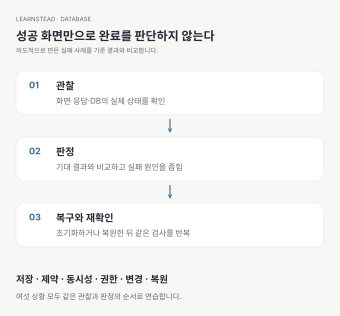

# 저장됐다고 끝이 아니다 — 데이터·권한·복구 확인하기

<!-- learnstead:nav:start -->
[← 학습 자료 목록](../../README.md) · [시작: 01. 저장 — 껐다 켜도 남는가](01-persistence.md) · [검증 기록](VALIDATION.md)
<!-- learnstead:nav:end -->


**저장 위치·잘못된 입력·동시 신청·다른 사용자·구조 변경·백업 복원을 직접 확인합니다.** AI가 만든 앱의 화면만으로 완료를 판단하기 어려운 분을 위한 실습입니다. 코드를 모두 해석할 필요는 없지만 명령의 대상과 결과는 확인해야 합니다.

SQLite 비교는 계정 없이 Python만으로 실행합니다. 나머지는 [신청 앱 튜토리얼](../../tutorials/study-signup-db/README.md)의 로컬 Supabase를 사용합니다. 실패 상황은 재현을 위해 의도적으로 만든 fixture이며, 특정 AI 모델의 실패율을 측정하는 실험이 아닙니다.



> **실행 검증 · 2026-09-13:** macOS에서 SQLite 자동 비교 6개와 수동 저장·조회·초기화, Supabase/PostgreSQL 통합 판정 14개를 확인했습니다. 실제 환경·응답·복원 범위는 [검증 기록](VALIDATION.md)에 있습니다. 이 숫자는 정해 둔 교육용 시나리오의 판정 수입니다.

## 완료 조건

여섯 상황에서 실행 전 예상과 실제 결과를 비교하고, 통과 또는 실패 이유를 설명합니다. 오류 응답뿐 아니라 **실제로 남은 행과 바뀐 값으로** 판정합니다. 마지막에는 연습 데이터를 초기화하거나 서비스를 멈출 수 있어야 합니다.

## 준비와 공통 실행

<a id="1-계정-없는-첫-실습"></a>

### Part 1. SQLite로 저장 확인 — 01장

Python 3만 있으면 시작할 수 있습니다. Docker나 신청 앱은 아직 필요하지 않습니다. [01 저장](01-persistence.md)의 예상 결과를 읽고, Learnstead 최상위 폴더에서 다음을 실행합니다.

```bash
cd labs/database-safety
python3 code/sqlite_lab.py
```

외부 Python 패키지는 필요 없습니다. Python이 없다면 Python 3를 먼저 설치합니다. 자동 비교 뒤에 01장의 수동 저장·조회도 해 볼 수 있습니다. 여기까지만 마치고 개념 가이드로 돌아가도 됩니다.

<a id="2-db-실습-준비"></a>

### Part 2. 신청 앱의 데이터·권한·복원 확인 — 02~06장

먼저 [신청 앱 튜토리얼](../../tutorials/study-signup-db/README.md)을 완료합니다. 다른 날 이어서 한다면 [재시작 절차](../../tutorials/study-signup-db/05-finish.md#멈추고-다시-시작하기)로 로컬 DB를 시작합니다. 클라우드 DB나 실제 데이터는 사용하지 않습니다.

1. 아래 02~06장의 기대 결과를 먼저 읽고 관찰 표의 예상치를 적습니다. 아직 검증 명령은 실행하지 않습니다.
2. **`tutorials/study-signup-db/app` 폴더**로 이동합니다. 검증은 모임 세 개·신청 0개에서 시작합니다. 튜토리얼이나 실습 01에서 만든 신청이 있다면 각 사용자로 로그인해 자신의 신청을 취소합니다.
3. 처음부터 다시 시작하려면 보존할 결과를 먼저 기록하고, 필요 없는 연습 데이터임을 확인한 뒤 아래 초기화를 실행합니다. 이미 기준 상태라면 초기화할 필요가 없습니다.

```bash
npm run db:reset -- --confirm-local-reset
```

이 명령은 이 프로젝트 소유의 DB 볼륨을 새로 만들어 연습 DB의 사용자·신청 데이터를 삭제하고 기준 계정과 데이터를 다시 만듭니다. SQLite 파일과 `.local`의 백업은 그대로 남습니다. 다른 프로젝트를 정리하는 Docker 전체 삭제 명령은 사용하지 않습니다.

<a id="3-전체-검증-실행"></a>

### 예상치를 적고 기준 상태를 준비했다면 실행하기

같은 `app` 폴더에서 실행합니다.

```bash
npm run verify
```

한 번의 실행에 02~06장의 제약조건·동시 요청·권한·기존 데이터 변경·별도 DB 복원이 들어 있습니다. 장마다 반복 실행할 필요는 없습니다. 터미널의 `관찰 [02]`처럼 장 번호가 붙은 항목에서 **예상·실제·판정을** 읽고 해당 장의 표를 채우세요. `before`는 변경 전, `after`는 변경 후, `rows`는 행 수, `http`는 응답 상태를 뜻합니다. 신청 ID는 실행마다 달라질 수 있으므로 이번 실행 안에서 비교합니다.

출력한 관찰값은 `app/.local/verification.json`의 `observations`에도 저장합니다. 예상과 실제가 다르면 `FAIL`을 표시하고 중단합니다. JSON은 끝까지 성공했을 때 갱신하므로, 실패한 실행은 터미널을 확인하고 이전 JSON을 새 결과로 읽지 마세요.

실행 중에는 연습용 신청이 만들어지고 바뀝니다. 브라우저에서 동시에 신청을 추가하지 마세요. 완료 시 검증이 만든 신청과 정원 카운터는 0으로 돌아옵니다. 연습용 논리 백업은 `app/.local/practice-backup.sql`에 남습니다. 백업에는 가상 계정 정보도 포함되므로 공개하거나 실제 계정에 재사용하지 않습니다.

일부 SQL 오류와 권한 안내는 의도한 거절을 확인하는 과정에서 표시됩니다. `PASS`와 최종 결과를 함께 읽으세요. 비로그인 조회를 허용하라는 일반적인 힌트가 보여도 실습을 통과시키려고 권한을 넓히지 않습니다.

중간에 실패하면 오류와 남은 상태를 확인하고, [튜토리얼 초기화](../../tutorials/study-signup-db/01-prepare.md)로 기준 상태를 만든 뒤 다시 실행합니다. 이름이 같은 검증 DB가 이미 있으면 임의로 덮어쓰지 않고 중단합니다. 다른 작업의 DB인지 확인 없이 지우지 마세요.

## 여섯 시나리오

| 문서 | 고정된 질문 | 통과 조건 |
| --- | --- | --- |
| [01 저장](01-persistence.md) | 연결·프로그램을 다시 열면? | 메모리와 파일의 차이, DB 재조회 결과 확인 |
| [02 규칙](02-constraints.md) | 중복·없는 모임을 보내면? | 잘못된 행이 남지 않음 |
| [03 동시 변경](03-atomicity.md) | 마지막 한 자리에 두 요청이 오면? | 한 명 성공, 한 행. 실패 시 부분 변경 없음 |
| [04 접근](04-authorization.md) | 다른 사용자의 ID로 요청하면? | 허용한 작업만 적용, 타인의 행 유지 |
| [05 구조 변경](05-migration.md) | 예전 신청에 메모 열을 추가하면? | 기존 값·관계 보존, 새 구조 사용 가능 |
| [06 복원](06-restore.md) | 백업을 다른 DB에 복원하면? | 값·관계·DB 접근 규칙 복원 |

## 판정에서 구분할 것

| 관찰 | 곧바로 뜻하지 않는 것 | 함께 확인 |
| --- | --- | --- |
| HTTP 성공 | 쓰기 성공 | 실제 영향 행 수와 소유자의 재조회 |
| 오류 발생 | 의도한 보호 성공 | 오류 종류와 DB 상태 |
| 관리자 조회 성공 | 일반 사용자 접근 허용 | A·B·비로그인 요청 |
| 백업 파일 생성 | 복원 성공 | 별도 대상의 행·관계·권한 |
| 전체 `PASS` | 모든 환경의 운영 준비 | 검사한 환경·데이터·범위 |

원본 DB의 권한은 실제 Auth 로그인과 REST 요청으로 검사합니다. **복원한 별도 DB의 권한은 SQL 역할과 사용자 식별자를 설정해 검사합니다.** 복원본에서 Auth 서비스까지 다시 연결해 웹 로그인을 재현했다는 뜻은 아닙니다. 첨부 파일 본체·클라우드 설정·시점 복구(PITR)도 포함하지 않습니다.

## 재실행과 정리

SQLite 임시 비교는 종료 시 자기 파일을 정리합니다. DB 검증은 자신의 fixture와 검증용 DB를 대상으로 하며, 완료 후 같은 명령으로 반복할 수 있습니다. 앱 사용을 마치면 웹 서버 터미널에서 `Ctrl+C`, 별도 터미널의 `app` 폴더에서 다음을 실행합니다.

```bash
npm run db:stop
```

이 명령은 로컬 DB 데이터를 보존하며 서비스를 멈춥니다. `.local`의 백업·결과를 보존할지와 완전히 새로 시작할지는 별도로 결정하세요.

## 검증과 출처

- [실행 환경·실제 판정·확인하지 않은 범위](VALIDATION.md)
- [공식 출처](SOURCES.md)
- [변경 기록](CHANGELOG.md)

함께 읽기: [개념 가이드](../../guides/database-for-vibe-coders/README.md)

<!-- learnstead:footer:start -->

---

[← 학습 자료 목록](../../README.md) · [시작: 01. 저장 — 껐다 켜도 남는가](01-persistence.md) · [검증 기록](VALIDATION.md)

<!-- learnstead:footer:end -->
