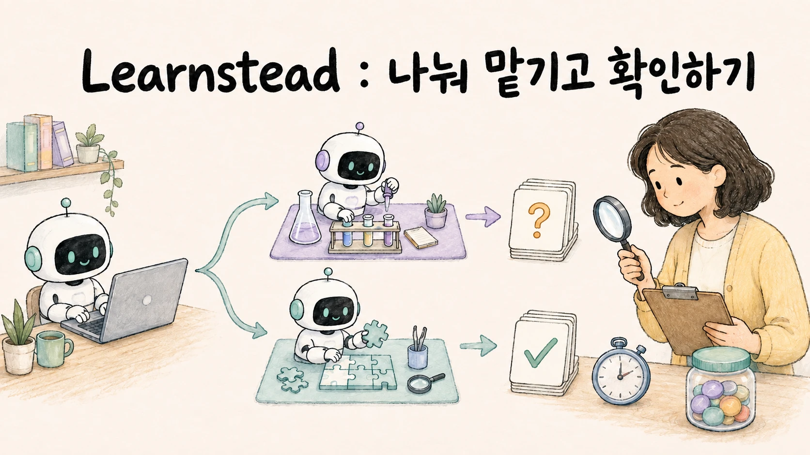

# 나눠 맡기고 확인하기 — Subagent 위임·병렬·검토 실측

> [시작: 01. 기준선 — 한 세션이 하는 만큼 →](01-baseline.md)



> 작은 가계부 프로젝트에 결함 세 개를 심어 두고, 같은 과제를 **한 세션 · subagent 위임 · subagent 병렬 · 새 컨텍스트 검토로** Claude Code와 Codex CLI에서 반복 실행합니다. 사용자가 대화하는 메인 세션의 마지막 입력 크기, 총 경과 시간(벽시계 시간), 미리 정한 결함 위치와 일치하는 지적 수를 채점기로 기록합니다. 불충분한 위임 요청·같은 파일의 편집 충돌·검토 범위를 넓혔을 때 늘어나는 제안을 살펴보고, 작성 세션 이어 가기 검토와 새 컨텍스트 검토를 같은 기준으로 비교합니다. 가이드 [AI Agent에게 일을 나눠 맡기는 법](../../guides/agent-delegation/README.md)의 실습편.

## 학습 달성 목표(Learning Objective)

- 한 세션이 직접 처리한 토큰 사용량·시간·결함 위치 일치 수를 기준선으로 기록하고, 작업 분담 후의 결과와 비교합니다.
- subagent에 위임했을 때 메인 컨텍스트가 줄었는지, 전체 토큰이 늘었는지를 도구의 사용량(usage) 기록에서 확인합니다.
- 병렬이 실제로 시간을 줄였는지 순차와 대조하고, 같은 파일 편집의 충돌을 worktree 유무로 재현한다.
- 작성 세션 이어 가기 검토와 새 컨텍스트 검토, "결함만"과 "모든 개선점(gap)"을 찾으라는 요청의 결함 위치 일치 수와 정답 목록(골든셋) 밖 지적을 동일한 기준으로 비교합니다.

## 완료 조건

1. 01에서 두 도구의 기준선 행(검토 위치 일치 수와 지적 원문, 과제 A의 기능·테스트 결과)을 기록한다.
2. 02에서 위임 시 메인 토큰과 위임 토큰을 나눠 적고, 이력 의존 위임의 결과를 관측한다.
3. 03에서 동시 3 vs 순차의 벽시계와, 같은 파일 과제의 최종 상태를 격리 유무로 기록한다.
4. 04에서 이어 가기·새 컨텍스트·교차 검토의 규격 위반 발견 횟수와 검토 턴의 입력량·시간, 두 검토 프롬프트의 골든셋 밖 지적 수를 기록한다.
5. 05에서 종합표를 채우고 다섯 질문으로 각 구성의 유지·되돌림을 판정한다.

## 지원 환경 · 준비

| 필요 | 확인 |
| --- | --- |
| macOS 또는 Linux, Python 3.10+, git, rsync | `python3 --version` · `git --version` |
| Claude Code 2.1.263 이상, 로그인 | `claude --version`. 작성 환경은 Fable 5.1(01·02·04)과 Opus 5(03·교차). `CLAUDE_MODEL=opus`처럼 지정할 수 있습니다 |
| Codex CLI 0.153.4 이상, 로그인 | `codex --version`. 작성 환경의 모델은 `gpt-6-astra`(reasoning `medium`)였고 `CODEX_MODEL`·`CODEX_EFFORT`로 지정할 수 있습니다 |

한 도구만 있어도 진행할 수 있습니다. 없는 도구의 행은 비워 둡니다. `LAB_TOOLS=claude` 또는 `LAB_TOOLS=codex`를 설정하면 `batch.sh`가 선택한 도구만 실행하며 교차 검토는 건너뜁니다. 기본값은 `LAB_TOOLS=both`입니다.

처음에는 한 도구에서 직접 검토·위임 검토를 각 1회만 비교하세요. 아래 예시는 Codex이며 Claude Code라면 `LAB_TOOLS=claude`로 바꿉니다. 전체 단계는 이 작은 비교가 끝난 뒤 실행합니다.

```bash
# fixture/ 안에서
LAB_TOOLS=codex ./scripts/batch.sh first 1 s01-review-direct s02-review-delegate
python3 scripts/score.py --tsv runs/first/*
```

이후 비교에서는 같은 모델·설정을 유지하세요. `CODEX_MODEL`·`CODEX_EFFORT`는 Codex runner 2종에, `CLAUDE_MODEL`은 Claude runner에 적용됩니다. 자식 모델까지 같았는지는 실행 기록에서 확인해야 합니다.

모든 실행 명령은 `fixture/` 안에서 실행합니다. 아래 준비 절차의 `cd fixture`는 실습 README가 있는 디렉터리에서 한 번만 실행합니다.

```bash
cd fixture
(cd project && PYTHONPATH=src python3 -m unittest -q)       # OK, 2 tests
./scripts/run-claude.sh s01-review-direct smoke 1            # 첫 실행 확인
python3 scripts/score.py --tsv runs/smoke/claude-s01-review-direct-r1
```

첫 실행이 실패하면 `runs/smoke/…/stderr.txt`를 봅니다. 로그인·네트워크·권한 오류가 대부분입니다. 같은 실행 이름·시나리오·회차가 이미 있으면 runner는 덮어쓰지 않고 멈춥니다. 재실행은 새 실행 이름을 쓰세요. fixture 원본은 바뀌지 않습니다.

```text
fixture/
├── project/            결함 3개를 심은 가계부 CLI (src/ledger/, tests/, data/sample.csv)
├── expected/golden.json  결함 목록 — 04 전에는 열지 않는다
├── prompts/            과제·검토·위임 프롬프트 원문
├── agents/claude/ · agents/codex/   reviewer · implementer subagent 정의
└── scripts/            run-claude.sh · run-codex.sh · run-codex-worktrees.sh · batch.sh · scenario.sh · score.py
```

비용: 시나리오 14종 × 도구 2 × 3회 = 84개 실행 디렉터리입니다. 이어 가기는 한 실행에 작성·검토 두 턴, Codex worktree는 두 프로세스가 들어가므로 모델 호출 횟수와 같지 않습니다. 메인·위임 입력 합계는 시나리오에 따라 수만~수십만 토큰이며, 일부 중앙값은 90만 토큰을 넘었습니다. 한 번에 다 돌리지 말고 단계마다 돌립니다.

## 고정 시나리오

- **과제:** `project/`의 가계부 CLI. README 규격 5줄 중 세 곳이 코드와 다릅니다(부호·월말 포함·정렬). `store.py`·`cli.py`는 결함이 없습니다.
- **채점:** `score.py`가 검토 결과 JSON의 `(file, function)`을 골든셋과 대조해 결함 위치 일치(`hits`)·골든셋 밖 지적(`fp` 열)·결함 없는 파일 지적을 셉니다. 골든셋 밖 지적은 "틀린 지적"이 아니라 심어 둔 결함 밖의 지적 전부이며, 같은 함수를 다른 이유로 지적해도 위치 일치로 셉니다. `semantic_correctness`는 `not_evaluated`이며, 결함의 입력·원인·영향이 맞는지는 원문과 골든셋 설명을 대조해야 합니다. 구현 과제는 기존 unittest뿐 아니라 요구 기능과 최종 변경도 확인합니다.
- **토큰:** 누적 입력은 Claude Code `result.usage`(메인)와 `modelUsage` 합계(전체)의 차로 위임분을, Codex는 `turn.completed`(메인)와 자식 rollout `token_count`(위임)로 구합니다. 메인 컨텍스트 끝 크기(`main_ctx_last`)는 마지막 assistant 메시지 `usage`(Claude Code)와 `last_token_usage`(Codex)에서 따로 읽습니다. 이어 가기 검토 시나리오는 검토 턴(`stream-followup`)만 따로 집계합니다. 두 도구의 토큰 단위는 다르므로 도구 간 비교가 아니라 **같은 도구 안의 구성 간 비교만** 합니다.

## 단계

| 단계 | 파일 | 관측 |
| --- | --- | --- |
| 01 | [`01-baseline.md`](01-baseline.md) | 한 세션의 검토·구현 기준선 |
| 02 | [`02-delegate.md`](02-delegate.md) | 위임 시 메인/위임 토큰, 이력 의존 프롬프트의 결과 |
| 03 | [`03-parallel.md`](03-parallel.md) | 동시 vs 순차 벽시계, 같은 파일 충돌과 worktree |
| 04 | [`04-review.md`](04-review.md) | 자기 vs 새 컨텍스트 vs 교차 검토, 결함만 vs 모든 gap |
| 05 | [`05-decide.md`](05-decide.md) | 종합표, 다섯 질문 판정, reset |

## 정상 경로와 실패 경로

낮은 점수와 충돌은 의도된 관측입니다.

- 02의 이력 의존 위임은 subagent가 엉뚱한 것을 고치거나 되묻는 것이 기대 결과입니다. 도구가 프롬프트를 보정해 성공하면 그것도 관측입니다.
- 03의 같은 파일 과제는 격리 없이 돌리면 한쪽 편집이 사라지거나 테스트가 깨질 수 있습니다. worktree로 돌리면 merge 충돌이 기대 결과입니다.
- 04에서 위반을 놓쳐도 그 원인을 곧바로 편향이라고 판정하지 않습니다. 기준을 읽었는지와 원문을 확인합니다. 작성 환경에서는 같은 세션도 위반을 발견했습니다.
- 작성 환경의 Codex `exec --json` 스트림에는 `spawn_agent`가 나오지 않았습니다. `rollouts/`의 자식 파일이 근거입니다.

## 점수와 완료를 구분하기

- `hits`는 결함 위치 일치 수, `fp`는 골든셋 밖 지적 수입니다. 과거 필드명 `false_positives`는 호환을 위해 남겼지만 의미는 `outside_golden`과 같습니다.
- `PASS`는 실행한 테스트의 결과입니다. 원본 fixture의 테스트 2개는 심어 둔 결함 3개를 검사하지 않으므로 변경하지 않아도 통과합니다.
- worktree 실험은 `tests-x.txt`·`tests-y.txt`, `merge.txt`, `integration_status.txt`, 최종 `proj/src/ledger/report.py`를 함께 봅니다. merge·테스트 통과만으로 `title`·`top` 기능이 둘 다 구현됐다고 판정하지 않습니다.
- 과거 Codex worktree 시간은 편집 프로세스 구간만입니다. 후속 실행은 `wall_edit_seconds.txt`·`wall_integration_seconds.txt`·`wall_total_seconds.txt`를 따로 남깁니다. 충돌한 실행의 총 경과 시간은 통합 성공까지 걸린 시간이 아닙니다.

## reset

```bash
rm -rf runs          # fixture/ 안에서
```

fixture 원본은 바뀌지 않고, 홈 디렉터리의 **설정**(`~/.claude/settings*`, `~/.codex/config.toml`, 전역 지시문)도 바뀌지 않습니다. subagent 정의는 각 실행 폴더의 `.claude/agents`·`.codex/agents`에만 복사됩니다. 다만 두 도구는 실행마다 홈 아래에 **세션 기록을** 남깁니다. Claude Code는 `~/.claude/projects/<경로 slug>/`, Codex는 `~/.codex/sessions/<날짜>/`. 이 실습의 reset은 이것을 지우지 않으며, 도구의 정리 설정(`cleanupPeriodDays` 등)을 따릅니다.

## 실행 기록

작성 환경: macOS, Python 3.14, Claude Code 2.1.263(01·02·04는 Fable 5.1, 03·교차 검토는 Opus 5, 기본 권한 모드, `-p`), Codex CLI 0.153.4(`gpt-6-astra`/`medium`, 과제 A 직접 구현만 `gpt-5.6-sol`/`high`, `exec --sandbox workspace-write` 또는 `read-only`), 2026-09-06~07. 상세는 [`VALIDATION.md`](VALIDATION.md).

## 버전

[`CHANGELOG.md`](CHANGELOG.md) · 출처 [`SOURCES.md`](SOURCES.md)

## 실행 도구의 회귀 검사

`fixture/`에서 다음 명령으로 runner와 채점기의 제어 흐름을 검사합니다. 실제 모델은 호출하지 않습니다.

```bash
python3 -m unittest discover -s scripts -p 'test_*.py' -v
```

---

> [시작: 01. 기준선 — 한 세션이 하는 만큼 →](01-baseline.md)
