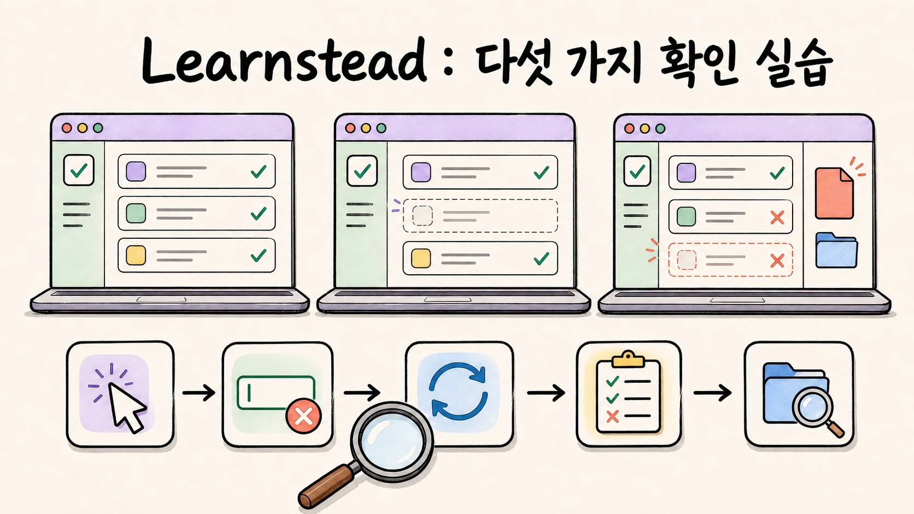

# 다섯 가지 확인 — 코드를 읽지 않고 세 판을 판정하기



AI가 "완료했습니다"라고 한 결과물 세 판을 놓고, [가이드 05](../../guides/vibe-coding-practice/05-verify-without-reading.md)의 **다섯 가지 확인 — 직접 눌러 보기 · 일부러
틀리게 하기 · 껐다 켜기 · 다른 데 안 깨졌나 · 무엇이 바뀌었나 — 를** 순서대로 해 봅니다. 세 판은 겉보기에 똑같은 할 일 목록이지만
하나는 멀쩡하고, 하나는 새로고침하면 사라지고, 하나는 요청한 기능은 되는데 다른 것이 깨져 있습니다. **AI 없이, 브라우저와 터미널만으로**
합니다. 코드는 읽지 않아도 됩니다.

이 자료는 [가이드: AI와 함께 만들기 — 바이브 코딩에서 Agentic Engineering으로](../../guides/vibe-coding-practice/README.md)의 실습입니다. 가이드를 읽지 않았어도 실행할 수 있고, 05장의 다섯 확인이 무엇을
잡아내는지를 몸으로 익히는 것이 목적입니다.

> **왜 하나:** "AI가 됐다고 했다"와 "내가 확인했다"는 다릅니다. 이 실습의 세 판 중 둘은 AI가 "완료"라고 말했을 법한 결과이고,
> 다섯 확인을 해 보기 전에는 어디가 정상이고 어디가 깨졌는지 판단하기 어렵습니다.

> **검증 상태:** 세 판을 macOS·Chrome에서 실제로 열어 다섯 확인을 수행하고 결과를 기록했습니다. `[실행 검증 · 2026-09-01]`
> Git 명령은 macOS Git 2.50에서 실행했습니다. 상세는 [검증 기록](VALIDATION.md).

**[준비 → §1](#1-준비)** · **[바로 시작 → §3 첫 판](#3-첫-판-v1--잘-되던-상태)**

## 학습 목표와 완료 조건

| 목표 | 완료 조건 |
| --- | --- |
| 다섯 확인을 순서대로 한다 | 세 판 각각에 대해 ①~⑤ 결과를 아래 표(§6) 형식으로 적었다 |
| 실패를 알아본다 | v2·v3에서 어느 확인이 실패하는지 내 기록이 기대 결과(§6)와 일치한다 |
| 확인 결과를 다음 행동으로 잇는다 | 실패한 확인마다 "새 요청 / 되돌리기 / 물어보기" 중 무엇을 할지 말할 수 있다 |
| 원상복구한다 | `git restore .`로 v1 상태로 돌아왔다 |

## 고정된 시나리오·입력·환경

`fixture/`에 세 판이 있습니다. 전부 브라우저에서 파일을 열기만 하면 되는 정적 파일입니다(설치·서버 없음).

```text
fixture/
├── v1-ok/               잘 되던 상태 — 추가·삭제·빈칸 안내·새로고침 유지
├── v2-no-persist/       "완료 체크를 추가했습니다" — 체크는 되는데 ③이 실패
└── v3-broken-delete/    "완료 체크를 추가했습니다" — 체크·저장은 되는데 ②④⑤가 실패
    └── debug-notes.txt  ← 요청하지 않은 파일
```

각 판은 `index.html`·`style.css`·`app.js` 세 파일입니다. v2와 v3는 **v1에 "할 일을 클릭하면 취소선" 기능을 추가해 달라고 한 결과라고
가정합니다** — 같은 요청에 대한 두 가지 "완료".

| 환경 | 값 (작성 환경) |
| --- | --- |
| 브라우저 | Chrome (다른 브라우저도 동작하나 확인하지 않음 `[미검증]`) |
| Git | 2.50 (⑤에만 필요. 없으면 ⑤는 건너뛰고 §7의 💬 대안) |

## 1. 준비

터미널에서 연습용 폴더를 만들고 v1을 복사한 뒤 저장 지점을 만듭니다. 터미널이 처음이면 [Git 가이드 03](../../guides/git-for-vibe-coders/03-setup-mac-windows.md)을
먼저 보세요. 💬로 AI에게 시켜도 됩니다.

```bash
mkdir five-checks-practice && cd five-checks-practice
git init
cp <fixture 경로>/v1-ok/* .
git add . && git commit -m "AI에게 완료 체크 시키기 전"
```

> 💬 "이 폴더에 git 저장소를 만들고, (fixture 경로)/v1-ok 안의 파일들을 복사한 뒤 'AI에게 완료 체크 시키기 전'이라는 메시지로 커밋해 줘."

**★ 준비 완료 판정:** `git log --oneline`에 커밋 한 줄이 보이고, `index.html`을 브라우저로 열면(파일을 더블클릭) "할 일 목록"이 보입니다.

## 2. 다섯 확인 — 이 실습에서는 이렇게

| 확인 | 이 앱에서 할 것 | 통과 |
| --- | --- | --- |
| ① 직접 눌러 보기 | 할 일 세 개("우유", "빵", "달걀")를 추가. v2·v3에서는 "빵"을 클릭해 취소선 | 세 줄이 보인다. (v2·v3) 빵에만 취소선 |
| ② 일부러 틀리게 하기 | 입력칸을 **비운 채** 추가 버튼 | "할 일을 입력하세요"가 뜨고 빈 줄이 생기지 않는다 |
| ③ 껐다 켜기 | 새로고침(F5 또는 ⌘R) | 세 줄이 그대로 (v2·v3는 취소선도 그대로) |
| ④ 다른 데 안 깨졌나 | 가운데 "빵"의 삭제 버튼 | **빵만** 사라지고 우유·달걀은 남는다 |
| ⑤ 무엇이 바뀌었나 | `git status --short` · `git diff --stat` | 요청한 기능에 맞는 파일만, 납득할 만한 양만 바뀌었다 |

`[해석]` 정상 입력과 요청한 기능만 확인하면 ②·④에서 드러나는 결함을 놓칩니다.

## 3. 첫 판: v1 — 잘 되던 상태

`index.html`을 브라우저로 열고 §2의 ①~④를 합니다(취소선은 v1에 없으니 건너뜀). ⑤는 방금 커밋했으니 `git status --short`가 비어 있습니다.

**★ 판정:** 다섯 개 모두 통과. 이것이 **기준선입니다** — 이제부터 "AI가 고친 뒤"와 비교할 상태.

## 4. 둘째 판: v2 — "완료 체크를 추가했습니다" (하나)

v2 파일을 덮어씁니다. AI가 방금 작업을 끝냈다고 생각하세요.

```bash
cp <fixture 경로>/v2-no-persist/* .
```

브라우저를 새로고침하고 §2를 처음부터 합니다.

| 확인 | 작성 환경에서 본 것 | 판정 |
| --- | --- | --- |
| ① | 세 줄 추가됨, 빵 클릭 시 취소선, 다시 클릭 시 풀림 | 통과 |
| ② | "할 일을 입력하세요" 표시, 빈 줄 없음 | 통과 |
| ③ | **새로고침하자 목록이 전부 사라짐** | **실패** |
| ④ | (다시 세 개 넣고) 빵 삭제 → 빵만 사라짐 | 통과 |
| ⑤ | `app.js`만 변경, 23줄(+12 −11) | 통과 |

**★ 판정:** ③만 실패. "완료 체크"는 되지만 **v1에 있던 저장 기능이 사라졌습니다.** 이런 결과를 완료로 받아들이면 요청한
기능만 확인하고 기존 기능의 퇴행을 놓치게 됩니다. `[실행 검증 · 2026-09-01]`

**다음 행동:** 새 요청 — "새로고침하면 목록이 사라져. 전에는 남아 있었어. 저장되게 다시 해 줘. 취소선 기능은 그대로 두고."

되돌리고 셋째 판으로:

```bash
git restore .
```

## 5. 셋째 판: v3 — "완료 체크를 추가했습니다" (둘)

```bash
cp <fixture 경로>/v3-broken-delete/* .
```

> v3를 열면 v1·v2에서 넣은 할 일이 이미 보일 수 있습니다 — 같은 브라우저 저장소를 쓰기 때문입니다. 그것도 ③의 관찰입니다.
> 일단 전부 지우고 시작하세요(삭제 버튼을 반복해 누르면 됩니다).

| 확인 | 작성 환경에서 본 것 | 판정 |
| --- | --- | --- |
| ① | 세 줄 추가됨, 빵 취소선 됨 · 화면이 어두운 테마로 완전히 바뀜 | 통과 (디자인 변경은 ⑤에서) |
| ② | **빈칸으로 추가하자 빈 줄이 생김, 안내 없음** | **실패** |
| ③ | 새로고침해도 세 줄·취소선 유지 | 통과 |
| ④ | **빵을 삭제했더니 우유가 사라짐** (맨 위 항목이 지워짐) | **실패** |
| ⑤ | `app.js`·`style.css` 변경(2파일 +30 −19), 새 파일 `?? debug-notes.txt` | **의심** — 디자인을 시키지 않았고 `debug-notes.txt`는 요청한 적 없음 |

**★ 판정:** ②④ 실패, ⑤ 의심. 요청한 완료 표시와 저장은 동작하지만, **요청한 기능만 확인했다면 "완료"로 커밋했을**
결과입니다. 이번에 바꾸지 말아야 할 삭제 기능이 깨졌고, 가운데를 지우면 맨 위가 사라지므로 다른 기능까지 눌러 봐야 발견할 수
있습니다. `[실행 검증 · 2026-09-01]`

**다음 행동:** ④가 실패했으므로 **되돌리기를 먼저** 고려합니다([가이드 05 §2](../../guides/vibe-coding-practice/05-verify-without-reading.md)). 그다음 요청을 쪼갭니다 —
"취소선 기능만, 삭제와 디자인은 건드리지 말고." ⑤의 `debug-notes.txt`는 "왜 이 파일이 생겼어?"라고 물어봅니다.

## 6. 기대 결과 한눈에

| 판 | ① | ② | ③ | ④ | ⑤ | 한 줄 |
| --- | --- | --- | --- | --- | --- | --- |
| v1 | ○ | ○ | ○ | ○ | ○ | 기준선 |
| v2 | ○ | ○ | **✗** | ○ | ○ | 요청한 건 되고 기존 것이 빠짐 |
| v3 | ○ | **✗** | ○ | **✗** | **의심** | 요청한 건 되고 다른 게 깨지고 안 시킨 걸 함 |

`[해석]` — 두 판 모두 **①은 통과합니다.** 요청한 기능만 눌러 보는 확인으로는 어느 것도 잡히지 않습니다. ③은 v2를, ②④⑤는 v3를 잡습니다.
다섯 확인이 각각 다른 실패를 잡기 때문에 하나도 빼기 어렵습니다.

## 7. 원상복구

```bash
git restore .        # 바뀐 파일을 v1(커밋한 상태)로
rm debug-notes.txt   # 요청하지 않은 새 파일은 restore가 지우지 않음
git status --short   # 비어 있으면 끝
```

> 💬 "이 폴더를 마지막 커밋 상태로 되돌려 줘. 커밋 안 된 변경과 새로 생긴 파일은 버려도 돼. 실행할 명령을 먼저 보여 줘."

연습 폴더 자체를 지우려면 폴더를 통째로 삭제하면 됩니다. fixture는 건드리지 않았으므로 처음부터 다시 할 수 있습니다.

## 8. 기록하기

[프로젝트 카드](../../guides/vibe-coding-practice/PROJECT-CARD.md)의 Check 표에 세 판의 결과를 적어 두면, 실제 프로젝트에서 같은 표를 쓸 때 "무엇을 어떻게 눌러야
하는지"의 견본이 됩니다.

## 검증 상태를 읽는 법

| 표기 | 뜻 |
| --- | --- |
| `원리` | 특정 제품 version보다 오래 유지되는 구조·수학·물리 설명 |
| `실행 검증 · YYYY-MM-DD` | 기록한 환경에서 명령과 성공 조건을 실제로 확인함 |
| `부분 검증 · YYYY-MM-DD` | 명시한 단계만 실제로 확인함 |
| `문서 확인 · YYYY-MM-DD` | 공식 문서나 발표를 확인했지만 직접 실행하지는 않음 |
| `자료 확인 · YYYY-MM-DD` | 공개 자료를 확인했지만 1차 출처나 직접 실행으로 확정하지 못함 |
| `미검증` | 아직 직접 확인하지 못함 |
| `해석` | 근거를 바탕으로 저자가 정리한 판단 |

## 범위

이 실습이 끝나는 지점은 **세 판에 다섯 확인을 적용해 기대 결과와 대조하고, 실패마다 다음 행동을 말하며, 원상복구한 순간입니다.**
다루지 않는 것: 실제 AI 도구로 v2·v3 같은 결과를 만들어 보기(도구마다 결과가 달라 고정할 수 없음), 코드 읽기, Windows 실환경.

## 변경과 출처

- [이 실습의 변경 기록](CHANGELOG.md)
- [핵심 정보의 1차 출처](SOURCES.md)
- [환경별 실행 검증 기록](VALIDATION.md)

**← [가이드로 돌아가기](../../guides/vibe-coding-practice/README.md)**
