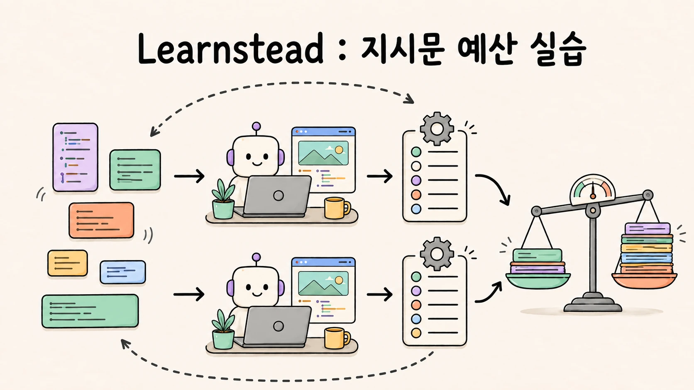

# 지시문 예산 — 크기·위치·형태가 준수율을 얼마나 바꾸나



> 작은 Python 프로젝트에 검사 가능한 규칙 5개를 정하고, 지시문을 **없음 · 짧게 · 길게 · pointer · import · 조건부** 여섯 가지로 두어 같은 과제를 Claude Code와 Codex에서 3회씩 돌립니다. 판정은 스크립트가 합니다. 가이드 [AI Agent가 놓치지 않게 정보 설계하기 — Context Engineering 기초](../../guides/context-engineering/README.md)의 실습편.

## 학습 달성 목표(Learning Objective)

- 규칙 준수를 **기계 판정으로** 재는 실험을 설계·실행합니다.
- "기존 코드가 규칙을 따르는가"가 실험 결과를 뒤집는 것을 직접 봅니다.
- 지시문의 크기·위치·형태별 준수율과 토큰을 표로 확인할 수 있습니다.
- 두 도구의 조건부 로드(경로 규칙 vs 중첩 AGENTS.md)가 어떻게 다른지 봅니다.

## 완료 조건

1. 01에서 라운드 1(추론 가능)을 최소 V0·V1로 돌려 만점이 나는 것을 본다.
2. 02에서 기존 코드를 바꾼 뒤 V0·V1로 0점과 만점 근처가 갈리는 것을 본다.
3. 03·04에서 V2·V3·V3i·V4를 돌려 표를 채운다.
4. 05에서 `summarize.py`로 집계하고 토큰을 비교한다.

## 지원 환경 · 준비

| 필요 | 확인 |
| --- | --- |
| Claude Code CLI 로그인 | `claude --version` |
| Codex CLI 로그인 | `codex --version` |
| Python 3, git | — |

한 도구만 있어도 전 단계를 진행할 수 있다(표의 한 열만 채운다).

```bash
mkdir -p ~/ctx-workshop && cd ~/ctx-workshop
FIX=<이 실습 폴더>/fixture
$FIX/scripts/run-variant.sh claude V1 smoke     # 한 번 돌려 본다
cat runs/smoke/check.txt
```

실행이 중간에 실패하면 `runs/<라벨>/`에 일부 파일이 남을 수 있습니다. 원인을 확인한 뒤 같은 라벨로 다시 실행하면 해당 디렉터리만 안전 검사를 거쳐 새로 만듭니다. 보존하고 싶다면 다른 라벨을 사용합니다.

fixture 구성:

```text
fixture/
├── project/               ← 고정 프로젝트(textkit). 라운드 2 상태 = 규칙을 따르지 않는 코드
├── RULES.md               ← 규칙 5개
├── variants/              ← V1-short · V2-long · V3-pointer · V3i-import · V4-rule-python
├── scripts/
│   ├── run-variant.sh     ← <claude|codex> <V0..V4> <라벨>: 사본 만들고 지시문 설치·과제 실행·판정
│   ├── batch.sh           ← 변형 목록 × 반복 → results.tsv
│   ├── check.py           ← 규칙 5개 판정, n/5
│   └── summarize.py       ← results.tsv 집계
└── (참고) ../results/     ← 작성 환경의 라운드 1·2 원본 결과
```

비용: Claude Code 1회 캐시 읽기 7.5만~20만 토큰, Codex 1회 2.3만~5만 토큰입니다. 전체 매트릭스는 36회이며 각 도구를 18회씩 실행합니다. 변형 하나만 골라 횟수를 줄여도 됩니다.

## 고정 시나리오

- **과제**: `src/textkit/slug.py`에 `slugify(text)` 추가 + 테스트 + "프로젝트 관례를 따라 마무리".
- **규칙 5개**(`RULES.md`): 새 `.py` 첫 줄 `# owner: platform-team` · 모든 함수 한국어 docstring · 모든 함수 타입 힌트 · `tests/test_slug.py`에 `test_slugify_<경우>` · CHANGELOG `[Unreleased]`에 한 줄.
- **판정**: `check.py`가 새로 생긴 `.py` 파일과 CHANGELOG를 보고 5점 만점. 테스트 함수도 "함수"로 봅니다.

## 단계

| 단계 | 파일 | 관측 |
| --- | --- | --- |
| 01 | [`01-inferable-baseline.md`](01-inferable-baseline.md) | 기존 코드가 규칙을 따를 때 — 지시문 없이도 만점, 턴 수 차이 |
| 02 | [`02-short-vs-none.md`](02-short-vs-none.md) | 코드에서 관례를 지운 뒤 — 0점 vs 만점 근처, 놓친 항목 분석 |
| 03 | [`03-long-and-pointer.md`](03-long-and-pointer.md) | 긴 지시문(희석), pointer vs import |
| 04 | [`04-conditional.md`](04-conditional.md) | Claude 경로 규칙 vs Codex 중첩 AGENTS.md |
| 05 | [`05-tokens.md`](05-tokens.md) | 집계·토큰 비교·해석 |

## 정상 경로와 실패 경로

정상 경로에서는 V1·V3i·V4(Claude)가 높은 점수를 받습니다. 낮은 점수는 의도된 실패입니다.

- 01: 모든 변형 만점 → 실험 설계 실패(추론 가능한 규칙)
- 02: V0 0점
- 03: Codex V2 희석, Claude V3 pointer 저하
- 04: Codex 중첩 AGENTS.md 미로드

CLI 자체가 오류로 끝나면 batch는 해당 행과 `cli_rc`를 기록한 뒤 멈춥니다. 원인을 확인하고 아직 실행하지 않은 변형만 다시 돌립니다.

## reset

```bash
rm -rf ~/ctx-workshop/runs ~/ctx-workshop/results.tsv
```

fixture와 홈 디렉터리는 바뀌지 않습니다. 사용자 레벨 `~/.claude/CLAUDE.md`·`~/.codex/AGENTS.md`가 있으면 실험에 함께 로드되므로 결과를 읽을 때 감안합니다.

## 실행 기록

작성 환경(2026-08-30~31, Claude Code 2.1.251 `defaultMode: "auto"`, Codex CLI 0.144.1)의 결과는 각 단계와 [`VALIDATION.md`](VALIDATION.md), 원본은 [`results/`](results/)에 있습니다.

2026-09-02에는 실행 스크립트의 인자를 다시 검토했습니다. `run-variant.sh`는 도구·변형·라벨을 실행 전에 검사하고, 라벨은 영문자 또는 숫자로 시작하며 이후에는 영문자·숫자·점·밑줄·하이픈만 허용합니다. 이 제한과 정규화된 경로 검사로 `runs/` 바깥 경로가 정리 대상이 되는 일을 막습니다.

## 버전

[`CHANGELOG.md`](CHANGELOG.md) · 출처 [`SOURCES.md`](SOURCES.md)
