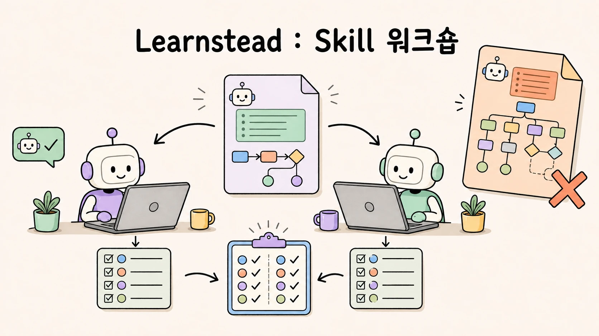

# Skill 워크숍 — 하나를 만들어 두 도구에서 관측하기



> 회의록에서 액션 아이템을 뽑는 skill 하나를 만들고, Claude Code와 Codex에서 **명시 호출·자동 호출·과호출·경로 발견·이름 충돌·프롬프트 대비 비교를** 직접 관측한다. 가이드 [AI Agent에게 일을 가르치는 법 — Agent Skills 기초](../../guides/agent-skills/README.md)의 실습편이다.

## 학습 달성 목표(Learning Objective)

- 규격 필드만 쓴 `SKILL.md`를 두 도구에서 설치하고 부른다.
- description 한 줄을 바꿔 **자동 호출이 뒤집히는 것을** 본다.
- 각 도구가 어느 경로를 읽는지, 같은 이름이 겹치면 누가 이기는지 **탐침 skill로 확인한다**.
- 본문 규칙을 한 줄 보강해 두 도구의 출력을 **수렴시킨다**.
- 같은 절차를 프롬프트에 붙인 경우와 skill로 둔 경우를 **판정 스크립트로 비교한다**.

## 완료 조건

1. 01의 명시 호출·자동 호출 출력이 `check.py`를 통과한다.
2. 02에서 넓은 description이 요약 요청에 skill을 호출시키는 것을 로그로 확인한다.
3. 03에서 Codex가 읽는 경로와 읽지 않는 경로를 표로 채운다.
4. 04에서 v1.1 본문으로 두 도구가 모두 통과한다.
5. 05에서 skill on/off 각 3회의 통과 수를 적는다.

## 지원 환경 · 준비

| 필요 | 확인 |
| --- | --- |
| Claude Code CLI (2.1.x) 로그인 상태 | `claude --version` |
| Codex CLI (0.14x) 로그인 상태 | `codex --version` |
| Python 3 | `python3 --version` |
| git | `git --version` |

두 도구 중 하나만 있어도 01·02·05는 진행할 수 있다. 03·04의 도구 비교는 둘 다 필요하다.

비용: 이 실습은 두 도구의 API를 실제로 호출한다. 작성 환경에서 Claude Code 실행 1회는 캐시 포함 입력 3~6만 토큰, Codex 실행 1회는 1.2~2.4만 토큰이었다. 기록된 전 과정은 Claude Code 20회, Codex 10회 실행이다.

```bash
# 워크숍 저장소 만들기 (이 실습 폴더에서)
bash fixture/scripts/setup.sh ~/skill-workshop
cd ~/skill-workshop
```

준비가 중간에 실패했다면 오류를 고친 뒤, 방금 만들다 만 `~/skill-workshop`만 지우고 다시 실행한다. 기존 작업 폴더를 대상으로 재실행하지 않는다.

`setup.sh`가 만드는 것:

```text
~/skill-workshop/
├── .agents/skills/meeting-actions/      ← 실제 skill (Codex·Gemini·Cursor가 읽음)
│   ├── SKILL.md
│   └── scripts/check.py                 ← 출력 판정기
├── .claude/skills/meeting-actions -> ../../.agents/skills/meeting-actions   ← symlink (Claude Code가 읽음)
├── input/meeting-notes.md               ← 고정 입력
├── variants/                            ← 02·04에서 쓸 변형 skill
├── expected/meeting-actions.md          ← 기대 출력 예
├── scripts/run-claude.sh · run-codex.sh ← 비-대화형 실행 + 로그
└── logs/
```

## 고정 시나리오

입력은 항상 `input/meeting-notes.md`(플랫폼팀 주간 회의, 결정 5건 중 **사람이 할 일은** 4건). 기대 출력은 4열 4행의 표이며 `python3 .agents/skills/meeting-actions/scripts/check.py <출력 파일>`이 PASS/FAIL을 판정한다. 판정 기준:

- 4열(#, 액션 아이템, 담당, 기한) · 데이터 4행
- 담당·기한이 원문과 정확히 일치 ("다음 주 수요일"을 날짜로 환산하면 FAIL, `미정`을 `**미정**`으로 꾸며도 FAIL)
- 날짜·장소만 정한 결정(보고회 개최, 다음 회의)과 보류 안건(채용)은 미포함

## 단계

| 단계 | 파일 | 관측하는 것 |
| --- | --- | --- |
| 01 | [`01-first-skill.md`](01-first-skill.md) | 설치, 명시 호출 `/name`, 자동 호출, 오호출 방지, 목록 확인 |
| 02 | [`02-description-experiments.md`](02-description-experiments.md) | 넓은 description의 과호출, `skillOverrides`로 끄기 |
| 03 | [`03-same-skill-in-codex.md`](03-same-skill-in-codex.md) | `$name` 호출, 모델이 파일을 읽는 방식, 경로 발견 탐침, 두 도구의 출력 차이 |
| 04 | [`04-tighten-and-collide.md`](04-tighten-and-collide.md) | 본문 v1.1로 수렴, description 겹침, 같은 이름 충돌 |
| 05 | [`05-skill-vs-prompt.md`](05-skill-vs-prompt.md) | skill on/off 3회씩 판정, 토큰 비교 |

## 정상 경로와 실패 경로

정상 경로(01·04·05의 skill on)는 판정 PASS다. 실패 경로는 의도된 것이다:

- 02: 넓은 description → 요약 요청에 skill 호출(과호출)
- 03: v1.0 본문 → Codex가 5행(경계 사례 해석 차이)
- 05: skill off + 프롬프트 지시 → 열 추가·기한 환산으로 FAIL

## reset

```bash
# 실험 중 변형을 되돌린다 (워크숍 저장소 루트에서)
git checkout -- . && git clean -fdq -e logs/
rm -f .claude/settings.local.json
# 홈 경로에 둔 탐침 skill(03·04)을 반드시 지운다
rm -rf ~/.agents/skills/ws-probe-home-agents ~/.claude/skills/ws-probe-claude-only ~/.claude/skills/ws-dup-meeting-actions ~/.agents/skills/ws-dup-meeting-actions
```

03·04는 홈 디렉터리(`~/.agents/skills`, `~/.claude/skills`)에 임시 skill을 둔다. **실습이 끝나면 지운다.** 남겨 두면 다른 프로젝트에서도 보이고, Claude Code에서는 프로젝트 skill을 가린다.

## 실행 기록

작성 환경(2026-08-30, macOS, Claude Code 2.1.251, Codex CLI 0.144.1)의 결과는 각 단계 문서의 "작성 환경의 실제 결과"와 [`VALIDATION.md`](VALIDATION.md)에 있다. 모델과 버전이 다르면 자동 호출 판단이 달라질 수 있으므로 **내 결과를 기대값이 아니라 그 표와 비교한다**.

## 버전

[`CHANGELOG.md`](CHANGELOG.md) · 출처 [`SOURCES.md`](SOURCES.md)
