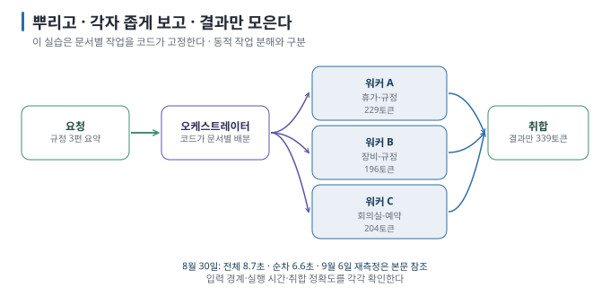

# 02. 오케스트레이터-워커 — 입력 경계·병렬 시간·취합 결과를 따로 본다

> [← 이전: 01. 파이프라인과 라우터](01-pipeline-router.md) · [목차](README.md) · [다음: 03. 평가-개선 루프 →](03-evaluator-loop.md)

## 목표

문서별로 모델을 호출하는 코드를 봅니다. 이 실습의 코드는 문서마다 워커를 하나씩 호출한 뒤 결과를 모읍니다. 이를 작업 배정·결과 취합(fan-out/fan-in) 흐름이라고 합니다. 모델이 실행 중에 하위 작업을 새로 정하는 구성은 아닙니다. 각 워커의 **입력 경계는** 전달 자료로 확인합니다. 그런데 병렬로
돌린 워커가 순차보다 빠르지 않았고, 취합 단계가 워커의 답을 **조용히 바꿨습니다.**

> **검증 상태:** Apple M4 Pro·24GB Mac, Ollama 0.33.0(`OLLAMA_NUM_PARALLEL` 미지정), `gemma3:4b`. 병렬·순차를 각 2회 실행했습니다. §3 끝의 `OLLAMA_NUM_PARALLEL=3` 재측정은 2026-09-06에 추가했습니다.
> `[실행 검증 · 2026-08-30]`


## 0. 이 패턴이 푸는 문제

**"대상이 여럿이고, 각각 따로 처리한 뒤 합쳐야 하는 일."** 문서 10편 요약, 파일 20개 검토, 후보 5개 비교 같은 것입니다.
단일 호출로 하면 전부를 한 프롬프트에 넣어야 하고, 전체 입력이 모델이 한 번에 읽을 수 있는 한도(컨텍스트 창)를 넘을 수 있습니다. `[원리]`



## 1. 코드 — 30줄이면 됩니다

```python
def run_workers(q, model, quiet, max_workers=0):
    docs = load_docs()

    def worker(item):
        name, body = item
        return name, ask(f"너는 '{name}' 담당 워커다. 주어진 규정만 보고 답한다. 다른 분야는 모른다.",
                         f"<규정>\n{body}\n</규정>\n\n요청: {q}", model)

    with futures.ThreadPoolExecutor(max_workers=max_workers or len(docs)) as ex:
        results = list(ex.map(worker, docs.items()))          # ① 병렬 실행 (--max-workers 1이면 순차)

    merged = "\n".join(f"- {n}: {r}" for n, r in results)     # ② 결과만 모음 (원문 아님)
    return ask("워커들의 결과를 중복 없이 정리한다. 없는 내용을 만들지 않는다.",
               f"요청: {q}\n\n워커 결과:\n{merged}", model)    # ③ 취합
```

①은 코드의 동시 호출, ②는 전달 입력의 분리, ③은 취합입니다. 프레임워크의 subagent가 어떤 입력을 받는지는 구현·설정으로 확인해야 합니다. `[해석]`

## 2. 실행 — 격리 확인과 ② 조용한 손실 ★

```bash
python3 patterns.py workers "규정 세 편의 핵심을 각각 한 줄로 정리해 줘"
```

**실제 출력:**

```text
  [워커:장비-규정]   2.0초 · 토큰 196→89
  [워커:회의실-예약] 3.5초 · 토큰 204→88
  [워커:휴가-규정]   5.2초 · 토큰 229→81
  → 워커 3개 완료 (동시 3) · 벽시계 5.2초
  → 오케스트레이터가 결과 취합
  [취합] 3.5초 · 토큰 339→193

답변:
*   장비-규정: 업무용 노트북은 입사 시 지급되며, 퇴직 시 3영업일 전까지 반납해야 하며, 분실/파손 시 24시간 이내에 신고해야 합니다.
*   회의실-예약: … 15분 내 입실해야 자동 취소되고, 노쇼 시 다음 달 예약이 제한됩니다.
*   휴가-규정: 연차는 근속 연수에 따라 발생하며 이월 제한이 있고, 경조 휴가는 결혼 시 5일, 출산 시 10일로 …

[workers] 호출 4회 · 입력 968 + 출력 451 토큰 · 8.7초
```

**★ 입력 경계 — 확인:** 코드에서 각 워커에 문서 한 편을 전달하고 취합에는 결과만 전달했습니다. 각 호출의 입력 토큰은 196·204·229, 취합은 339입니다. 이 숫자만으로 전달 자료의 내용을 증명하는 것은 아닙니다.
결과를 취합하는 호출에는 원문을 다시 전달하지 않았습니다.

**★ 내용 판정 — 실패:** 회의실 줄을 보세요. 워커는 "15분 이내에 입실하지 않으면 자동 취소"라고 정확히 썼는데, 취합은 **"15분 내
입실해야 자동 취소되고"로** 뒤집었습니다. 뜻이 반대입니다. 워커 결과를 로그에서 대조하지 않았다면 최종 답만 보고 통과시켰을
것입니다. 이것이 **② 조용한 손실**(정확히는 왜곡)이며, 취합 프롬프트에 "없는 내용을 만들지 않는다"가 있어도 생겼습니다.
`[실행 검증 · 2026-08-30]`

같은 일이 단일 질문에서도 났습니다.

```bash
python3 patterns.py workers "관리자는 연차를 며칠까지 이월할 수 있나요?"
```

```text
  [워커:장비-규정]   0.6초 · 토큰 197→12 · 규정에 연차 이월에 대한 내용은 없습니다.
  [워커:회의실-예약] 1.2초 · 토큰 205→18 · 죄송합니다. 규정에는 연차 이월에 대한 내용이 없습니다.
  [워커:휴가-규정]   2.2초 · 토큰 230→40 · 관리자는 3년 이상 근속 시 2년마다 1일씩 가산하여 연차를 이월할 수 있으며, 이월 한도는 10일입니다.
  [취합] 1.5초 · 토큰 150→80

답변: 관리자가 연차를 이월할 수 있는 내용은 다음과 같습니다.
*   규정: 연차 이월에 대한 규정은 없습니다.
*   휴가-규정: 3년 이상 근속 시 2년마다 1일씩 가산하여 연차를 이월할 수 있으며, 이월 한도는 10일입니다.
[workers] 호출 4회 · 입력 782 + 출력 150 토큰 · 3.7초
```

워커의 답변과 최종 취합 결과에서 각각 오류가 발생했습니다. 휴가 워커가 "가산"과 "이월"을 한 문장으로 엮어 **규정에 없는 인과**("가산하여 이월할 수 있으며")를 만들었고,
취합은 다른 두 워커의 "모른다"를 **"규정: 연차 이월에 대한 규정은 없습니다"라는 줄로** 승격시켜 정답 옆에 나란히 놓았습니다. 답에 10일이
있으니 정답으로 세면 안 됩니다 — 사용자는 "규정이 없다"와 "10일"을 동시에 받았습니다. `[실행 검증 · 2026-08-30]`

| 실패가 발생한 단계 | 취합 (여러 결과를 한 문장으로 합치는 단계) — 워커가 "모른다"고 한 것도 결과로 들어감 |
| --- | --- |
| 판정 | 토큰 ↑ · 최종 답 ↔ 워커 결과 불일치 |
| 처방 | 워커 결과 전문을 로그로 남기고 최종 답과 대조 · "모른다" 응답은 취합에 넣지 않고 걸러 내기 · 취합에 "모순이 있으면 그대로 보고하라" |
| 실무에서의 신호 | 최종 답이 매끄러운데 세부 조건이 반대이거나, "없다"와 "있다"가 함께 나옴 |

## 3. 병렬이 실제로 됐는가 — 순차와 대조 ★

워커 개별 시간이 2.0 / 3.5 / 5.2초로 늘어났습니다. 요청이 큐에서 기다린 것인지 과제별 처리 시간이 다른 것인지 이 숫자만으로 구분할 수는 없습니다. `--max-workers 1`로
순차 실행과 비교합니다.

```bash
python3 patterns.py workers "규정 세 편의 핵심을 각각 한 줄로 정리해 줘" --max-workers 1
```

| 실행 | 워커 개별 시간 | 워커 벽시계 | 전체 (취합 포함) |
| --- | --- | --- | --- |
| 병렬 (동시 3) 1회차 | 2.0 / 3.5 / 5.2 | 5.2초 | 8.7초 |
| **순차 (동시 1)** 1회차 | 1.5 / 1.3 / 1.2 | **3.9초** | 6.6초 |
| 병렬 2회차 | 1.5 / 2.7 / 3.8 | 3.8초 | 6.5초 |
| 순차 2회차 | 1.4 / 1.2 / 1.1 | 3.8초 | 6.5초 |

**★ 판정:** 이 조건에서는 동시 호출이 순차보다 빠르지 않았습니다(같거나 느림). 개별 시간에 서버 대기가 포함됐을 가능성이 있지만, 서버 내부 계산 구간을 직접 측정한 결과는 아닙니다.
Ollama는 `OLLAMA_NUM_PARALLEL`을 지정하지 않으면 메모리에 따라 동시 처리 수를 정하며, 이 실행에서는 적용된 동시 처리 수를 직접 확인하지 못했습니다.
`[실행 검증 · 2026-08-30]` `[문서 확인 · 2026-08-30]`

> **초판과 다른 점:** 2026-08-23판은 "순차라면 13초였을 것"이라고 추론만 하고 병렬이 됐다고 적었습니다. 대조 측정에서는 동시 호출의 시간 절감 효과가 확인되지 않았습니다.
> **코드의 동시 호출과 서버 내부의 동시 계산은 구분해야 합니다.** 스레드를 셋 실행했다는 사실만으로 서버가 세 요청을 동시에 계산했다고 확인할 수는 없습니다. `[해석]`

서버 쪽 동시 처리 설정(`OLLAMA_NUM_PARALLEL=3` 등)을 바꾸면 실행 시간과 메모리 사용량이 달라질 수 있습니다. 2026-09-06에
`OLLAMA_NUM_PARALLEL=3`으로 서버를 다시 올리고 같은 질문으로 다시 쟀습니다(모델 적재가 포함된 첫 실행은 제외). `[실행 검증 · 2026-09-06]`

| 실행 (`OLLAMA_NUM_PARALLEL=3`) | 워커 개별 시간 | 워커 벽시계 | 전체 (취합 포함) |
| --- | --- | --- | --- |
| 병렬 (동시 3) | 0.6 / 0.8 / 1.1 | 1.1초 | 2.3초 |
| 순차 (동시 1) 1회차 | 0.4 / 0.4 / 0.7 | 1.5초 | 2.7초 |
| 순차 (동시 1) 2회차 | 0.4 / 0.3 / 0.8 | 1.5초 | 3.0초 |

**★ 판정:** 동시 호출 구간이 겹쳤고 전체 시간은 순차보다 **0.4~0.7초 짧았습니다**. 개별 호출 시간·서버 대기·취합 비용을 함께 봐야 합니다. 이 결과는 서버 내부 계산의 겹침이나 시간 차이의 원인을 각각 분리해 입증한 것은 아닙니다. `[해석]`

## 4. 비용 — 워커를 추가한 뒤 입력량과 시간이 늘었다

같은 질문("관리자는 연차를…")으로 기준선과 비교하면:

| | 호출 | 입력 토큰 | 출력 토큰 | 시간 | 내용 |
| --- | --- | --- | --- | --- | --- |
| 단일 | 1 | 508 | 19 | 0.6초 | 정답 |
| **워커** | **4** | **782** ↑ | **150** ↑ | 3.7초 | 정답 + "규정 없음" 혼재 |

**이 단일 질문 실험에서는 이 패턴이 불리했습니다** — 토큰 1.5배, 시간 6배, 그리고 내용까지 흐려졌습니다. 워커 셋이 각자 문서를 읽고(3×), 둘은
"모른다"고 답하며, 취합 단계가 세 워커의 답을 다시 읽습니다. `[실행 검증 · 2026-08-30]`

**추가 비교를 해 볼 조건** `[해석]`:

| 조건 | 이유 |
| --- | --- |
| 대상이 **많다** (문서 10편+) | 문서 길이에 따라 단일 호출의 입력 한도를 넘을 수 있음. 문서 개수만으로 판단하지 않음 |
| 대상이 **서로 독립적이다** | 이 실습의 워커는 다른 워커의 진행 상황과 결과를 전달받지 않음 |
| **전부를** 다뤄야 한다 | 하나만 필요하면 라우터·검색이 맞음 |
| runtime이 **실제로 동시 처리한다** | 아니면 지연 이득이 없음 (§3) |

## 5. 이 패턴의 실패 모드

| 실패 | 증상 | 대책 |
| --- | --- | --- |
| **취합에서 정보 손실·왜곡** | 워커는 정확했는데 최종 답이 다름 (§2) | 워커 결과를 로그에 남기고 최종 답과 대조 |
| **"모른다"가 결과로 승격** | 무관한 워커의 응답이 답에 섞임 (§2) | 취합 전에 "찾지 못했습니다" 응답 제거 |
| **워커 간 모순** | A는 "가능", B는 "불가" | 취합 프롬프트에 "모순이 있으면 그대로 보고하라" |
| **시간 절감이 확인되지 않음** | 워커별 완료 시간이 순차적으로 늘어남 (§3) | 순차와 대조 측정, runtime 동시 처리 설정 확인 |
| **워커 하나가 실패** | 예외로 전체 중단 | 워커별 예외 처리 후 "실패"도 결과로 취합 |
| **취합이 원문을 다시 봄** | 추가 입력 발생 | 검증에 필요한 원문 범위와 비용 확인 |

> 🔧 **한 단계 더 — 부분 실패를 살려 내기**
>
> `ex.map`의 결과를 읽는 중 워커의 예외가 전달되면 현재 코드는 중단됩니다. 실무에서는 워커마다 `try/except`로 감싸고 실패를 `("워커명", "실패: 사유")`로
> 바꿔 취합에 넘깁니다. 부분 결과를 허용할 수 있는 과제인지 먼저 정하고, 누락된 워커와 결론의 한계를 함께 표시해야 합니다. 이 실습은 해당 경로를 구현하지 않았습니다. `[해석]`

## 6. 점검표

- [ ] 각 워커가 문서 한 편을 받는지 코드·입력 기록으로 확인했다
- [ ] 취합이 원문이 아니라 결과만 받는지 확인했다
- [ ] **워커 결과 전문과 최종 답을 대조했다** (조용한 손실)
- [ ] 병렬과 순차의 벽시계를 대조 측정했다
- [ ] 단일 호출 기준선과 토큰을 비교했다

---

> [← 이전: 01. 파이프라인과 라우터](01-pipeline-router.md) · [목차](README.md) · [다음: 03. 평가-개선 루프 →](03-evaluator-loop.md)
