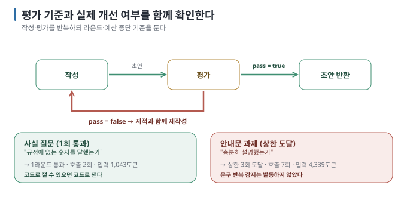

# 03. 평가-개선 루프 — 통과 기준과 중단 조건을 확인한다

> 이전 ← [`02-orchestrator-workers.md`](02-orchestrator-workers.md) · 처음 → [`README.md`](README.md)

## 목표

"AI가 스스로 검토해서 고치게 하면 좋아지지 않을까?" — 사실 질문은 1라운드에 통과했고, 안내문 작성은 3라운드 상한에 걸려 **토큰을
8.5배** 썼습니다. 그리고 "같은 지적이 반복되면 멈추기"는 **발동하지 않았습니다.** 평가자의 지적과 재작성 결과를 대조하고, 어떤 조건에서 실행을 중단할지 확인합니다.

> **검증 상태:** Apple M4 Pro·24GB Mac, Ollama 0.33.0, `gemma3:4b`. 기본·`--stop-on-repeat`·`--budget-tokens` 세 실행. `[실행 검증 · 2026-08-30]`


## 0. 결론 먼저 ★

- 구조는 단순합니다 — 작성 → 평가 → (불합격이면) 재작성 → … 통과하거나 **상한까지**. `[원리]`
- **평가 기준과 피드백이 유용한지 확인해야 합니다.** "규정에 없는 말을 했는가"는 1라운드에 끝났고, "신입에게 충분한가"는 끝나지 않았습니다. `[실행 검증 · 2026-08-30]`
- 상한은 선택이 아니라 **필수입니다**. 횟수 상한만으로는 부족하고 토큰 상한이 따로 필요합니다 — §4에서 실측. `[해석]`
- "같은 지적 반복 감지"는 지적의 **문구가** 매번 달라 잡히지 않았습니다. 문구 비교만 믿지 말고 횟수·예산 조건도 함께 둡니다. `[실행 검증 · 2026-08-30]`

## 1. 코드

```python
draft = ask(ANSWER_RULE, f"<규정>…\n요청: {q}")                    # 작성
for i in range(1, rounds + 1):
    verdict = json.loads(ask("초안이 규정에 없는 내용을 말하거나 요청을 벗어났는지 검사한다. "
                             "문제가 없으면 pass=true …",
                             f"…초안: {draft}", schema=CHECK_SCHEMA))   # 평가 (구조화 출력)
    if verdict["pass"]:
        return draft                                                # 통과 → 종료
    draft = ask(ANSWER_RULE + " 지적된 문제를 고쳐 다시 쓴다.",
                f"…이전 초안: {draft}\n지적: {verdict['problem']}")      # 재작성
return draft                                                        # 상한 도달
```

평가를 **구조화 출력**(`{pass: bool, problem: string}`)으로 강제하는 것이 핵심입니다. 자유 텍스트로 받으면 "괜찮은 것 같지만…"
같은 답이 나와 통과 여부를 코드가 판단할 수 없습니다. 평가 JSON을 읽지 못하면 이 코드는 **통과로 치지 않고** 경고를 내며 멈춥니다 —
"파싱 실패 = 통과"로 두면 실패가 조용히 통과로 둔갑합니다. `[해석]`



## 2. 잘 되는 경우 — 객관적 기준

```bash
python3 patterns.py loop "관리자는 연차를 며칠까지 이월할 수 있나요?"
```

**실제 출력:**

```text
  [작성 1회] 1.1초 · 토큰 508→21 · 관리자는 이월 한도는 일반 직원 5일, 관리자 10일이다.
  [평가 1회] 1.2초 · 토큰 535→24 · { "pass": true, "problem": "초안이 규정에 있는 내용을 정확하게 반영했다." }
  → 1회차에서 통과
[loop] 호출 2회 · 입력 1,043 + 출력 45 토큰 · 2.3초
```

**★ 성공 판정:** `1회차에서 통과`가 찍히고 호출이 2회(작성 1 + 평가 1)입니다. 다만 **비용을 보세요** — 평가자가 문서 전체 + 초안을
다시 읽어야 해서 입력이 기준선(508)의 2배입니다. 통과했어도 값어치가 있었는지는 별개입니다: 단일 호출의 답(§01 기준선)과 같은
답을 두 배 비용으로 얻었습니다. `[실행 검증 · 2026-08-30]`

## 3. ③ 수렴 실패 — 안내문 작성이 상한에 도달한 사례 ★

```bash
python3 patterns.py loop "신입에게 보낼 휴가 안내문을 써 줘"
```

**실제 출력:**

```text
  [작성 1회]   2.5초 · 토큰 504→81
  [평가 1회]   1.8초 · 토큰 591→54 · pass=false
  → 지적: 초안은 연차 사용 신청 절차에 대한 상세 내용이 부족하고, 신입 직원을 대상으로 하는 안내문이라는 점을 고려…
  [재작성 1회] 2.9초 · 토큰 644→112
  [평가 2회]   2.0초 · 토큰 622→64 · pass=false
  → 지적: 초안은 연차 사용 이월 한도를 일반 직원 5일, 관리자 10일로 명확히 제시하지 않고…
  [재작성 2회] 2.9초 · 토큰 685→114
  [평가 3회]   1.8초 · 토큰 624→46 · pass=false
  → 지적: 초안은 연차 가산 및 이월 한도에 대한 구체적인 정보가 부족하여 신입에게 혼란을 줄 수 있습니다.
  [재작성 3회] 2.8초 · 토큰 669→114
  → 상한(3회) 도달, 마지막 초안 반환

[loop] 호출 7회 · 입력 4,339 + 출력 585 토큰 · 16.7초
```

**★ 판정:** `상한(3회) 도달`이 찍히면 수렴 실패입니다. 호출 7회 = 작성 1 + (평가 + 재작성) × 3 — 상한 N이면 최대 **2N+1회입니다**.
`[실행 검증 · 2026-08-30]`

### 무엇이 잘못됐나 `[해석]`

1. **평가자가 매번 다른 말로 지적했습니다.** 1회 "절차 상세 부족", 2회 "이월 한도를 명확히 제시하지 않음", 3회 "가산 및 이월 한도 정보
   부족". 2·3회는 사실상 같은 요구인데 문장은 다릅니다.
2. **재작성이 지적을 반영했는데도** 평가자가 만족하지 않았습니다. 2회차 재작성에는 "일반 직원 5일, 관리자 10일"이 들어갔지만 3회차
   평가는 다시 "구체적인 정보가 부족"이라고 했습니다. "충분히"의 기준이 없기 때문입니다.
3. **마지막 초안이 나쁘지는 않습니다.** 3회차 초안은 발생·신청·반차·이월 한도를 다 담았습니다. 문제는 좋아졌는지를 **평가자가 알아보지
   못한다는** 것이고, 그래서 언제 멈출지를 평가자에게 맡길 수 없다는 것입니다.
4. **비용은 8.5배입니다.** 단일 호출 508토큰 vs 루프 4,339토큰. 답이 8.5배 낫지는 않습니다.

### 왜 이런 일이 생기나

**같은 모델을 평가자로 다시 호출한다고 검토 품질이 보장되지는 않습니다.** 별도 요청에서 작성 중 놓친 문제를 발견할 수도 있으므로, 같은 모델이라는 사실만으로 실패를 설명할 수는 없습니다. 이번 기록에서 확인한 문제는 요구를 반영한 초안에도 비슷한 지적이 계속 나왔다는 점입니다. 무엇을 충족하면 통과인지 기준을 구체적으로 정하고, 평가자의 지적이 그 기준에 맞는지 확인해야 합니다. `[해석]`

## 4. 고치기 — 두 장치를 실제로 걸어 보면

### 같은 지적 감지는 발동하지 않았다

`--stop-on-repeat`는 이번 지적이 직전 지적과 유사도 0.8 이상이면 멈춥니다.

```bash
python3 patterns.py loop "신입에게 보낼 휴가 안내문을 써 줘" --stop-on-repeat
```

**실제 결과:** 세 지적이 뜻은 비슷해도 문장이 달라 유사도가 0.8에 못 미쳤고, 루프는 **그대로 상한까지** 돌았습니다(호출 7회 · 입력
4,343). `[실행 검증 · 2026-08-30]` 문구 비교는 이 문제에 맞는 장치가 아니었습니다 — 평가자가 매번 다르게 말하는 것이 바로 수렴 실패의
증상이기 때문입니다. `[해석]`

### 토큰 예산은 발동했다

```bash
python3 patterns.py loop "신입에게 보낼 휴가 안내문을 써 줘" --budget-tokens 2500
```

```text
  [작성 1회] … [평가 1회] … [재작성 1회] … [평가 2회] …
답변: (중단) 누적 토큰 2676 ≥ 상한 2500
[loop] 호출 4회 · 입력 2,361 + 출력 315 토큰 · 8.1초
```

**★ 판정:** 보고된 사용량이 기준을 넘은 뒤 다음 호출 전에 멈췄습니다. 2,500으로 설정했지만 2,676을 썼으므로 엄격한 총량 상한은 아닙니다. 횟수 상한(3회)만 있을 때의 절반 비용입니다. 상한에 닿았을 때 **무엇을 돌려줄지는**
정해야 합니다 — 이 코드는 "(중단)" 표시와 사유를 냅니다. 실무에서는 마지막 초안을 내거나, 첫 초안을 내거나, 사람에게 넘깁니다.
`[실행 검증 · 2026-08-30]`

| 확인할 원인 | 평가 기준 (모호한 기준을 같은 모델에게 판정시킴) |
| --- | --- |
| 판정 | 상한 도달 · 지적이 매번 바뀜 · 토큰 ↑↑ |
| 동작한 장치 | 횟수 상한, **토큰 예산** |
| 동작하지 않은 장치 | 지적 문구 유사도 |
| 실무에서의 신호 | 라운드가 늘어도 통과율이 안 오름, 평가자의 지적이 매번 새로움 |

## 5. 동작하게 만드는 조건

| 조건 | 나쁜 예 | 좋은 예 |
| --- | --- | --- |
| **기준이 객관적** | "충분히 설명했는가" | "규정에 없는 숫자를 말했는가" |
| **통과 조건을 명확히 판정할 수 있음** | "품질이 좋은가" | "JSON이 스키마에 맞는가" |
| **코드로 잴 수 있으면 코드로** | LLM에게 문법 검사 | `json.loads()` / 테스트 실행 |
| **예산이 있다** | 통과할 때까지 | 최대 3회 **그리고** 토큰 상한 |
| **멈춤을 평가자에게 맡기지 않는다** | 같은 지적이면 멈춤 | 예산·횟수처럼 모델과 무관한 조건 |

`[해석]` — **가장 중요한 것: 평가를 LLM이 아니라 코드가 할 수 있는지 먼저 봅니다.** JSON 형식, 필수 필드, 숫자 범위, 테스트 통과
여부는 코드로 검사할 수 있습니다. 다만 검사를 통과했다는 사실과 내용이 요구사항에 맞다는 판단은 구분해야 합니다.

> 🔧 **한 단계 더 — 코드 우선 검사를 앞에 두기**
>
> `run_loop()`의 평가 호출 앞에 "규정의 숫자(5일·10일·3영업일…)가 초안에 있는가"를 문자열로 검사하는 함수를 두면, 그 검사를 통과한
> 초안만 LLM 평가로 보내게 됩니다. 이 실습에서는 구현하지 않았습니다 — 직접 넣고 호출 수가 줄어드는지 보세요. `[미검증]`

## 6. 점검표

- [ ] 통과 기준을 한 문장으로 쓸 수 있다 (못 쓰면 이 패턴을 쓰지 않는다)
- [ ] 코드로 잴 수 있는 것은 코드로 재고 있다
- [ ] 횟수 상한과 **토큰 예산이** 둘 다 있고, 닿았을 때 무엇을 반환할지 정했다
- [ ] 멈춤 조건이 평가자의 말이 아니라 모델과 무관한 값에 걸려 있다
- [ ] 루프 전후의 토큰을 비교해 값어치를 확인했다


## 이 실습을 끝내면

- 다섯 방식의 입력 경계를 확인하고 호출 수·토큰·시간·정답을 기준선과 비교할 수 있습니다.
- 오분류 전파·조용한 손실·수렴 실패를 출력의 어느 줄로 판정하는지 알고, 폴백·순차 대조·토큰 예산으로 결과가 바뀌는 것을 봤습니다.
- 원리와 선택 규칙은 [가이드 05](../../guides/agent-orchestration/05-when-not-to.md)에, 코딩 에이전트 안에서 같은 판단을 하는 법은 [나눠 맡기는 법](../../guides/agent-delegation/README.md)에 있습니다.

reset: `ollama stop gemma3:4b` (이 실습은 파일을 만들지 않습니다)
