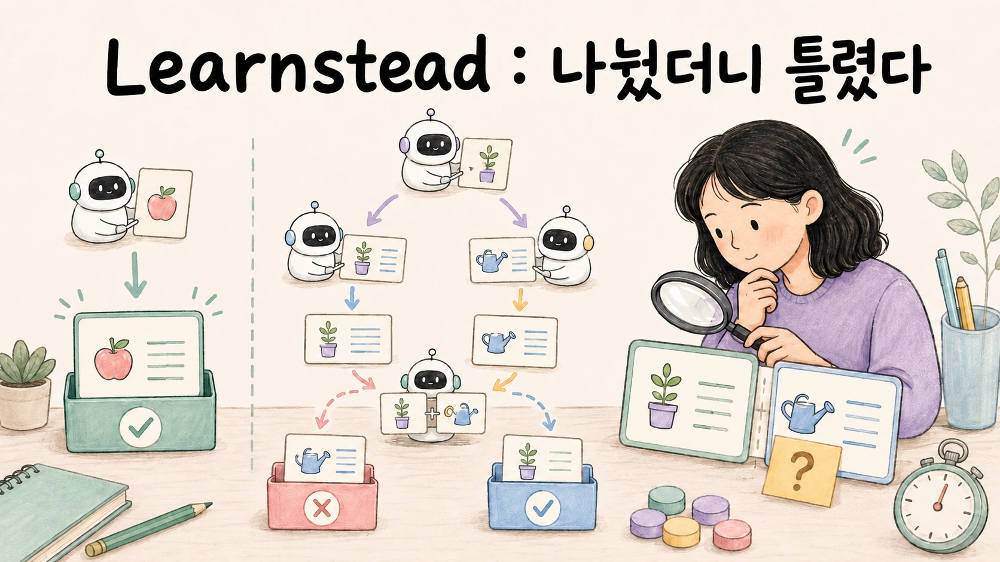

# 나눴더니 틀렸다 — 패턴별 실측과 실패 재현



> 작업을 여러 역할이나 단계로 분담하면 결과가 좋아지는지 **같은 질문, 같은 모델, 같은 문서 3편으로** 비교합니다. 단일 호출·파이프라인·라우터·오케스트레이터-워커·평가 루프 다섯 방식을 한 스크립트로 돌려 호출 수·토큰·시간·정답 여부를 나란히 놓고, 담당 분야 선택 오류, 결과 취합 중의 누락·왜곡, 평가와 수정이 끝나지 않는 현상, 토큰 사용량 증가를 재현합니다. 이어서 재시도 경로나 중단 조건을 추가하면 결과가 달라지는지 확인합니다. 가이드 [여러 AI를 엮어 일하게 하기](../../guides/agent-orchestration/README.md)의 실습편이며, 가이드 없이도 실행됩니다. 모델을 프로그램에서 부르는 법과 구조화 출력은 [앱 연결 가이드](../../guides/local-llm-app-integration/README.md)를 전제로 합니다.

## 학습 달성 목표(Learning Objective)

- 다섯 방식의 호출 수·입력 토큰·시간·정답 여부를 같은 기준으로 측정합니다.
- 각 호출의 전달 자료로 입력 경계를 확인하고, 전체 토큰을 기준선과 별도로 비교한다.
- 오분류 전파·조용한 손실·수렴 실패를 재현하고 출력의 어느 줄로 판정하는지 안다.
- 실패 시 대체 경로(폴백), 순차 실행과의 비교, 토큰 사용량 제한을 각각 적용하고, 기준선과 비교해 유지·되돌림을 판정한다.

## 완료 조건

1. `patterns.py all`로 다섯 방식의 호출 수·입력 토큰·시간·정답을 한 표에 적었다.
2. 라우터 8문항 `--batch` 정확도와 `--fallback` 비용을 기록했다(01).
3. 워커 병렬과 `--max-workers 1` 순차의 벽시계를 대조하고, 워커 결과와 취합 답을 대조했다(02).
4. 평가 루프에서 `--stop-on-repeat`와 `--budget-tokens`가 각각 발동했는지 기록했다(03).
5. "유지 / 되돌림"을 [오케스트레이션 카드](../../guides/agent-orchestration/ORCHESTRATION-CARD.md)에 적었다.


## 판정의 기본 규칙 ★

모든 시나리오에서 다음 네 항목을 확인합니다. `[원리]`

1. **기준선** — 같은 질문을 모델 호출 1회로 처리한 입력 토큰·시간·정답 여부입니다. 다른 방식의 효과를 비교할 출발점으로 씁니다.
2. **입력 토큰 합계** — 기준선보다 줄었는가? 각 호출의 입력 범위는 전달 자료로 따로 확인합니다.
3. **중간 로그** — 분류 결과와 `reason`, 워커별 결과, 평가자의 지적. 최종 답만 보면 실패가 보이지 않습니다.
4. **최종 답 ↔ 중간 결과 대조** — 워커는 맞았는데 취합에서 빠졌는가? 담당은 정직하게 "모른다"고 했는데 그게 오분류 때문인가?

| 기준선 대비 토큰 | 정답 | 중간 로그 | 판정 |
| --- | --- | --- | --- |
| ↓ | ○ | 정상 | 토큰 절감 — 유지 후보 |
| ↓ | ✗ | 분류가 엉뚱한 곳 | **오분류 전파** (01) — 폴백 없이는 되돌림 |
| ↑ | ○ | 워커 결과에 있던 내용이 답에 없음 | **조용한 손실** (02) — 취합 대조 필요 |
| ↑↑ | △ | 같은 지적 반복, 상한 도달 | **수렴 실패 · 비용 폭발** (03) — 기준 재정의 또는 되돌림 |
| ↑ | ○ | 정상 | 추가 비용 발생 — 개별 컨텍스트·시간·품질 이득과 비교 |

## 단계 — 시나리오 지도

| # | 실패 | 어떻게 만드나 | 고치는 장치 | 문서 |
| --- | --- | --- | --- | --- |
| 기준선 | — | `single`로 같은 질문 | — | [01 §0](01-pipeline-router.md) |
| 격리 성공 | 파이프라인이 토큰을 줄임 | `pipeline` | — | [01 §1](01-pipeline-router.md) |
| ① 오분류 전파 | 라우터가 엉뚱한 담당에게 보냄 | `router` + 8문항 `--batch` | `--fallback` | [01 §3](01-pipeline-router.md) |
| ② 조용한 손실 | 워커는 맞았는데 취합이 바꿈 | `workers` | 워커 결과 ↔ 답 대조 | [02 §2](02-orchestrator-workers.md) |
| 병렬 검증 | 병렬이 실제로 빨랐나 | `workers` vs `--max-workers 1` | — | [02 §3](02-orchestrator-workers.md) |
| ③ 수렴 실패 | 주관적 과제의 평가 루프 | `loop` | `--stop-on-repeat` | [03 §3](03-evaluator-loop.md) |
| ④ 비용 폭발 | 루프가 토큰을 몇 배 씀 | `loop` | `--budget-tokens` | [03 §4](03-evaluator-loop.md) |

## 지원 환경 · 고정 시나리오

`labs/`를 통째로 복사합니다.

```text
labs/
├── docs/                 # 가상 사내 규정 3편 (휴가·장비·회의실) — 각 4문장
├── patterns.py           # 다섯 방식 + 실패 재현·수정 플래그 (--fallback --stop-on-repeat --max-workers --budget-tokens --batch)
└── questions.json        # 라우터 정확도용 8문항 (질문 · 정답 분야)
```

코드는 `ask()` 하나만 모델을 부르고, 패턴마다 **호출 순서와 횟수, 각 호출에 맡기는 역할과 전달 자료가 다릅니다.** 모든 호출이 `[단계] 시간 · 입력→출력 토큰 · 출력 앞부분`을
찍으므로 이 로그가 곧 판정 재료입니다. `[원리]`

| 환경 | 값 (작성 환경) |
| --- | --- |
| Ollama · 모델 | 0.33.0 · `gemma3:4b`(Q4_K_M, 적용 context 4,096), temperature 0 |
| Python · 패키지 | 3.14.7 · `openai` 3.6.0 (`pip install openai`). `dict \| None` 문법 때문에 3.10 이상 |
| 동시 처리 | `OLLAMA_NUM_PARALLEL` 미지정 (02 §3의 대조 측정 참조) |
| 호출 시간 | 질문당 0.5~3초 (첫 호출은 모델 적재 포함) |

사전 확인: `curl http://localhost:11434/` → `Ollama is running`, `ollama pull gemma3:4b`.

## reset

이 실습은 파일을 만들지 않습니다. 모델을 내리려면 `ollama stop gemma3:4b`. 기록은 [오케스트레이션 카드](../../guides/agent-orchestration/ORCHESTRATION-CARD.md)에 "기준선 → 역할·단계를 추가한 구성 →
유지/되돌림"으로 남깁니다.

## 문서 지도

| # | 문서 | 내용 |
| --- | --- | --- |
| 01 | [파이프라인과 라우터](01-pipeline-router.md) | 기준선 · 단계별 입력을 제한해 토큰이 줄어드는 사례 · ① 오분류 전파 재현과 8문항 정확도 · 폴백으로 되돌리기 |
| 02 | [오케스트레이터-워커](02-orchestrator-workers.md) | 병렬 워커와 취합 · ② 조용한 손실 · 병렬이 실제였는지 순차 대조 |
| 03 | [평가-개선 루프](03-evaluator-loop.md) | 객관적 기준에서 통과 · ③ 수렴 실패 재현 · ④ 비용 폭발 · 같은 지적 감지와 토큰 상한 |

## 검증 표기

| 표기 | 뜻 |
| --- | --- |
| `원리` | 특정 제품 version보다 오래 유지되는 구조·수학·물리 설명 |
| `실행 검증 · YYYY-MM-DD` | 기록한 환경에서 명령과 성공 조건을 실제로 확인함 |
| `부분 검증 · YYYY-MM-DD` | 명시한 단계만 실제로 확인함 |
| `문서 확인 · YYYY-MM-DD` | 공식 문서나 발표를 확인했지만 직접 실행하지는 않음 |
| `자료 확인 · YYYY-MM-DD` | 공개 자료를 확인했지만 1차 출처나 직접 실행으로 확정하지 못함 |
| `미검증` | 아직 직접 확인하지 못함 |
| `해석` | 근거를 바탕으로 저자가 정리한 판단 |

## 범위

이 실습이 끝나는 지점은 **다섯 방식의 숫자를 한 표에 놓고, 여러 역할·단계를 연결했을 때의 실패를 로그에서 확인하며, 한 가지 장치로 결과가 바뀌는 것을 본 순간입니다.**
다루지 않는 것: 다른 모델·문서 10편 규모에서의 재현, 프레임워크 구현과의 비교, 여러 사용자 동시 요청, 쓰기 권한을 가진 agent.

## 실행 기록

작성 환경: Apple M4 Pro·24GB Mac, Ollama 0.33.0, `gemma3:4b`(temperature 0), 2026-08-30. 모든 시나리오를 실제로 실행했고, 초판(Ollama 0.32.7, 2026-08-23)과 라우터 결과가 달라진 곳은 01 §3에 그대로 적었습니다. `OLLAMA_NUM_PARALLEL=3`으로 서버를 올린 병렬 재측정은 2026-09-06에 추가했습니다(02 §3). 모델·버전이 다르면 오분류·수렴 여부가 달라질 수 있으니 "재현됨/안 됨"을 스스로 기록하세요. 상세는 [`VALIDATION.md`](VALIDATION.md).

## 버전

[`CHANGELOG.md`](CHANGELOG.md) · 출처 [`SOURCES.md`](SOURCES.md)

## 실행 도구의 검사와 중단 기준

`labs/`에서 다음 명령으로 제어 흐름을 검사합니다. Python 표준 라이브러리만 사용하며 SDK·Ollama·모델 호출은 필요하지 않습니다.

```bash
python3 -m unittest discover -p 'test_*.py' -v
```

- `--rounds`는 1 이상, `--max-workers`·`--budget-tokens`는 0 이상입니다. 워커 0은 문서 수만큼, 예산 0은 중단 기준 비활성화를 뜻합니다.
- `--batch`는 질문 위치 인자 없이 `router`에서만 사용합니다. 질문 파일 전체를 검증한 뒤 호출을 시작합니다.
- `--budget-tokens`는 입력+출력의 보고된 누적 사용량으로 다음 호출을 막습니다. 이미 진행 중인 호출의 초과 사용을 막는 엄격한 총량 상한은 아닙니다. `all`은 패턴마다 통계를 초기화하므로 예산도 패턴별입니다.
- 예산 중단은 종료 코드 1입니다. 배치가 중단되면 전체 정확도를 출력하지 않습니다. 사용량 누락은 별도로 표시하며, 예산이 켜져 있으면 중단합니다.
- 라운드 상한으로 반환한 마지막 초안은 평가를 다시 거치지 않았을 수 있습니다. 평가자의 통과와 사람의 최종 승인은 따로 판단합니다.
