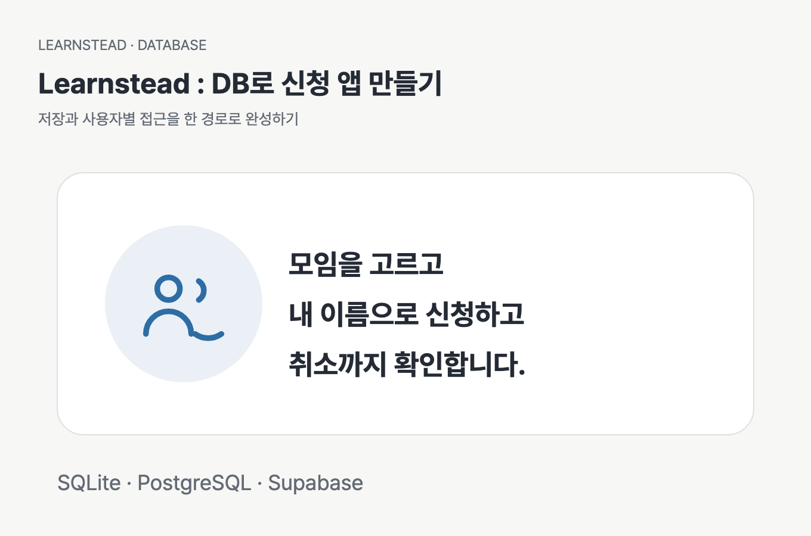
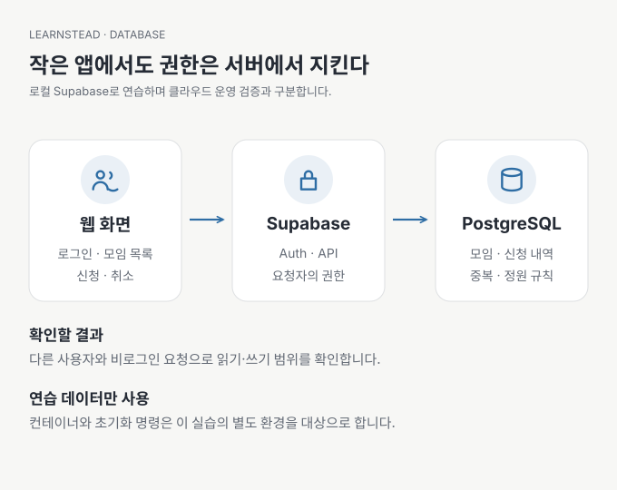

# AI와 함께 만드는 작은 신청 앱 — DB 연결부터 사용자별 접근까지



[01 준비부터 시작 →](01-prepare.md) · [개념 가이드](../../guides/database-for-vibe-coders/README.md) · [실패와 복원 실습](../../labs/database-safety/README.md)

**내 컴퓨터에서 로그인하고 모임에 신청하는 작은 웹 앱을 실행하고, 데이터가 어디에 저장되며 누가 읽고 바꿀 수 있는지 확인합니다.** 화면 만들기는 AI에게 맡겨 본 적이 있지만 DB 연결·계정·권한이 낯선 분을 위한 튜토리얼입니다.

가상의 스터디 모임 세 개와 사용자 두 명만 사용합니다. Node.js로 실행하는 최소 웹 화면, Supabase Auth, PostgreSQL이 함께 동작합니다. 완성된 기준 코드를 제공하므로 AI가 매번 같은 코드를 생성해야 따라갈 수 있는 자료는 아닙니다. 먼저 기준 앱을 실행하고, 각 단계의 요청문으로 AI에게 구조를 설명시키거나 작은 변경을 맡깁니다.

Supabase는 이 튜토리얼에서 PostgreSQL과 인증·API를 로컬로 실행하는 도구입니다. 클라우드 프로젝트나 유료 서비스 가입은 필요하지 않습니다. Docker 이미지와 npm 패키지를 처음 내려받을 때는 인터넷이 필요합니다.

> **실행 검증 · 2026-09-13:** macOS·Node.js 24·Chrome에서 설치부터 로그인·신청·메모·계정 전환·중지·재시작·초기화까지 확인했습니다. 실제 버전과 브라우저 11개 판정, DB 통합 검증의 구분은 [검증 기록](VALIDATION.md)에 있습니다.

## 이 튜토리얼의 완료 조건

- 연습 계정으로 로그인하고 모임에 신청할 수 있습니다.
- 새로고침 후 다시 로그인해도 신청 내역이 남습니다.
- 다른 사용자로 들어오면 상대의 신청 내역이 보이지 않습니다.
- DB를 멈추기·다시 시작하기·초기화하기의 차이를 설명할 수 있습니다.
- AI가 바꾼 결과를 저장·중복·계정 전환으로 확인할 수 있습니다.



## 지원 환경과 사전 준비

| 항목 | 준비 |
| --- | --- |
| OS·터미널 | macOS·로컬 Docker Unix 소켓 기준. Windows 네이티브 소켓·원격 Docker 경로는 제공하지 않음 |
| Docker Desktop | 설치 후 실행 완료. `docker info` 확인 |
| Node.js | 24 LTS. `node --version`과 `npm --version` 확인 |
| Supabase CLI | 별도 전역 설치 대신 `app/package-lock.json`의 고정 버전 설치 |
| 자료 | Learnstead 저장소 전체를 내려받아 폴더 관계 유지 |
| 계정·데이터 | 제공된 가상 계정만 사용 |

실제로 확인한 OS·도구 버전·명령·결과는 [검증 기록](VALIDATION.md)을 기준으로 읽으세요. 로컬 성공을 Windows·클라우드 배포·운영 서비스의 검증으로 확대하지 않습니다.

## 가장 짧은 실행 경로

아래 명령은 **내려받은 Learnstead 저장소의 최상위 폴더**에서 시작합니다. 이미 다른 프로젝트의 DB로 사용 중인 폴더나 실제 데이터를 넣은 환경에서 실행하지 않습니다.

```bash
cd tutorials/study-signup-db/app
npm ci
npm run db:start
npm run setup
npm run dev
```

브라우저에서 [연습 앱](http://127.0.0.1:5173)을 엽니다. `npm run dev`를 실행한 터미널은 그대로 둡니다.

| 구분 | 이메일 | 비밀번호 |
| --- | --- | --- |
| 사용자 A | `alice@example.com` | `Learnstead-local-2026!` |
| 사용자 B | `bob@example.com` | `Learnstead-local-2026!` |

위 값은 누구나 볼 수 있는 **로컬 연습 전용 fixture**입니다. 인터넷에 공개할 앱이나 개인 계정에 재사용하지 않습니다. 로그인 후 모임 세 개가 보이면 첫 연결 성공입니다. 신청 한 건을 만든 뒤 새로고침하고 같은 사용자로 다시 로그인해 보세요. 이 예제는 로그인 상태를 메모리에만 보관하므로 재로그인이 필요하지만 DB의 신청 내역은 유지됩니다.

`db:start`는 이 연습용 서비스를 컴퓨터 내부 주소에 묶어 실행합니다. 공식 CLI 명령을 임의로 대신 실행해 설정을 우회하지 말고 제공된 실행 명령을 사용하세요. 준비와 오류 대응은 [01 준비](01-prepare.md)에 있습니다.

## 단계별로 읽기

| 단계 | 할 일 | 성공 판정 |
| --- | --- | --- |
| [01 준비](01-prepare.md) | 패키지 설치·로컬 DB 실행·계정 준비 | 로컬 서비스 시작과 계정 준비 성공 |
| [02 구조](02-model.md) | 모임·사용자·신청 관계 읽기 | 중복·관계·정원의 규칙을 설명 |
| [03 연결](03-connect.md) | 로그인·신청·다시 조회 | 새로고침 후에도 본인 신청 유지 |
| [04 권한](04-access.md) | A·B·비로그인 비교 | 허용한 데이터만 조회·변경 |
| [05 완성](05-finish.md) | 결과 기록·중지·재시작 | 다음에도 같은 앱을 이어서 실행 |

## 명령의 영향을 먼저 구분하기

모든 명령은 `tutorials/study-signup-db/app`에서 실행합니다.

| 명령 | 영향 |
| --- | --- |
| `npm run db:start` | 이 연습용 로컬 서비스를 시작 |
| `npm run setup` | 가상 계정·앱 공개 설정 준비. 기존 신청 보존 |
| `npm run dev` | 웹 앱 서버 시작 |
| `npm run db:stop` | DB 서비스 중지. 로컬 볼륨 데이터 보존 |
| `npm run db:reset -- --confirm-local-reset` | 이 프로젝트의 DB 볼륨을 새로 만들어 사용자·신청 데이터 초기화. SQLite 파일·`.local` 백업은 유지 |
| `npm run verify` | 신청 0개에서 시작하는 실패·복원 실습 전체 실행 |

`verify`는 이번 튜토리얼을 마친 다음 [실습](../../labs/database-safety/README.md)에서 실행합니다. 자신이 만든 신청을 보존하고 싶다면 먼저 결과를 기록하세요. 시작 조건인 신청 0개가 아니면 검증은 중단합니다.

## 범위와 검증

이 자료는 로컬 학습 앱까지 다룹니다. 실제 개인정보, 결제, 운영 메일, 파일 업로드, 클라우드 공개 배포, 대규모 성능 검증은 포함하지 않습니다. UI 확인과 API·DB 검증은 서로 다른 근거이며, 실행한 범위는 [검증 기록](VALIDATION.md)에 나누어 적습니다.

- [공식 출처](SOURCES.md)
- [실행 환경과 검증 결과](VALIDATION.md)
- [독자에게 영향을 주는 변경](CHANGELOG.md)

---

[01 준비부터 시작 →](01-prepare.md) · [개념 가이드](../../guides/database-for-vibe-coders/README.md) · [실패와 복원 실습](../../labs/database-safety/README.md)
